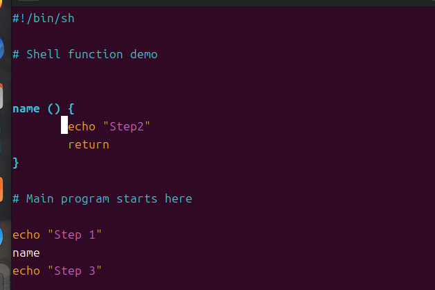
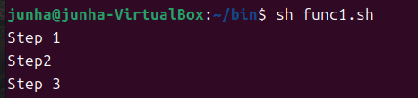
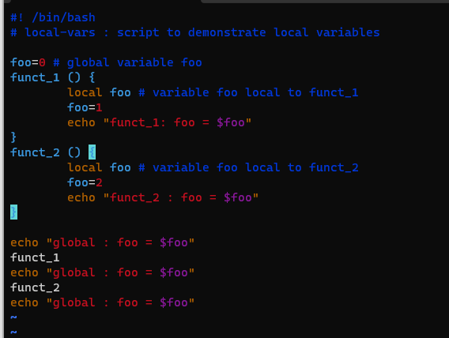
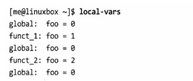

# 리눅스 커맨드라인

# 하향식 설계

프로그램의 규모가 커지고 복잡해질수록 프로그램을 설계하여 코딩하고 유지보수하는 것도 점점 어려워지게 되기 마련.

→ 크고 복잡한 작업을 작고 간단한 단위로 나누는 것이 좋다

## 쉘 함수

스크립트를 세 가지로 나눠 작성한 다음 **PATH에 정의된 디렉토리를 저장**하거나 **스크립트 자체를 쉘 함수로 정의**하여 프로그램에 추가할 수 있다

1. **함수 Syntax**

첫 번째 방법

```bash
function name{
	commands
} 
```

두 번째 방법

```bash
name(){
	commands
}
```



`#!/bin/bash` : shebang 이라고도 하는 특수한 주석. sh 쉘을 사용하도록 지정하며, 기본 쉘로 사용 됨

`function name 블록`: “Step2” 를 return 하는 name 함수

# Main 프로그램까지 행의 내용을 무시함

Step 1부터 Step3까지 실행이 되는데 그 사이에 name이 function을 호출 

> 첫 번째 함수 쓰는 방법인 `function name {}` 은 sh 쉘이 이 구문을 지원하지 않음. function 표현 방식은 대부분 `name ()` 이런식으로 하니까 두 번째 방법을 사용하자
> 

********결과********



쉘은 스크립트를 읽어가면서 `echo "Step 1"` 까지의 행은 무시한다. 주석과 함수 정의가 이뤄지는 부분이기 때문. 그다음 step1 에코가 실행되고, name함수의 내용이 실행되며 나머지를 실행한다.

<aside>
💡 함수 호출이 쉘 함수로서 인식이 되고 다른 프로그램으로 해석되지 않기 위해, 쉘 함수는 호출이 되기 전에 반드시 먼저 정의 되어야 함

</aside>

### 지역 변수

전연 벽수는 프로그램 전반에 걸쳐 적용되는 변수다. 대부분의 경우에 문제가 없지만 가끔 쉘 함수 사용에 혼란을 가져오기도 한다. 따라서 지역 변수가 종종 필요하다. 지역 변수는 쉘 함수 내에서만 유효하고 함수가 종료되는 순간 그 효과가 사라진다.

지역변수는 local이라는 단어를 변수명 앞에 선언함으로 정의할 수 있다. 이 변수는 쉘 함수 밖에서 존재하지 않음





두 개의 쉘 함수 내에서 선언된 지역 변수는 함수 밖에서 아무련 효력이 없다

이 특징은 쉘 함수가 다른 함수느 스크립트로부터 독립적일 수 있게 한다. 프로그램의 한 부분으로 다른 부분의 간섭을 받지 않을 수 있기 때문에 아주 중요한 특징임. 필요할 때 쉘 함수만 잘라내어 다른 스크립트에 갖다 붙일 수 있다.

### 스크립트 실행 상태 유지

프로그램을 실행 가능한 상태로 유지한채 프로그램을 테스트하면 개발 단계에서 오류들을 보다 쉽게 찾아낼 수 있다. 디버깅의 문제가 조금 더 쉬워질 수 있다.

스텁이라는 빈 함수를 프로그램에 추가하면, 초기 단계에서 프로그램의 논리적 흐름을 확인할 수 음. 스텁을 만들때는 프로그래머에게 논리적 흐름의 진행을 보여주는 일종의 피드백을 제공하는 것이 좋을 것

`du` 명령어와 `-sh` 옵션을 함께 사용하여 사용자 공간을 확인할 수 있지만 완벽한 해결책은 아니다. 우분투가 아닌 대부분의 시스템들은 **홈 디렉토리에 대한 접근 권한에 대해 보안상의 이유로 읽기도 허용하지 않기** 때문. → 스크립트가 슈퍼유저 권한으로 작성된 스크립트의 report_home_space 함수여야만이 실행이 가능하다.