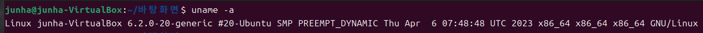
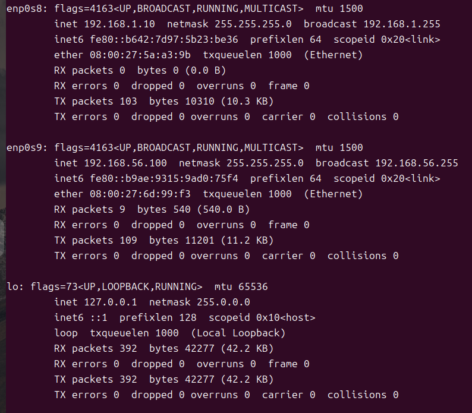
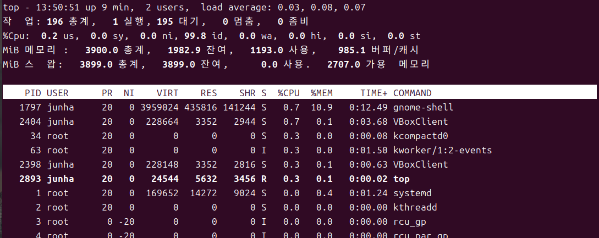

### **uname: 시스템과 커널의 정보**

Uname 명령어를 사용하면 시스템과 커널의 정보를 확인 가능

`-a` 옵션을 사용하면 모든 정보를 확인할 수 있음

- **[Linux] :** 커널 명
- **[junha] :** 호스트 명
- **[6.2.0-20-generic] :** 커널 릴리즈 정보
- **[#20-Ubuntu SMP PREEMPT_DYNAMIC Thu Apr 6 07:48:48 UTC 2023] :** 커널 버전
- **[x86_64] :** 머신 하드웨어 이름
- **[x86_64] :** 프로세서 종류
- **[x86_64] :** 하드웨어 플랫폼
- **[GNU/Linux] :** 운영체제

사용할 수 있는 옵션

**$ uname --help**

- **[-a, --all] :** 전체 내용 출력
- **[-s, --kernel-name] :** 커널 명 출력
- **[-n, --nodename] :** 네트워크 노드의 호스트 명 출력
- **[-r, --kernel-release] :** 커널 릴리즈 정보 출력
- **[-v, -kernel-version] :** 커널 버전 출력
- **[-m, --machine] :** 머신 하드웨어 이름 출력
- **[-p, --processor] :** 프로세서 종류 또는 'unknown' 출력
- **[-i,- -hardware-platform ] :** 하드웨어 플랫폼 또는 'unknown' 출력
- **[-o, --operating-system ] :** 운영체제 'unknown' 출력

### **ifconfig: 네트워크 기본 모니터링**

시스템에 설정된 네트워크 인터페이스의 상태를 확인 및 변경 가능

- **[enp0s8, enp0s9] :** 흔히 랜 카드라고 불리는 유선 네트워크 인터페이스. 위는 랜 카드가 2개있는 경우
- **[lo] :** 루프 백 인터페이스로 자기자신과 통신하는데 사용하는 가상 장치. IP가 127.0.0.1다
IP주소는 서버에 하나씩 부여되는 것이 아니라 네트워크 인터페이스에 할당되기 때문에 각 네트워크 인터페이스마다 다른 IP주소를 보유
- **[inet] :** 네트워크 인터페이스에 할당된 IP 주소
- **[boradcast] :** 브로드캐스트 주소
- **[netmask] :** 넷마스크
- **[MTU] :** 네트워크 최대 전송 단위(Maxium Transfer Unit)
- **[RX packets] :** 받은 패킷 정보
- **[TX packets] :** 보낸 패킷 정보
- **[collision] :** 충돌된 패킷 수

Ifconfig 명령어로는 private ip밖에 확인할 수 없다. 공인 아이피(Public IP)를 알고 싶다면 Curl을 설치 후에 확인 가능

`curl ifconfig.me`

### **top: 운영체제 작업 내역 모니터링**

윈도우의 작업관리자와 비슷한 기능을 하는 명령어입니다.

프로세스 작업 명령어로, 시스템 프로세스들의 CPU/Memory 점유율을 실시간으로 볼 수 있습니다. 현재 몇 개의 프로세스가 있는지, CPU의 자세한 사용률은 어떻게 되는지, Memory와 Swap은 얼마나 사용하고 있는지를 확인할 수 있습니다.

**% Cpu(s)**

- **[us] :** 사용자가 사용중인 사용률
- **[sy] :** 시스템이 사용중인 사용률
- **[ni] :** 프로세스 우선순위를 기반으로 사용되는 사용률(사용자 공간에서 사용됨)
- **[id] :** 아무 일도 하지 않는 여유률
- **[wa] :** 입출력을 기다리는 프로세스 사용률
- **[hi] :** 하드웨어 인터럽트 사용률
- **[si] :** 소프트웨어 인터럽트 사용률
- **[st] :** 가상화 환경에서 손실률

User값이 높다면, 사용자 코드를 수행하는데 시간이 오래 걸린다면 내부적으로 계산을 많이 하고 있다는 뜻. 

System값이 높다면, 시스템에 의해 사용되고 있는 시간이 오래 걸린다면 프로세스들이 시스템 호출 또는 I/O가 많다는 듯. 

idle의 값이 항상 0이라면 CPU를 100% 사용하고 있다는 것을 의미. CPU를 계속 사용하고 있는 프로세스를 찾아 적절하게 대응할 필요가 있다

**PROCESS**

- **[PID] :** 프로세스 ID
- **[USER] :** 프로세스를 실행시킨 사용자 ID
- **[PR] :** 프로세스의 우선순위
- **[NI] :** NICE 값, 마이너스를 가지는 값이 우선순위가 높음
- **[VIRT] :** 가상 메모리의 사용량(SWAP+RES)
- **[RES] :** 현재 페이지가 상주하고 있는 크기
- **[SHR] :** 가상 메모리 중 사용중인 메모리를 제외한 잔여 가상 메모리
- **[S] :** 프로세스의 상태
- **[%CPU] :** 프로세스가 사용하는 CPU의 사용률
- **[%MEM] :** 프로세스가 사용하는 메모리의 사용률
- **[TIME+] :** 프로세스가 CPU를 사용한 시간
- **[COMMAND] :** 실행된 명령어

프로세스 목록을 원하는 특정 기준에 따라 정렬 가능.
top 실행화면에서 Shift 키와 영문자를 누르면 프로세스의 정렬 기준이 변경

**PROCESS**

- **[SHIFT + M] :** 메모리 사용률 정렬
- **[SHIFT + N] :** PID 기준 정렬
- **[SHIFT + P] :** CPU 사용률 정렬
- **[SHIFT + T] :** 실행시간 기준 정렬
- **[SHIFT + R] :** 정렬 기준변경 (오름차순인 경우 내림차순으로, 내림차순인 경우 오름차순으로 변경)
