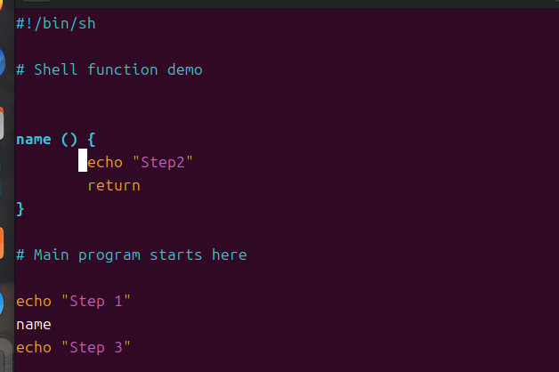

## 쉘 함수

스크립트를 세 가지로 나눠 작성한 다음 **PATH에 정의된 디렉토리를 저장**하거나 **스크립트 자체를 쉘 함수로 정의**하여 프로그램에 추가할 수 있다

1. **함수 Syntax**

첫 번째 방법

```bash
function name{
	commands
} 
```

두 번째 방법

```bash
name(){
	commands
}
```



`#!/bin/bash` : shebang 이라고도 하는 특수한 주석. sh 쉘을 사용하도록 지정하며, 기본 쉘로 사용 됨

`function name 블록`: “Step2” 를 return 하는 name 함수

# Main 프로그램까지 행의 내용을 무시함

Step 1부터 Step3까지 실행이 되는데 그 사이에 name이 function을 호출 

> 첫 번째 함수 쓰는 방법인 `function name {}` 은 sh 쉘이 이 구문을 지원하지 않음. function 표현 방식은 대부분 `name ()` 이런식으로 하니까 두 번째 방법을 사용하자
> 

********결과********


### Shell script에서 함수를 사용할 때 주의할 점

1. 함수를 사용하기 전에 함수가 정의되어 있어야 함
2. 함수를 다시 정의하게 되면 이전에 만들어진 함수의 정의를 덮어쓰게 됨
    1. Shell script 상에서는 **아무런 오류 메시지 없이 원래 함수의 정의를 덮어씌우므로** 주의

### Shell 프로그래밍이 필요한 이유

- 쉘에서 명령어를 이용하여 여러 작업들을 처리할 수 있지만, 동일한 작업을 반복적으로 실행해야 한다면, 매번 같은 작업을 반복하지 않고 파일에 기록하여 편리하게 이용가능
- 복잡한 애플리케이션을 작성하기 전에 빠르고 간단한 프로토타입으로 쓸 수 있음.
→ 마지막 코딩에 들어가기 앞서 전체 동작을 점검해, 전체 구조상의 중요한 결함을 발견 가능