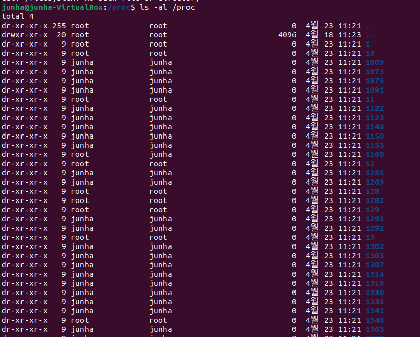
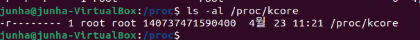
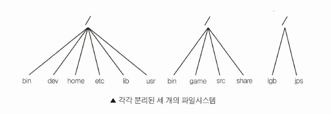
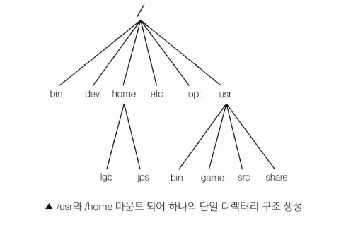
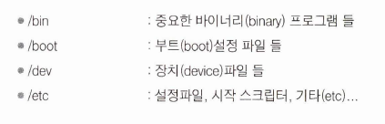
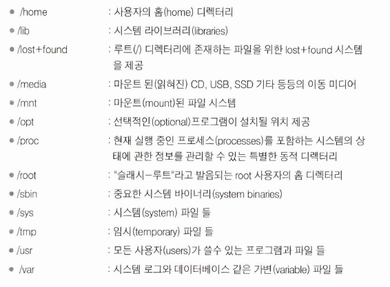
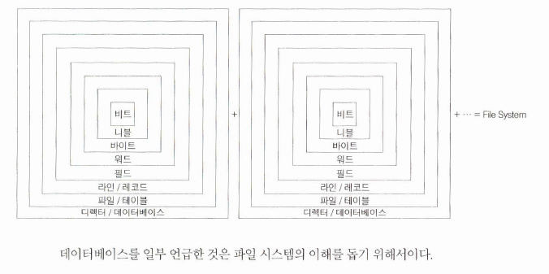

# 우분투 리눅스


# 파일 시스템

## 파일시스템이란

운영체제가 디스크에 파일을 효율적으로 저장하기 위해 사용하는 방법으로 조직화된 자료구조

- 파일을 저장하는데 사용되는 파티션이나 디스크, 파일시스템의 형식을 가리킬 때 사용
- 클라이언트를 통하여 파일 서버 상의 자료로의 접근을 제공하는 방식과 가상의 형태로 접근을 제공하는 방식도 파일 시스템의 범위에 포함될 수 있음

**역할** 

1. 파일관리 측면에서 파일의 저장과 참조를 지원하고 공유 및 보호를 위한 메커니즘 제공
2. 저장 공간을 할당하고 가능한 연속성을 보장함으로서 조각화 현상 억제

자료를 ‘클러스터’ 또는 ‘블럭’이라고 불리는 일정한 영역에 저장하는데 파일 하나가 필요로 하는 하드디스크의 최소공간

리눅스/유닉스 파일시스템의 중요한 특징으로 시스템에서 사용할 수 있는 각각의 파일 시스템이 장치 식별자로 접근 되느 것이 아니라 **하나의 계층적인 트리 구조로 통합**하여 전체적으로 여러 가지 다양한 파일 시스템이 마치 하나인 것처럼 보이게 함

마운트 포인트: 기존의 파일시스템에 다른 파일 시스템을 마운트 하는 과정을 통해 하나의 디렉토리 구조로 통합

파일 시스템의 전반적인 구조는 슈퍼블록, 아이노드, 데이터블록, 디렉토리블록, 우회블록 등의 개념을 포함

## 풍부한 파일 시스템

### 파일 할당 테이블(File Allocation Table, FAT)

마이크로소프트의 MS-DOS 파일 시스템에서 하드 디스크의 파일 위치 정보 등을 기록하기 위한 영역, 윈도우에도 들어가면서 파일 시스템 자체를 가리키게 되었다.

**종류**

- FAT12
- FAT16
- FAT32
- exFAT

### NTFS

윈도우NT계열 운영체제의 파일 시스템

메타데이터의 지원, 고급 데이터 주오의 사용으로 인한 성능 개선, 신뢰성, 추가 확장 기능을 더한 디스크 공간 활용 등으로 FAT 파일 시스템을 대체

********특징********

- 복구성
    - 시스템 고장과 디스크 손상을 복구하는 능력. 원자 행위로 트랜잭션을 처리하여 디스크 볼륨을 일관성 있는 상태로 복구한다.
- 보안성
    - 파일의 보안 속성을 관장하는 보안 서술자를 가진 파일 객체로 구현

### minix

가장 오래된 파일 시스템. 우분투에서는 제공하지 않음

### xia

minix의 개선 버전. 우분투에서 제공하지 않음

### Extended File System 고성능 저널링 파일 시스템

ext 시리즈

********ext4********

가장 많이 사용하는 파일 시스템 중 하나로 ext3의 강화 버전

**********특징**********

- 큰 파일 시스템: 1 EBS의 볼륨과 16TB 파일을 지원
- Extents: 큰 파일 처리를 개선하고 조각화(파편화) 현상을 줄여줌
- 호환성: ext2, ext3를 ext4 방식으로 마운트하여 성능이 향상된 상태로 사용할 수 있다
- 저널 체크섬: 파일 시스템 손상 가능성 하락
- 온라인 조각모음
- 빠른 파일 시스템 검사: 사용하지 않는 부분은 건너 뜀
- 영속적 선행 할당: 타임스탬프가 나노초 단위
- 지연 할당: 디스크 공간 할당을 마지막까지 지연하여 성능이 향상
- Multiblock allocator, 파일 복구 기능 추후 구현 가능성 등이 있음

********************************************************조각 모음이 필요한 이유********************************************************

리눅스 파일 시스템은 일반적으로 단편화가 적으나, 멀티미디어 서버와 같은 대규모 응용 프로그램에서는 단편화가 성능에 영향을 미칠 수 있다. ext3 파일 시스템은 시간이 지날수록 단편화가 심해지지만 ext4 파일 시스템은 조각 모음 기능이 있어 성능에 영향을 미치는 문제를 해결할 수 있다.

**************************************Checksum을 검사 X**************************************

Ext3에서는 checksum 검사를 하지 않아 충돌이 일어났을 때 심각한 파일 시스템 손상을 일으킬 수 있다. 하지만 대부분의 리눅스 배포판에서는 이를 기본적으로 비활성화 상태로 두어 위험에 노출되어 있다. 다음과 같은 시나리오에서 이러한 문제가 발생할 수 있다. 하드 디스크 쓰기가 쓰기 속도를 향상시키기 위한 하드 디스크 캐싱 때 문제가 발생하면, 시스템은 재부팅을 해야만 하는 상태가 된다. 이때 파일 시스템이 손상될 수 있다.

## 파일 시스템 선택

파일시스템의 선택은 상황에 따라 다르겠지만, 리눅스 본래 시스템이 아닌 것 중 하나라면 모든 수행능력을 가지고 있는 ext4를 선택
Untitled
`ls -al /proc` 을 실행하여 프로세스 리스트를 확인



파일 시스템이지만 proc파일의 어떤 것도 디스크를 건드리지 않는다. proc 파일시스템은 커널의 상상속에만 존재한다. 



위의 결과처럼 파일의 크기는 제시되어 있지만 실제 디스크 공간을 차지하지는 않고, 커널 코어가 사용하고 있는 공간을 계산하여 맵핑하여 보여줌

## 파일시스템 만들기

파일시스템은 `mkfs` 명령을 통해 초기화 된 상태로 만들 수 있음

```bash
mkfs [-V] [-t 형태] [fs-options] 장치이름 [블록]
```

- -t fstype: 파일시스템의 형식 선택
- -c : 불량블록을 조사하고 겨로가에 따라 불량블록 리스트를 초기화
- -l filename: filename으로부터 초기의 불량블록 리스트를 읽어들임
- -v: 작업 상태, 결과를 상세하게 보여줌

## 마운트하기와 마운트 풀기

파일시스템을 사용하기 전에 **반드시 마운트 되어 있어야 함**. 마운트가 되면 운영체제는 모든 것이 잘 작동하는지 확인하기 위해 여러 가지 기록하는 작업을 함

리눅스 안의 모든 파일들은 단일 디렉토리 트리 구조이며 루트 디렉토리를 지니는 3개의 다른 파일시스템이 있다





마운트할 디렉토리는 반드시 존재해야 하지만 비어있을 필요는 없다. 하지만 마운트 디렉토리에 있던 어떤 파일이라도 파일 시스템이 마운트 되어 있는 동안은 이름으로 접근할 수 없다

이미 열려있던 파일들이 접근 가능하고 다른 디렉토리에 하드 링크되어 있는 파일들이 이름으로 접근할 수 있다

<aside>
💡 다른 파일시스템에 마운트될 수 없는데, 루트 파일시스템은 어떻게 마운트 가능하지?

</aside>

→ 루트 파일시스템은 부팅 타임에 마운트되고, 마운트될 수 없다면 시스템은 부팅되지 않는다.

최초에 읽기만 되도록 마운트되고, 타당성 검증을 위해 fsck를 싱행하고, 쓰기가 허용되도록 다시 마운트한다

마운트하기와 마운트 풀기는 슈퍼유저(root) 권한을 필요로 한다

## fsck로 파일시스템 완정성(Integrity) 체크하기

파일시스템의 정확성과 타당성은 fsck를 통해 체크

대부분의 시스템들은 fsck를 부팅할 때 자동적으로 실행하도록 설정되어 시스템이 사용되기 전에 오류가 발견되고 수정된다.
큰 파일시스템에서 돌아가는데 약간의 시간이 걸리고, 적절히 종료되었다면 문제가 거의 일어나지 않기 때문에 몇 가지 트릭으로 체크를 피한다

1. /etc/fastboot라는 파일이 있으면 체크를 안함
2. 마운트 해제에 대해 알려주는 플래그가 값을 가지고 있다면 점검하지 앟는다

fsck는 마운트가 안 된 파일시스템에서만 행해져야 하고, 마운트 된 파일시스템에서는 해서 안된다 → 원시 디스크를 건드려서 운영체제의 인지 없이 파일시스템을 수정할 수 있기 때문

## badblocks로 디스크 에러를 검사하기

오류블록 검사는 badlocks 명령으로 행해짐

badlocks는 찾아낼 수 있는 모든 오류블록의 번호 리스트를 결과로 보여줌. 오류블록 리스트는 파일시스템 데이터 구조 안에 저장되기 위해 fsck로 입력될 수 있어서 운영체제는 데이터를 저장하기 위해 오류 블록을 사용 하지 않을 것

## 디스크 fragmented와 싸우기

디스크에 한 파일이 쓰일 때, 파일이 항상 연속되는 블록에 쓰일 수 는 없다. 연속적인 불록에 저장되지 않은 파일은 조각난(fragmented) 파일이라고 함

리눅스 파일 시스템에서는 일반적으로 단편화가 적으나, 멀티미디어 서버와 같은 대규모 응용 프로그램에서는 단편화가 성능에 영향을 미칠 수 있음. ext3 파일 시스템은 시간이 지날수록 단편화가 심해지지만 ext4 파일 시스템은 조각 모음 기능이 있어 성능에 영향을 미치는 문제를 해결할 수 있음. ext2는 블록들을 파일시스템을 재정리하는 많은 MS-DOS 조각 모으기 프로그램들이 있음.

## 모든 파일시스템들을 위한 다른 도구들

파일 시스템들을 다루는데 쓸모 있는 다른 도구들이 있다

- df: 하나 혹은 더 많은 파일시스템들의 여분의 디스크공간을 보여줌
- du: 얼마나 많은 디스크공간이 디렉토리와 디렉토리안의 파일들이 포함하고 있는가를 보여줌
- sync: 버퍼캐시 안의 모든 기록되지 않은 블록들이 디스크에 기록되도록 함
- tune2fs
    - 최대 마운트 수
    - 각 점검간의 검사 사이의 최대 ㅣㅅ간
    - 예약 블록 수

## 파일관리 심층 분석

리눅스에서의 파일은 일반 파일뿐만 아니라 특수파일;다른 시스템과 통신하기, 미디어장치 제어하기 등도 모두 파일관리를 통해 접근이 가능한 특징이 있기 때문에 매우 중요하다

 파일은 데이터의 집합체에 인식표가 붙어진 것

- 비트
    - 정보표현 단위의 가장 낮은 단계. 2진수 0과 1
- 니블
    - 비트 저장소를 4개 연속하여 표현장소 사용
- 바이트
    - 니블 + 니블 or 비트 8개를 합쳐서 정보를 표현하는 데이터 표현의 최소 단위
- 문자
    - 인간이 정보를 인식할 수 있는 기본단위 - 1바이트로 표현하는 ASCII 코드
- 워드
    - 바이트를 하나 이상 묶어서 정보를 표현하는 단위. 2바이트나 4바이트가 1워드
- 더블워드
    - 워드를 2개 합쳐서 표현하는 정보단위
- 필드
    - 문자들의 집합. 워드 또는 더불워드 바이트로도 구성될 수 있다. 
    다른 정보를 표현하는 문자들의 집합과 구분하기 위한 정보 단위
- 라인 또는 레코드
    - 필드의 집합. 물리레코드와 논리레코드로 나뉨
    - 물리레코드: 저장장치를 대상으로 실제로 읽고 쓰는 정보의 단위
    - 논리레코드: 소프트웨어에서 다루는 데이터의 집합
- 파일 또는 테이블
    - 레코드의 집합. DB에선 테이블이라 부르고, 조직화되지 않는 경우는 파일이라고 부름
- 디렉토리 또는 데이터베이스
    - 파일의 집합 또는 테이블의 집합
    - 리눅스에서 디렉토리 역할은 파일 시스템에서 파일을 빨리 찾을 수 있도록 구성하고 파일들의 이름과 위치정보를 담고 있다

`sudo apt-get install tree` 를 설치하여 `tree`를 실행하면 루트부터 하위 디렉토리와 파일들의 계층을 볼 수 있다 

**우분투에서 제시하는 일반적인 디렉토리 목록**





**파일 시스템**

데이터 저장 계층의 최상단이자 파일을 효과적으로 관리하기 위한 체계적인 시스템



**구성 스키마**

- 순차접근방식: 첫 번째 레코드부터 순차적으로 접근하여 레코드를 찾는 방식. 건너 뛸 수 없고 뒤돌아 갈 수 없다
- 직접접근방식: 시간은 첫 번째 레코드이지만, 원하는 위치의 레코드로 건너 뛰거나 뒤돌아 가서 직접 접근이 가능
- 인덱스 접근방식: 각 레코드별 인덱스를 따로 모아 인덱스 값에 의한 직접 접근을 제공하는 파일

## 파일의 속성

파일은 다양한 연산으로 접근이 가능하다

open, close, create, purge, copy, rename, list, access mode, inode 등으로 파일의 조작이 가능하도록 지원

내부 항목에 대한 연산으로는 read, write, update, insert, delete로 파일의 내용에 대한 조작이 가능하다. 이를 지원하기 위해서 필요한 내용이 속성이다.