# 7장. 서버 시스템

서비스를 제공하는 컴퓨터를 서버, 서비스를 제공받는 컴퓨터를 클라이언트라고 한다.

좁은 의미로는 운영체제를 서버로 정의하고 일반 프로그램을 클라이언트로 정의할 수 있다.

****************서버 종류****************

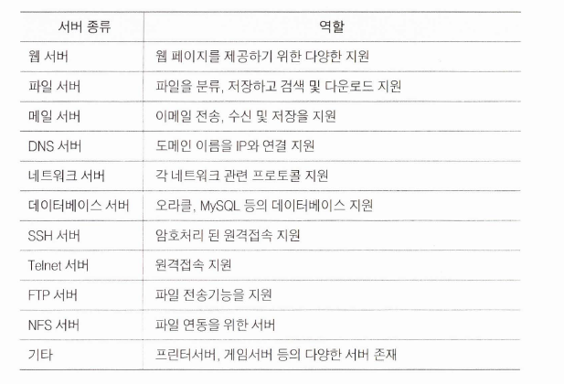

### LAMP

LAMP: Linux, Apache, MySQL, PHP의 두문자어로 리눅스 시스템에서 웹 페이지를 만들어 서비스 할 수 있는 홈페이지 지원 프로그램 패키지

## FTP 설치

vsftpd(매우 안전한 FTP 데몬)는 Linux 및 Unix 계열 시스템을 위한 가볍고 안전하며 빠른 FTP 서버 소프트웨어입니다. 보안 기능과 단순성으로 유명하여 FTP 서버 설치에 널리 사용됩니다.

### vsftpd 패키지 설치

`sudo apt install vsftpd -y`

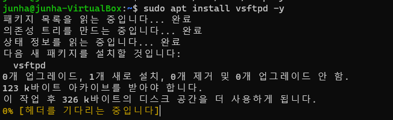

### anonymous

익명 사용자의 접속 및 파일 업로드를 허용하도록 설정

`sudo vim /etc/vsftpd.conf`

vi 에디터로 /etc/vsftpd.conf 파일을 열고, anonymous 계정 권한 변경

```groovy
anonymous_enable=YES #25
write_enable=YES # 31
anon_upload_enable=YES # 40
anon_mkdir_write_enable=YES # 44

utf8_filesystem=YES
```

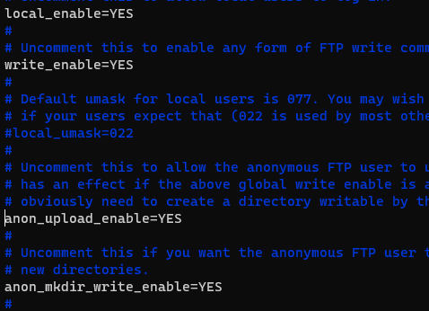

UTF8 은 마지막 줄에 있음 (한글 파일 허용)

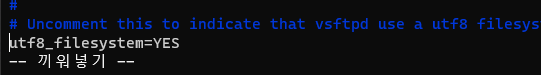

### 패시브 모드

기본적으로 `vsftpd`는 데이터 전송에 `패시브`모드를 사용. 

클라이언트가 수동 모드를 사용하도록 구성되지 않은 경우 서버와의 데이터 연결을 설정할 수 없어 파일 목록이 표시되지 않을 수 있음 

수동 모드를 사용하도록 클라이언트를 구성하거나 vsftpd 구성 파일(/etc/vsftpd.conf)에 다음 줄을 추가하여 vsftpd에서 활성 모드를 활성화할 수 있음

`pasv_enable=NO`

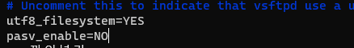

### 익명 폴더

anonymous로 접속되는 기본 디렉토리는 /srv/ftp 이 디렉토리 안에 pub 디렉토리를 만들고 모든 사용자의 읽기, 쓰기 권한 허용

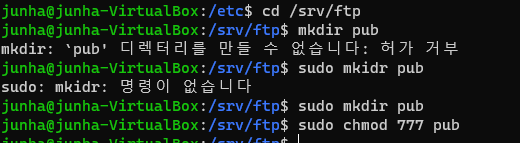

vsftpd 데몬이 정상적으로 실행되는지 확인

`sudo systemctl status vsftpd`

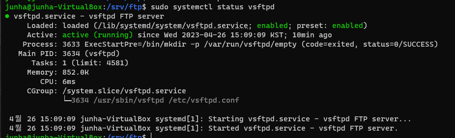

### 방화벽 허용

외부에서 FTP 서버에 접근하도록 방화벽 포트 허용

`sudo ufw allow ftp`

`sudo ufw reload`

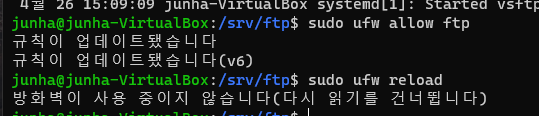

난 걍 꺼놔서 상관업슴

### 접속 주소 확인

192.168.56.100 인것을 확인

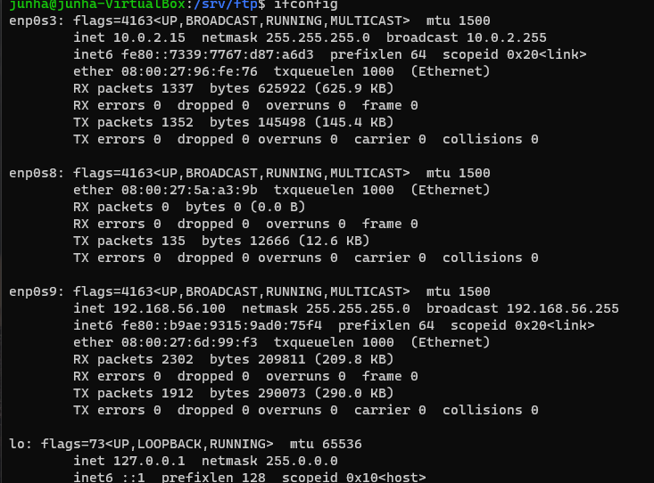

### 클라이언트 접속

Client에서 FTP 서버에 접속하여 파일 다운로드/업로드 하기

`sudo apt-get -y install filezilla`

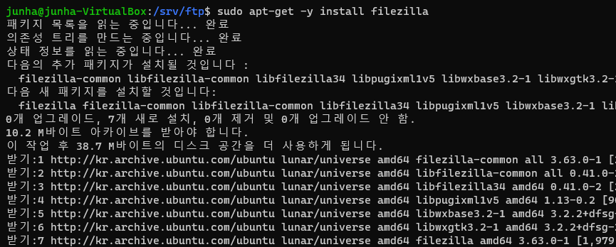

`filezilla` 실행

호스트: IP 주소, 사용자명: anonymous, 비밀번호는 ‘junha’ , 포트에 21 설정

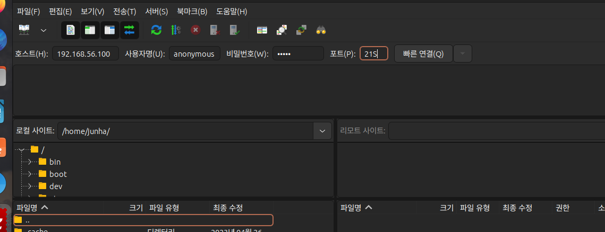

빠른연결 클릭

오류 발생

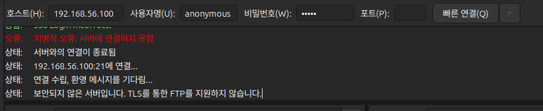

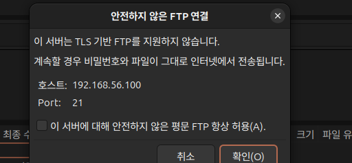

위의 체크박스 무조건 체크

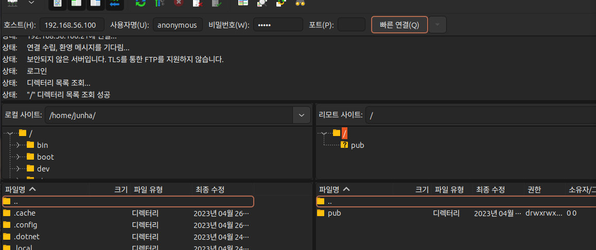

연결 Success

## NFS 서버

NFS는 네트워크 상 다른 사용자 컴퓨터의 디렉토리와 파일을 공유할 수 있도록 시스템을 구성. NFS를 사용하여 사용자와 프로그램은 원격지 컴퓨터의 파일을 자신의 컴퓨터에 있는 파일을 사용하는 것 처럼 쉽게 접근 가능

**********특징**********

1. 공통적으로 사용되는 데이터가 단일 시스템에 저장되고, 네트워크 상의 다른 컴퓨터에 접근할 수 있기 때문에 저장공간 절약
2. 사용자가 모든 네트워크 컴퓨터들에 대응하는 각각의 홈 디렉토리를 가질 필요가 없음
3. 홈 디렉토리를 NFS 서버 상에 만들 수 있고 네트워크 통하여 접근할 수 있음
4. 저장 장치들도 네트워크 상의 다른 컴퓨터에서 사용될 수 있음

### 와인

우분투에서 윈도우용 프로그램을 사용하려면 가상 머신을 사용하거나 윈도우로 재부팅 해야함.
wine을 설치하면 익스플로러 등 간단한 윈도우용 프로그램을 우분투에서 곧바로 사용할 수 있다

## 오라클 11g 설치

### 설치 준비

1. 버전 확인
    
    `uname -r`
    
2. 패키지 수정 및 업그레이드
    
    `apt-get update`
    
    `apt-get upgrade`
    
3. 오라클 추가 패키지 일괄 설치 (한 줄이다 중요)
    
    ```java
    apt-get install elfutils libaio1 libaio-dev libstdc++6-4.3-dev sysstat lesstif2 lesstif2-dev build-essential rpm original-awk ksh alien
    ```
    
    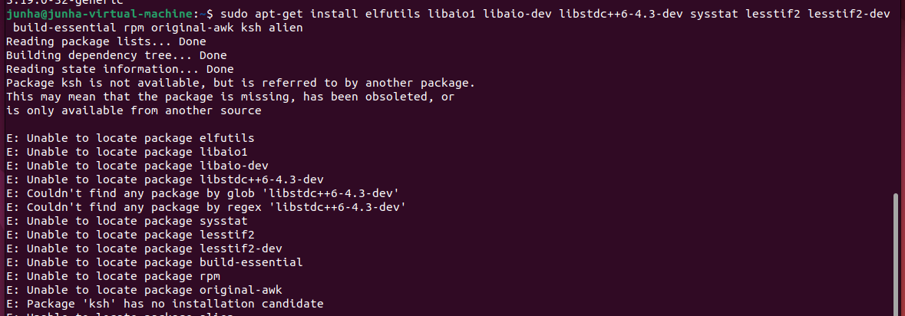
    
    노후화된 패키지라서 설치가 안된단다..