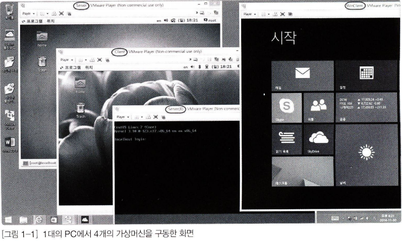

# 이것이 리눅스다 - 01.실습 환경 구축

# 1.1 가상머신의 소개와 설치

## 1.1.1 가상머신의 소개

가상머신 SW 이용 Windows를 그대로 사용하면서 여러 대의 리눅스 서버를 운영하는 효과를 낼 수 있다.

## 1.1.2 가상머신과 가상머신 소프트웨어 개념

**가상머신** : 가상으로 존재하는 컴퓨터

**가상머신 SW** : 가상머신을 생성하는 소프트웨어, 호스트OS 내 가상 컴퓨터 만들고 또 다른 게스트 OS를 설치 운영할 수 있도록 하는 소프트웨어

## 1.1.3 가상머신 소프트웨어 종류와 VMware Player 설치

# 1.2 가상머신 생성

가상머신으로 생성한 리눅스와 실제 실무에서 사용하는 리눅스와 운영 방식은 똑같다.

## 1.2.1 가상머신의 겉모양

Edit virtual machine settings를 클릭하면, 현재 가상머신의 하드웨어 환경을 상세히 확인할 수 있고, 수정이 가능하다.

Hardware 탭에서는 가상머신의 가상의 하드웨어 장치들을 보여준다.

## 1.2.2 가상머신 만들기

Virtual Machine Settings 창에서 용량 변경 및 추가/제거 가능하다.

## 1.3 VMware 특징

- **1대의 컴퓨터만으로 실무 환경과 거의 비슷한 네트워크 컴퓨터 환경의 구성이 가능**
- **운영체제의 특정 시점을 저장하는 스냅숏 기능 사용 가능**

- **하드디스크 등의 하드웨어를 내 맘대로 여러 개 장착해서 테스트 가능**
- **현재 PC 상태를 그대로 저장해 놓고, 다음 사용할 때 현재 상태를 이어서 구동할 수 있다.**

## 1.4 원활한 실습 진행을 위한 사전 준비

## 1.4.1 VMware 핫 키

`Ctrl` + `Alt` : 가상머신 화면에서 호스트 OS로 마우스 초점 가져오기

`Ctrl` + `Alt` + `Insert` : 가상머신 내에서의 작업 관리자

## 1.4.2 VMware Player 종료 시 닫기 옵션

## 1.4.3 전체 화면으로 사용

`Ctrl` + `Alt` + `Enter`

## 1.4.4 여러 개의 가상머신을 동시에 부팅하기

## 1.4.5 네트워크 정보 파악과 변경

네트워크 개념 중요하다. 정상적인 네트워킹 이루어지려면 각 가상머신에 **IP 주소, 서브넷 마스크, 게이트웨이, DNS 서버 주소**라는 4가지 정보 개념을 알고 이를 입력해야 한다.

## 1.4.6 호스트 OS와 게스트 OS 사이의 파일 전송법

호스트 OS에서 보낼 파일을 ISO 파일로 만든 후, 게스트 OS에 DVD/CD를 넣어주는 효과를 사용하는 방법.

Free ISO Creator 프로그램 사용 보낼 파일 ISO 파일로 변환

해당 iso파일을 진짜 DVD/CD와 동일하게 인식한다.