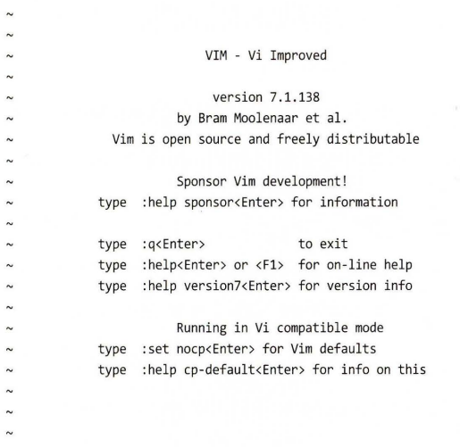

# 리눅스 커맨드라인 완벽입문 - 12. VI 맛보기

# vi 시작과 종료

```bash
$ vi
```



## vi 편집기 종료

```bash
:q
:q! // 강제 종료
```

# 편집 모드

```bash
$ vi test.txt
```

vi 편집기는 `**모달 편집기**` modal editor 이다. **vi 가 살행되면 `명령어 모드`로 시작**된다.

## 텍스트 입력 모드로 들어가기

- vi 편집기에서 파일에 텍스트를 입력하기 위해서는 입력 모드로 들어가야 한다.
- ‘`i`’ 키 입력을 통해 들어갈 수 있다.
- 다시 명령모드로 돌아가려면 `ESC` 버튼 입력

## 저장하기

`ex명령어 모드`에서 입력해야 한다.

```bash
:w
```


```bash
$ sudo apt install vim
$ sudo yum install vim
```

# 커서 이동


# 기본 편집

**실행 취소 :** ‘`U`’

**텍스트 덧붙이기 :** ‘`A`’ - 줄의 맨 끝에 텍스트 덧붙이기

**빈 줄 추가**


## **텍스트 삭제**

- `‘x’` : 문자 한개 삭제
- ‘`숫자x`’ : 숫자만큼 글자 삭제
- ‘`숫자d`’ : 숫자만큼 삭제


## 텍스트 자르기, 복사하기 그리고 붙이기

`d` 명령어를 사용할 때마다. 삭제된 내용은 버퍼에 복사 되어 `p` 명령어로 그 내용을 다시 불러 와서 커서 앞 또는 뒤로 붙이기를 수행한다.


- `p` : 붙여넣기

## 줄 합치기

**`‘J’`**


# 검색 및 치환

검색된 **`위치로 커서 이동 기능`** 및 파일 전체 통틀어 이동 가능하다.

사용자에게 확인 메시지 및 없이 **`텍스트 치환`** 가능

## 줄에서 텍스트 검색

`f[찾을거]` : 해당 문자를 찾아 커서 이동, `;` 입력시 반복 검색

## 파일에서 텍스트 검색

`/`검색할 단어나 문장, `n` : 다음

## 전체 검색 및 치환

```bash
:%s/찾을단어/바꿀단어/g

:%s/Line/line/g
```


# 다중 파일 편집

여러 파일 지정하여 연 다음 vi로 편집

```bash
vi file1 file2 file3 ...
```

## 파일 간 전환


## 다른 파일 열어서 편집


## 파일 내용을 다른 파일로 복사


그 후 p 명령어 통해 이전 파일에서 복사한 줄을 붙여 넣을 수 있다.

## 파일 전체를 다른 파일에 삽입


# 저장하기

```bash
:w
:wq
:wq 새로운이름.txt
```

- 새로운 이름으로 저장하면 편집 중인 현재 파일명은 변경되지 않는다. 따라서 편집을 계속한다면, 기존 파일을 수정하는 것이지 새로운 파일을 수정하는 것은 아니다.