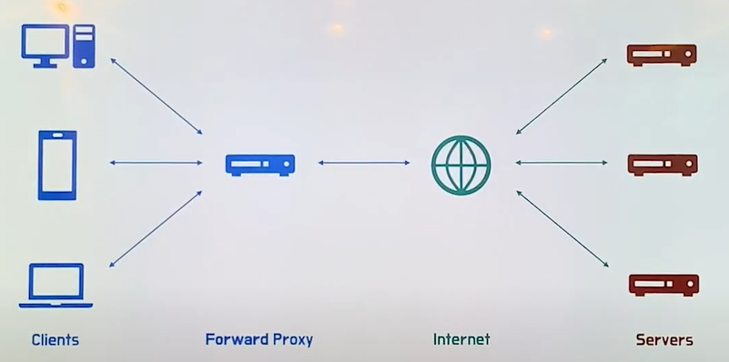
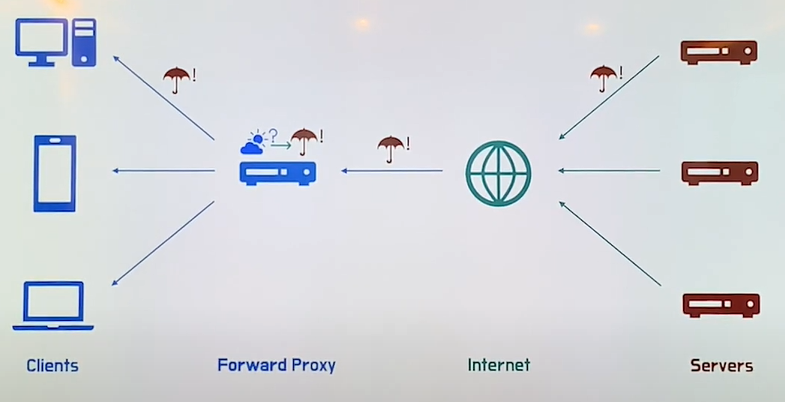

# Proxy 서버와 Loadbalancer

### 포워드 **프록시 (Proxy)**

포워드 프록시는 `클라이언트와 인터넷 사이에 위치`하며, 흔히 포워드 프록시(Forward Proxy)를 통상적으로 프록시라고 부른다.

**프록시의 사전적 정의**

> 프록시 서버는 클라이언트가 자신을 통해서 다른 네트워크 서비스에 간접적으로 접속할 수 있게 해 주는 컴퓨터 시스템이나 응용 프로그램을 가리킨다. `**서버와 클라이언트 사이에 중계기**`로서 **`대리로 통신을 수행하는 것을 가리켜 '프록시', 그 중계 기능을 하는 것을 프록시 서버라고 부른다.`**
> 

나의 작업을 바톤터치해서 대리로 해주는 친구. 이 친구를 프록시라고 이해하면 편할 듯하다.

위 그림과 같이 **클라이언트들이 요청하는 작업을 대리로 처리해주는 프록시**가 존재한다. 따라서, **`인터넷(서버)와 직접적으로 통신하는 것은 실제 클라이언트가 아닌, 프록시`**가 된다.

### **1. 캐싱을 통한 성능 향상**

**프록시를 사용하면 캐싱을 통해 성능을 향상**시킬 수 있다.

예를 들어 위의 사진에서 하나의 컴퓨터가 서버에 오늘 날씨가 어떤지 요청을 하면 서버는 비가온다고 응답을 했다고 하자.

그럼 포워드 프록시는 이러한 내용들을 캐싱해둔다. 이후 또 다른 컴퓨터가 오늘 날씨가 어떤지 요청을 하면 서버로 거치지 않고 포워드 프록시가 즉시 응답을 해준다.

이는 전송 시간을 절약하며 외부 요청이 감소하여 네트워크 병목 현상을 방지할 수 있다.

### **2. 보안 및 우회 가능 (익명성)**

클라이언트 1, 2, 3이 인터넷과 직접적으로 통신하게 되면 클라이언트 1, 2, 3의 IP가 직접적으로 인터넷에 드러나게 된다. 이는 보안적으로 취약할 수밖에 없다. **중간에 프록시 서버를 둔다면, 인터넷 서버는 프록시 서버와 통신하기 때문에 클라이언트 1, 2, 3의 IP를 알 수 없게 된다.** `즉, 서버가 받은 요청 IP는 클라이언트의 IP가 아닌 프록시 서버의 IP가 된다.` 이는 보안적인 취약점을 커버할 수 있게 되며, 특정 서버를 우회하여 들어갈 수 있도록 허용해주는 역할도 하게 된다.

# **리버스 프록시 (Reverse Proxy)**

리버스 프록시는 포워드 프록시와 다르게 `인터넷과 서버 사이에 위치`한다. **응답을 보내주는 측 역시, 어떠한 요청에 대한 응답을 보내줄 때 캐싱과 보안 취약점 제거를 위해 리버스 프록시를 사용**한다. 클라이언트 입장에서는 서버 측의 실제 IP가 아닌, **`리버스 프록시의 IP만 알 수 있기 때문에 보안상 취약점을 커버할 수 있게 된다.`**

---

# **로드 밸런서(Load Balancer)**

**요청에 대한 응답을 처리할 때, 서버에서 일을 부하분산시키는 작업**을 의미한다. 이를 행하는 주체가 로드 밸런서(Load Balancer)이다.

위와 같이 일에 대한 부하가 9 정도 되는 것을, 로드밸런싱 작업으로 각 서버에서 3씩 처리할 수 있게 해 일의 부하를 최소화시켜주는 작업을 로드밸런싱이라 한다.

위와 같이 **서버를 추가로 증설하여 일의 부하를 분산시키는 방법을 `Scale-out`이라 하며, 서버 증설이 아닌 기존 서버 성능 자체를 확장시켜 업그레이드하는 것을 `Scale-up`이라 한다**.

### 로드 밸런서를 사용하는 이유

사용자가 적은 서비스는 하나의 서버로도 운영이 가능하다. 하지만 사용자 수가 엄청나게 증가할 경우, 하나의 서버로 운영하기엔 과부하가 걸릴 것이다.

그래서 `Scale-up`을 통해 운영하고 있던 서버의 성능을 올릴 경우에는 한계가 있다.

이럴 때는 여러 대의 서버가 나누어서 일을 할 수 있도록 `Scale-out`해야 한다.이러한 역할을 위해 로드 밸런서를 사용한다.

### 로드 밸런서의 종류

로드 밸런서의 종류로는 L2, L3, L4, L7이 있으며, L4, L7 로드밸런서가 가장 많이 쓰이고 있다.

L2는 MAC 주소를 바탕으로 로드 밸런싱을 한다.

L3는 IP 주소를 바탕으로 로드 밸런싱을 한다.

**`L4 로드밸런서`는 전송 계층에서 IP, TCP/UDP, port 번호, MAC 주소 등을 바탕으로 부하를 분산**한다. L4 로드밸런서는 높은 **성능**을 가진다.

**`L7 로드밸런서`는 응용계층에서 URL, payload, cookie, HTTP 헤더 등을 통해 부하를 분산**한다. L4 로드밸런서와 달리, 데이터를 분석해서 부하를 분산하기 때문에 **비정상적인 트래픽을 필터링할 수 있어 DDos 공격을 예방할 수 있다는 장점**이 있다. 대신, 그만큼 **자원적인 소모가 커서 L4 로드밸런서에 비해 성능은 느리다는 단점**이 존재한다. L7 로드밸런서는 가장 기본적인 로드밸런서로 널리 통용되고 있다.

---

# 참고 문헌

[우아한테크 - Forward Proxy, Reverse Proxy, Load Balancer](https://www.youtube.com/watch?v=YxwYhenZ3BE)