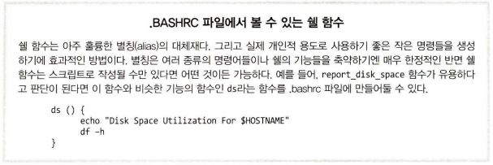

# 커멘드라인분석 - 26장 하향식 설계

# 하향식 설계

**최상위 단계들을 정의**하고 이러한 단**계들을 구체적으로 나누어가는 과정**을 `하향식 설계 (top-down design)`이라고 한다. 이러한 설계 방식은 프로그램 설계 방법 중 가장 흔히 사용되고, 특히 **쉘 프로그래밍에 적합한 방법이다.**

## 쉘 함수

우리가 작성 중인 스크립트는 다음과 같은 단계에 따라 HTML 문서를 생성하고 있다.

1. 페이지 열기
2. 페이지 헤더 열기
3. 페이지 제목 정하기
4. 페이지 헤더 닫기
5. 페이지 본문 열기
6. 페이지 헤더 정보 출력
7. 날짜 및 시간 출력
8. 페이지 본문 닫기
9. 페이지 닫기

**시스템 가동시간(uptime)**

- uptime은 가장 최근에 시스템이 종료되거나 재부팅된 이후부터의 가동시간을 나타냄.

**부하량**

- 일정 시간마다 프로세서상에서 현재 실행 중인 작업의 평균 개수

**디스크 사용 공간**

- 현재 사용중인 저장 장치의 사용 공간

**홈 공간**

- 사용자별 저장 장치 사용 공간

만약, **각 작업에 대한 명령어를 알고 있다면**, `명령어 치환`을 통해 **스크립트에 그 명령어를 추가할 수 있다.**

```bash
# ! /bin/bash 
# Program to output a system information page 

TITLE="System Information Report For $HOSTNAME" 
CURRENT_TIME=$(date +"%x %r %Z") 
TIME_STAMP="Generated $CURRENT_TIME, by $USER" 

cat « _EOF_ 
<HTML> 
		<HEAD>
				<TITLE >$TITLE</TITLE > 
		</HEAD> 
		<BODY> 
				<H1>$TITLE</Hl> 
				<P>$TIME_STAMP</P> 
				$(report_uptime) 
				$(report_disk_space) 
				$(report_home_space) 
		</BODY> 
</HTML> 
_EOF_
```

스크립트를 세 가지로 나누어 작성한 다음 PATH에 정의된 디렉토리에 저장하거나 스크립트 자체를 쉘 함수로 정의하여 프로그램에 추가할 수 있다.

- 쉘 함수는 ‘미니스크립트’와 같다. 즉, 스크립트 안에 있는 다른 스크립트이며 독립적인 프로그램으로서 동작한다.

```bash
# 쉘 함수 정의 방법 1
function name {
				commands
				return
}
```

```bash
# 쉘 함수 정의 방법 2
name () {
				commands
				return
}
```

```bash
# 쉘 함수 사용 예시
#!/bin/bash

# Shell function demo

function func {
				echo "Step 2"
				return
}

# Main program starts here

echo "Step 1"
funct
echo "Step 3"
```

```bash
#!/bin/bash 

# Program to output a system information page 

TITLE="System Information Report For $HOSTNAME" 
CURRENT_TIME=$(date +"%x %r %Z") 
TIME_STAMP="Generated $CURRENT_TIME, by $USER" 

report_uptime () { 
				return
}
 
report_disk_space () { 
				return 
}

report_home_space () { 
				return 
}

cat « _EOF 
<HTML> 
		<HEAD >
				<TITLE>$TITLE</TITLE> 
		</HEAD> 
		<BODY> 
				<H1>$TITLE</Hl> 
				<P>$TIME_STAMP</P> 
				$(report_uptime) 
				$(report_disk_space) 
				$(report_home_space) 
		</BODY> 
</HTML> 
_EOF_
```

- 쉘 함수 이름은 변수명 규칙을 따른다.
- 함수는 최소한 하나의 명령어를 포함해야 한다.
- return 명령어는 이 규칙을 만족시킨다.

## 지역 변수

전역 변수는 프로그램 전반에 걸쳐 적용된다. 쉘 함수 내부적으로 사용할 지역 변수가 종종 필요할 때가 있다. 쉘 함수 내에서만 유효하며 함수가 종료되는 순간 그 효과 또한 사라진다.

```bash
#! / bin/ bash 
# local-vars: script to demonstrate local variables 

foo=0 # global variable foo 

funct_l () { 
				local foo # variable foo local to funct_l 

				foo=l 
				echo "funct_l : foo = $foo" 
}

funct_2 () { 
				local foo # variable foo local to funct_2 
		
				foo=2 
				echo "funct_2 : foo = $foo" 
} 

echo "global : foo = $foo" 
funct 1 
echo "global : foo = $foo" 
funct 2 
echo "global : foo = $foo "
```

- 지역 변수는 local이라는 단어를 변수명 앞에 선언함으로써 정의할 수 있다.

```bash
[me@linuxbox ~]$ local-vars 
global: foo = 0 
funct_l: foo = 1 
global : foo = 0 
funct_2 : foo = 2 
global : foo = 0
```

- 두 개의 쉘 함수 내에 선언된 지역 변수는 함수 밖에서는 아무런 효력이 없다는 것을 알 수 있다.

## 스크립트 실행 상태 유지

우리가 프로그램을 개발하는 동안, 프로그램을 실행 가능한 상태로 유지할 수 있다면 좋을 것이다.
자주 테스트하면 개발 단계에서 프로그램 오류들을 보다 쉽게 찾아낼 수 있을 것이다.

프로그래머들이 말하는 스텁(stubs) 이라는 빈 함수를 프로그램에 추가하면 초기 단계에서 프로그램의 논리적 흐름을 확인해볼 수 있다.

스텁을 만들 때, 프로그래머에게 그러한 프로그램의 논리적 흐름의 진행을 보여주는 일종의 피드백을 제공하는 것이 좋을 것이다. 현재 스크립트 출력 과를 살펴보면 타임스탬프가 출력된 다음 몇 줄의 공백이 있음을 알수 있다 하지만 그 이유는 정확히 알 수 없다. 왜 그런 것일까?

```bash
[me@linuxbox ~]$ sys_info_page 
<HTML> 
		<HEAD> 
				<TITLE>System Information Report For twin2</TITLE> 
		</HEAD> 
		<BODY>
				<Hl>System Information Report For linuxbox</Hl> 
				<P>Generated 03/19/2012 04:02:10 PM EDT, by me</P>
		</BODY>
</HTML>
```

- 피드백 볼 수 있는 내용을 함수에 추가

```bash
report_uptime () { 
		echo "Function report_uptime executed." 
		return
}

report_disk_space () {
		echo "Function report_disk_space executed." 
		return
}

report_home_space () { 
		echo "Function report_home_space executed." 
		return
}
```

```bash
[me@linuxbox ~]$ sys_info_page 
<HTML> 
<HEAD>
				<TITLE >System Information Report For linuxbox</ TITLE > 
</HEAD>
<BODY> 
				<Hl>System Information Report For linuxbox</Hl> 
				<P>Generated 03/ 20/ 2012 05 :17: 26 AM EDT, by me</P> 
				Function report_uptime exec uted . 
				Function report_dis k_spa ce executed . 
				Function report_home_space executed.
</BODY>
</HTML>
```

- 선언한 세 개의 함수가 실행되고 있는 것을 알 수 있다.

함수 프레임워크가 제대로 동작하기 위해, 함수에 살을 붙여야 할 때다. 우선 report_uptime 함수를 보자.

```bash
report_uptime () { 
		cat <<- EOF 
				<H2>5ystem Uptime</H2> 
				<PRE>$(uptime)</PRE> 
				_EOF_
		return
}
```

```bash
report_disk_space () { 
		cat «- EOF 
				<H2>Disk Space Utilization</H2> 
				<PRE>$(df -h)</PRE> 
				_EOF_
		return
}
```

이 함수는 df -h 명령어를 사용하여 디스크 사용 공간을 확인하였다.

```bash
report_home_space () { 
	cat «- EOF 
		<H2>Home Space Utilization</H2> 
		PRE>$(du -sh /home/*)</PRE> 
		_EOF_
	return 
}
```

대부분의 시스템들은 홈 디렉토리에 대한 접근 권한에 대해 보안상의 이유로 읽기 조차도 허용하지 않는다. 그러한 시스템에서는 스크립트가 슈퍼유저 권한으로 작성된 스크립트의 report_home_space 함수여아만 실행 가능하다. 



## 마무리 노트

쉘 함수를 여러 프로그램에서 재사용할 수 있도록 독립적으로 작성함으로써 많은 시간을 단축할 수 있게 되었다.