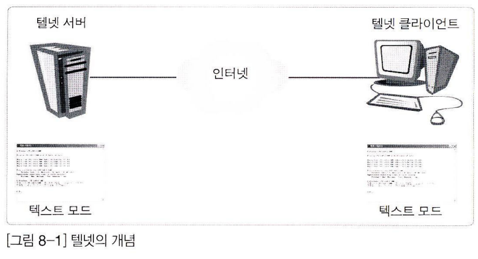

# 이것이 리눅스다 - 8장 원격지 시스템 관리하기

# 원격지 시스템 관리하기

## 8.1 텔넷 서버

### 8.1.1 텔넷 서버 개요

원격지에서 리눅스 서버에 접속할 PC에는 텔넷 클라이언트 프로그램이 필요하다. 대부분 OS에 기본적으로 내장되어 있다.



### 8.1.2 텔넷 서버 구축


**telnet 서버 설치**

```bash
rpm -qa telnet-server
yum -y install telnet-server
```

**서비스 시작**

```bash
systemctl start telnet.socket
systemctl status telnet.socket
systemctl enable telnet.socket
```

**접속 사용자 계정 만들기**

```bash
adduser teluser
passwd teluser
```

**telnet 클라이언트 프로그램 설치**

```bash
yum -y install telnet
```


## 8.2 OpenSSH 서버

보안이 강화된 SSH 서버. 텔넷과 거의 같지만, 데이터 전송 시에 암호화한다는 차이가 있다.


CentOS는 기본적으로 OpenSSH 서버를 설치하고 가동시켜주므로 원격지에서 클라이언트로 접속하면 된다.

```bash
rpm -qa openssh-server
systemctl status sshd
```

`ssh 사용자이름@호스트이름` , `ssh 사용자이름@IP주소` 이용 접속한다.

## 8.3 VNC 서버


```bash
yum -y install tigervnc-server
```

- centOS에서 제공하는 `tigervnc` 패키지 설치


### 텔넷, SSH, VNC 비교

