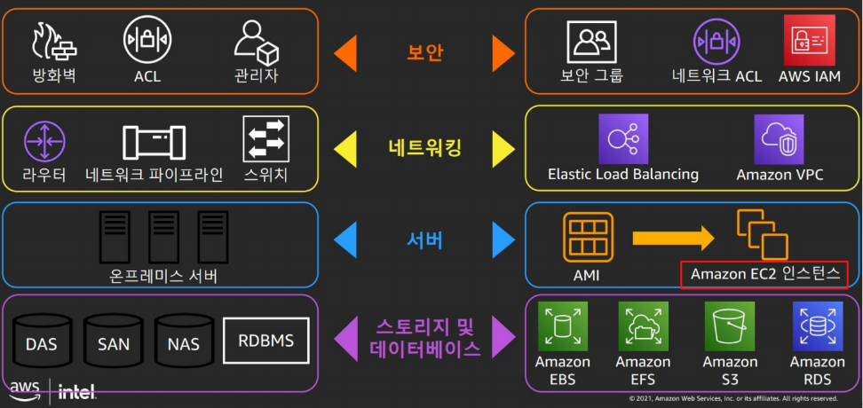

# amazon AWS 제공 주요 서비스

## ****AWS 서비스 개요****

amazon AWS의 주요 서비스 분야 : `클라우드 컴퓨팅`, `스토리지`, `데이터베이스`, `네트워킹`, `보안`

## 1. 컴퓨팅 서비스

### Amazon EC2(Elastic Compute Cloud)

- AWS에서 가장 기본적이면서 널리 쓰이는 인프라로 인터넷에 연결된 `가상머신 서버`를 제공한다.
- `인스턴스 단위` 기반 구성
- OS, HW, 컴퓨팅 파워 규모 등을 **사용자가 원하는 방식으로 구성하고 관리**할 수 있는 가상 머신 **프로비저닝** 제공
    - 프로비저닝 : IT 인프라를 생성하고 설정하는 프로세스
- **Amazon Machin Image (AMI) 사용** -> 사용자의 머신 이미지를 저장해 두고 **해당 이미지로 다시 EC2 설정하면 이전환경 그대로 사용 가능**

### Amazon Auto Scaling

- EC2 인스턴스를 자동으로 시작하거나 종료하여 애플리케이션 로드를 처리하기에 적절한 수의 Amazon EC2 인스턴스를 유지할 수 있도록 설계된 완전관리형 서비스
- 사용자가 정의하는 조건에 따라 Amazon EC2 용량을 **자동으로 확장 또는 축소함**으로써 애플리케이션 **`가용성을 유지`**할 수 있음

### ****Amazon Elastic Container Service (ECS)****

- **AWS의 ECS**는 Amazon에서 제공하는 **완전관리형 컨테이너 오케스트레이션 툴**
    - 오케스트레이션 : 컴퓨터 시스템과 애플리케이션, 서비스의 자동화된 구성, 관리, 조정을 의미
- **Docker 컨테이너를 이용하여 인프라 환경을 좀 더 편리하게 운영, 관리 할 수 있게 해주는 서비스이다.**
- 비슷한 툴로서는 `Kubernetes`나 Docker Swarm이 있다.

### **AWS Lambda**

- Serverless Computing 서비스 제공
- 완전 관리형 컴퓨팅 서비스
- 상태 비저장 코드 실행 (stateless)
- **일정에 따라 또는 이벤트 (S3 버킷, DynamoDB 테이블의 데이터 변경)에 대한 응답(트리거)으로 코드 실행**
- MSA(Micro Service Architecture)에서 단위 기능적 서비스 구현에 쓰일 수 있다.

## 2. 네트워킹 서비스

### Amazon Route 53

- 높은 가용성과 확장성이 뛰어난 **`클라우드 Domain Name System (DNS)`**
- **도메인 이름을 구매 및 관리**하고 **도메인에 대한 DNS 설정을 자동으로 구성**할 수 있음

### Amazon VPC(Virtual Private Cloud)

- **자체 IP 주소 범위** 선택, **서브넷(Subnet) 생성**, **라우팅 테이블** 및 **네트워크 게이트웨이 구성** 등 **가상 네트워킹 환경을 완벽하게 제어 가능**
- 웹 서버를 위한 **`public 서브넷`** 생성, **`private 서브넷`**에 데이터베이스 또는 애플리케이션 서버와 같은 백엔드 시스템을 배치할 수 있음

### Amazon ELB(Elastic Load Balancer)

- **트래픽**을 Amazon EC2 인스턴스, 컨테이너, IP 주소, Lambda 함수와 같은 여러 대상에 **자동으로 분산 시킴**
- 확장성, 성능 및 보안을 보장하여 애플리케이션의 **내결함성 확보**
- **3가지 유형의 로드 밸런서를 지원**
    - `Application Load Balancer` :: HTTP 요청을 로드 밸런싱해야하는 경우
    - `Network Load Balancer` :: 네트워크/전송 프로토콜(4계층-TCP, UDP) 로드 밸런싱의 경우와 고도의 성능이 요구되거나 지연 시간이 낮아야 하는 애플리케이션의 경우
    - `Classic Load Balancer` :: 애플리케이션이 EC2 Classic 네트워크에서 구축된 경우

## 3. 스토리지 서비스

### Amazon S3

- 인터넷 **스토리지 서비스**로 용량에 관계 없이 파일을 저장할 수 있고 **웹(HTTP 프로토콜)에서 파일에 접근할 수 있음**
- **안정성**이 매우 뛰어나고 `확장성`과 `데이터 가용성` 및 `보안`과 `성능`을 매우 저렴한 비용으로 제공
- 내구성과 보안이 뛰어나고 간편하며 빠른 스토리지 서비스 개발자들이 좀 더 쉽게 웹 규모 컴퓨팅을 수행할 수 있도록 설계되어 있음

### Amazon Glacier

- **데이터 백업 및 아카이브**를 위한 안전하고 안정적이며 **유연한 스토리지를 제공하는 매우 저렴한 스토리지**
- 서비스AWS에서 스토리지 운영과 확장을 처리
- 저렴한 스토리지 비용이 가장 중요하고 데이터에 밀리초 만에 액세스해야 할 필요가 없다면 Amazon S3 Glacier를 사용

### Amazon EBS(Elastic Block Storage)

- `EC2 인스턴스에 장착`하여 사용할 수 있는 가상 저장 장치 => **가상 스토리지를 제공**함
- EC2 인스턴스에서 제공하는 **기본 용량보다 더 사용**해야 할 때, **운영체제를 중단시키지 않고 자유롭게 늘리고 싶을 때**, **영구적인 데이터 보관이 필요**할 때 주로 사용
- EC2에 설치된 OS에서 그냥 일반적인 하드디스크 또는 SSD처럼 인식되어 원하는 크기로 만들 수 있고, 성능 또한 원하는 수치로 설정할 수 있으며 사용자가 삭제하기 전까지 데이터가 안전하게 유지됨

## 4. 데이터베이스 서비스

### Amazon **RDS (Relational Database Service)**

- MySQL, Oracle DB, PostgreSQL과 같이 선택할 수 있는 다양한 데이터베이스 엔진을 제공하는 호스팅 서비스
- **쉽게 클라우드에서 관계형 데이터베이스를 설정, 운영, 조정 가능**

### **Amazon Aurora**

- **클라우드용으로 빌드된 MySQL 및 PostgreSQL과 호환 관계형 데이터베이스**
- 성능, 비용, 효율 모두 갖춘 Amazon 자체 DB 엔진

### Amazon DynamoDB

- **비 관계형 데이터베이스 (NoSQL 데이터베이스 서비스)**

