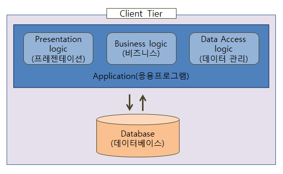

# 미들웨어란?

## **미들웨어의 개념**

미들웨어란 **운영체제와 해당 운영체제에서 실행되는 응용 프로그램 사이**에서 운영체제가 제공하는 서비스 이외에 **추가적인 서비스를 제공하는 소프트웨어**이다. 혹은 **클라이언트와 서버 간의 통신을 담당하는 소프트웨어**라고도 한다.

- 미들웨어는 표준화된 인터페이스를 제공하며 시스템 간의 `데이터 교환에 일관성을 보장`한다.
- `3-Tier Client/Server` 구조에서 `WAS` 서버가 미들웨어에 해당한다.

## 미들웨어가 나오게 된 배경 (feat. 3-Tier)

**기존 1-Tier 구조**

기존 웹 어플리케이션 운영 환경에서 `사용자의 요청이 유입`되는 순간부터 **비즈니스 로직 처리**, **데이터 처리** 등을 모두 **한 곳의 물리적 환경(서버)에서 통합 제공**했다.

- 운영자의 입장에서 하나의 서버만 죽자고 운영하면 되니 **관리 포인트가 1개**라는 장점이 있었다.

**단점**

- **1개의 통합 서버에 문제가 생겼을 때 전체 서비스 장애로 이어진다.**
- 어느 포인트에서 장애를 일으켰는 지 분석이 쉽지 않다.
- 동시다발적 **`사용자 요청(Request)`을** **하나의 통합된 서비스에서 비즈니스 로직을 처리하고 큰 부하를 받음**

이렇게 동시 다발적 사용자의 호출이 쌓이게 되면 통합된 서비스에서도 부하를 받을 것이다.

따라서, **효율적인 서비스 처리**를 위해 **미들웨어를 활용한** `3-Tier 구조`로 서비스를 나누게 되었다.

**3-Tier 구조**

- 사용자의 요청이 유입되는 순간 호출되는 앞단(Front-end)의 정적 페이지(html, css, js, png 등)를 전용으로 처리하는 `Web Server`
- 로그인, 검색 등 데이터를 가공하고 처리하는 뒷단(Back-end)의 동적 페이지(jsp, servlet 등)를 전용으로 처리하는 `WAS Server`

> **미들웨어 담당자**는 Client - Database 사이에 위치한 `WEB Server / WAS`를 관리한다.
> 

## MiddleWare의 동작

`Client` -  `MiddleWare Server` - `DB Server(DBMS)`

동작 과정

- **Client**는 단순히 **요청만 중앙에 있는 MiddleWare Server에게 보낸다.**
- MiddleWare Server에서 대부분의 로직이 수행된다.
- 이때, 데이터를 조작할 일이 있으면 DBMS에 부탁한다.
- 로직의 결과를 Client에게 전송한다.
- Client는 그 결과를 화면에 보여준다.

즉, **비즈니스 로직**을 **Client와 DBMS 사이의 `MiddleWare Server에서 동작하도록 함`으로써 **Client는 입력과 출력만 담당하게 된다.**