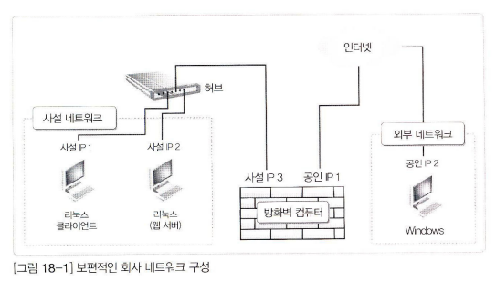
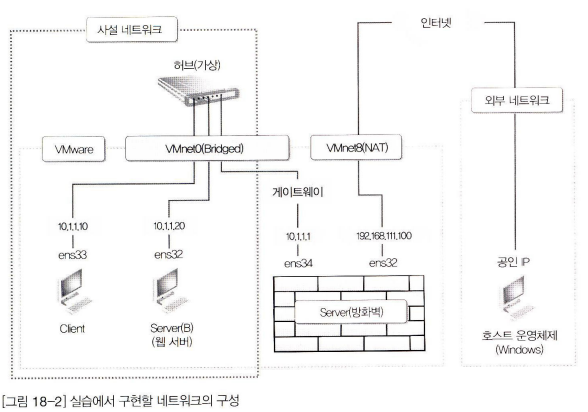

# 18. 방화벽

방화벽은 외부의 접근을 선별적으로 차단해주는 네트워크상의 보호장치로, 가격은 꽤 고가부터 아주 기본적인 역할을 하는 저가의 장비까지 다양하다. 이 장에서는 비록 고가의 방화벽 장치만큼은 못하겠지만, 기본적인 역할을 하는 리눅스 방화벽 컴퓨터를 만들어 보겠다.

## 18.1 보안을 위한 네트워크 설계

네트워크 보안은 외부의 악의적인 침입으로부터 내부의 컴퓨터들을 보호하는 것을 말한다. 네트워크 보안에는 다양한 방법이 있지만, 그 중 중요한 것 하나는 네트워크 설계를 안전하게 하는 것이라 할 수 있다.

그 중 가장 보편적으로 많이 사용하는 방법이 사설IP라 불리는 nonroutable IP주소를 이용하는 것이다. 이 방법은 내부 컴퓨터 사이의 트래픽은 허용하면서 외부 인터넷과의 접속은 허용 또는 제한할 수 있는 쉽고 좋은 방법이다.

사설 IP의 주소 범위는 10.0.0.0 ~ 10.255.255.255, 172.16.0.0 ~ 172.31.255.255, 192.168.0.0 ~ 192.168.255.255의 세 범위가 있다. 이 주소 범위에 있는 컴퓨터는 인터넷 라우터를 통과할 수 없다. 그래서 외부의 컴퓨터는 이 주소 범위에 있는 컴퓨터에 접근할 수가 없다. 하지만 이 주소의 컴퓨터도 외부 인터넷으로 나갈 수가 없다. 그래서 사설 IP 주소의 컴퓨터가 외부 인터넷에 접속할 수 있도록 해주는 방법이 IP 마스커레이딩이라는 방법이다.

### 18.1.1 보편적인 회사 네트워크 구성

1. 각 장치의 역할
    1. ‘사설 네트워크’는 회사의 내부라고 생각하면 된다.
    2. ‘외부 네트워크’는 특정한 컴퓨터가 아닌 인터넷상의 모든 컴퓨터라고 생각하면 된다.
    3. ‘방화벽 컴퓨터’는 2개의 네트워크 카드(랜카드)가 설치되어 있어야 한다. 하나는 내부의 사설 네트워크에 연결될 네트워크 카드며, 다른 하나는 외부의 인터넷과 연결되어야 할 네트워크 카드다.
    4. ‘허브’는 내부의 여러 대 컴퓨터 방화벽을 연결해줄 장치다. 내부의 컴퓨터가 1대뿐이라면 허브는 없어도 된다.
2. 작동 원리
    1. 사설 네트워크 안의 컴퓨터들은 외부의 인터넷에 접속할 수 있어야 한다. 따라서 사설 네트워크 안 컴퓨터들의 네트워크 정보 중, 게이트웨이 주소는 방화벽 컴퓨터의 [사설IP 3]으로 지정되어 있어야 한다. 그래야만 게이트웨이를 통해서 외부의 인터넷에 접속할 수 있다.
    결론적으로 사설 네트워크의 모든 컴퓨터가 외부 인터넷을 사용할 때는 방화벽의 [공인 IP 1]을 사용하게 된다. 이러한 것을 앞에서 얘기했던 마스커레이딩이라고 부른다.
    2. NAT의 기능을 알아보자. 리눅스 클라이언트가 [사설 IP 1]로 방화벽의 [사설 IP 3]과 [사설 IP 1]을 통해 외부 서버로 접속하려면 패킷을 전송하게 된다. 그리고 이 외부 서버는 접속한 리눅스 클라이언트에게 응답 패킷을 전송해주려고 할 때, 리눅스 클라이언트의 IP 주소를 [사설 IP 1]이 아닌 [공인 IP 1]로 알고 있어서 [공인 IP 1]로 패킷을 전송한다. 그러면 방화벽 컴퓨터는 해당 패킷을 [사설 IP 1]로 전송하게 된다. 이러한 것을 SNAT라고 부른다.
    3. 이번에는 외부에서 [사설 IP 2]를 이용하는 리눅스 웹 서버에 접속할 때를 생각해보자. 일단은 방화벽의 [공인 IP 1]로 접속해야 하며 방화벽 컴퓨터가 이 패킷을 내부의 [사설 IP 2]에게 전송한다. 이러한 기능을 DNAT라고 부른다.
    이러한 기능들은 자동으로 사용할 수 있는 것이 아니라, 서버 관리자가 직접 설정해야 한다. 서버 관리자가 여러가지 규칙을 지정해주는 것을 ‘정책 수립’이라고 한다. 즉, 방화벽 컴퓨터는 서버 관리자에 따라 아주 강력한 보안 정책을 유지할 수도 있고, 유연한 보안 정책을 갖게될 수도 있고, 없는 것과 마찬가지일 수도 있다. 결론적으로 방화벽 컴퓨터의 운영 ‘정책’을 어떻게 수립하느냐의 문제가 더 중요하다고 할 수 있다.

## 18.2 리눅스 방화벽 컴퓨터의 구축

1. 이번 실습을 원활히 하려면 공인 IP가 두 개 필요하다. 그래서 이번 실습에서는 192.168.111.ooo와 그 외의 IP 주소는 공인 IP 주소로 취급하고 실습을 진행하겠다. 그리고 사설 네트워크와 사설 IP 주소는 10.1.1.xxx를 사용하겠다.
이번 실습은 여러 대의 컴퓨터로 운영되는 실무 환경에서는 구현이 더 쉽다. 우리는 제약된 환경(VMware상)에서 실제 물리 환경과 동일한 구성을 실습하려는 것이므로 몇 가지 제약이 따르는 것뿐이다.
2. Client와 Server는 기존처럼 네트워크 카드를 하나 설치해 사용한다. 그런데 이번 실습에서는 VMware에서 가상머신의 네트워크로 지정했던 NAT를 Bridged Network로 변경해 사용한다. ㅇ렇게 하면 위의 그림의 왼쪽처럼 2대의 컴퓨터를 허브(가상)로 연결해 사설 네트워크상에 독립적으로 구성한 것 같은 효과를 낼 수 있다. 그렇게 되면 호스트 운영체제를 비롯한 외부 컴퓨터가 사설 네트워크 안으로 접근할 수 없다.
3. Server에는 네트워크 카드를 2개 장착하겠다. 1개는 사설 네트워크에 포함되도록 허브(가상)에 연결한다. 그러려면 VMware의 네트워크를 Bridged Network로 설정하고, IP 주소를 10.1.1.1로 사용하면 된다. 이는 사설 네트워크의 컴퓨터들이 외부 인터넷으로 연결되는 데 필요한 게이트웨이 역할을 할 것이다.
다른 1개에는 외부와 연결되는 공인 IP를 할당한다. 그러기 위해 VMware의 네트워크를 NAT로 설정한다
4. 호스트 운영체제는 외부 인터넷상에 존재하는 컴퓨터로 사용된다. 이는 순수한 사용자 컴퓨터가 될 수도 있고, 악의적인 해커의 컴퓨터가 될 수도 있다.
5. 현재까지는 하드웨어와 운영체제만 구성해 놓았다. 이제는 ‘정책 수립’의 단계다. 이번 실습에서는 다음과 같은 간단한 정책을 수립한다. 당연히 이 정책은 방화벽 컴퓨터인 Server에 적용할 내용이다

→ 그 이후 실습은 캡처 위주이므로 본 교재를 참고하여 진행하자