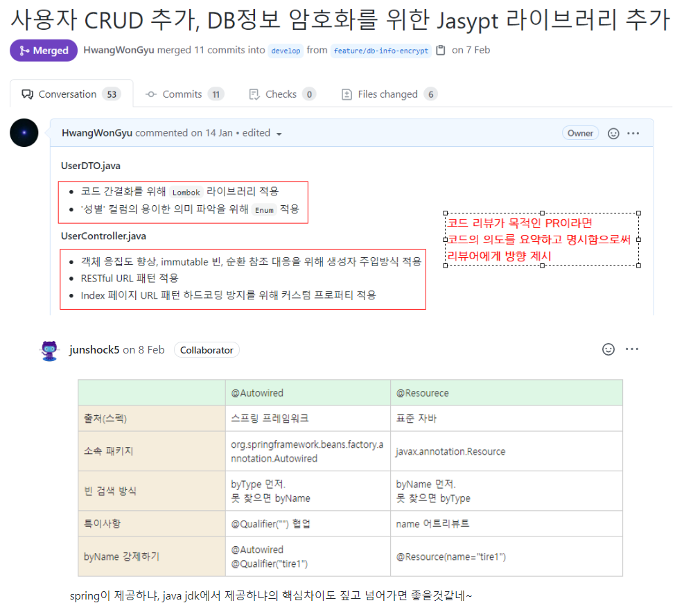
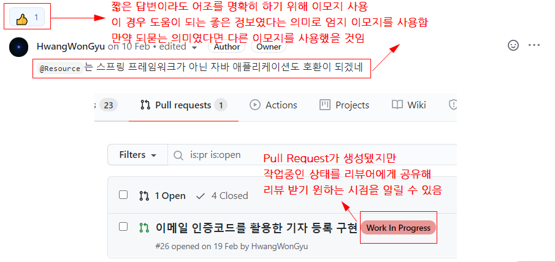

# 1. GIT 컨벤션이란?

- git 저장소에서 커밋 메시지를 작성할 때 따르는 규칙과 규약의 모음
- 가장 흔히 쓰이는 커밋 메시지 스타일 유다시티의 스타일
    - 유다시티는 대규모 온라인 코스를 제공하는 교육기관
- 유다시티는 이상적인 커밋 메시지에 대해 혼란을 겪는 학생들을 위해서 Git Commit Message Style Guide를 제공
    - 링크 : [유다시티_깃허브](https://udacity.github.io/git-styleguide/)

# 2. COMMIT 컨벤션

- 구조 :

```sql
type: Subject

body

footer
```

- 타입 (type)
    - 유다시티에서는 `타입을 다음 7개중 하나로 쓸 것을 권장`
    - `feat` : 새로운 기능과 관련된 것을 의미
    - `fix` : 오류와 같은 것을 수정했을 때 사용
    - `docs` : 문서와 관련하여 수정한 부분이 있을 때 사용
    - `style` : 코드의 변화와 관련없는 포맷이나 세미콜론을 놓친 것과 같은 부분들을 의미
    - `refactor` : 코드의 리팩토링을 의미
    - `test` : test를 추가하거나 수정했을 때를 의미
    - `chore` : build와 관련된 부분, 패키지 매니저 설정 등 여러가지 production code와 무관한 부분 들을 의미
- 제목 (subject)
    - `대문자로 시작하는 명령형 문장`
    - 50자를 넘지 않도록 주의
    - "commit이 무엇을 했는지" 대신 "commit이 무엇을 하는지"를 명령어 형태로 설명. 예를 들어, "changed"가 아닌 "change"를 사용
- 본문 (body)
    - 와 마찬가지로 명령형과 현재 시제를 사용
    - `무엇을, 왜 와 같은 설명`들을 작성
    - 72자가 넘어가면 문단을 나누는 것을 권장
- 꼬리 (footer)
    - 다른 구성 요소에 영향을 미칠 수 있는 변경 사항의 경우, 꼬리말에 구체적인 변경 사항과 함께 타당한 이유를 기재
    - 종료된 이슈는 Closes #123과 같은 형태로 별도의 줄에 나열합니다.
    - `어떤 이슈와 관련된 부분인지, 참고할 다른 이슈는 어떤 것이 있는지 작성`
- 예시
    - 아래는 유다시티에서 제공하는 예시
    
    ```sql
    feat: Summarize changes in around 50 characters or less
    
    More detailed explanatory text, if necessary. Wrap it to about 72
    characters or so. In some contexts, the first line is treated as the
    subject of the commit and the rest of the text as the body. The
    blank line separating the summary from the body is critical (unless
    you omit the body entirely); various tools like `log`, `shortlog`
    and `rebase` can get confused if you run the two together.
    
    Explain the problem that this commit is solving. Focus on why you
    are making this change as opposed to how (the code explains that).
    Are there side effects or other unintuitive consequences of this
    change? Here's the place to explain them.
    
    Further paragraphs come after blank lines.
    
     - Bullet points are okay, too
    
     - Typically a hyphen or asterisk is used for the bullet, preceded
       by a single space, with blank lines in between, but conventions
       vary here
    
    If you use an issue tracker, put references to them at the bottom,
    like this:
    
    Resolves: #123
    See also: #456, #789
    ```
    

# 3. PULL REQUEST 컨벤션

- COMMIT 컨벤션과 같이, PULL REQUEST 메시지도 일정한 규칙에 의해 적자고 함.
- 필요한 이유?
    - PR의 description 형식을 표준화 할 수 있음
    - 잘 작성한 PR 은 리뷰어로 하여금 코드 이해를 돕고 시간을 절약 할 수 있음
    - PR을 요청한 개발자 역시 PR template을 작성하면서 한번 더 코드를 체크 할 수 있
- 가이드 라인
    - [깃허브 공식 블로그](https://github.blog/2015-01-21-how-to-write-the-perfect-pull-request/)
- 컨벤션 내용
    - PR의 목적을 한문장으로 요약하기
    - PR을 생성하게된 맥락이 있는데 이를 리뷰어가 알아야 한다면 함께 명시
    - 피드백 받기를 원하는 시점을 명시
    - 요청한 PR이 작업중이라면 리뷰어들이 알 수 있도록 '작업중' 혹은 'WIP(Work In Progress)' 라고 기재
    - 원하는 피드백의 방향과 내용을 리뷰어가 알 수 있도록 명시

## 3.1 PULL REQUEST 컨벤션 예시

- 출처 : [PR컨벤션예시](https://beststar-1.tistory.com/12)



