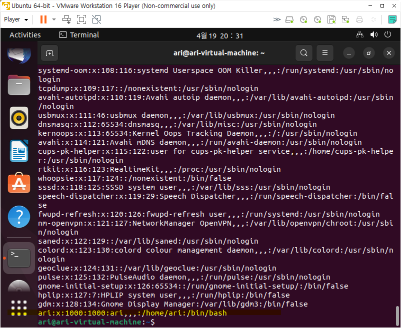
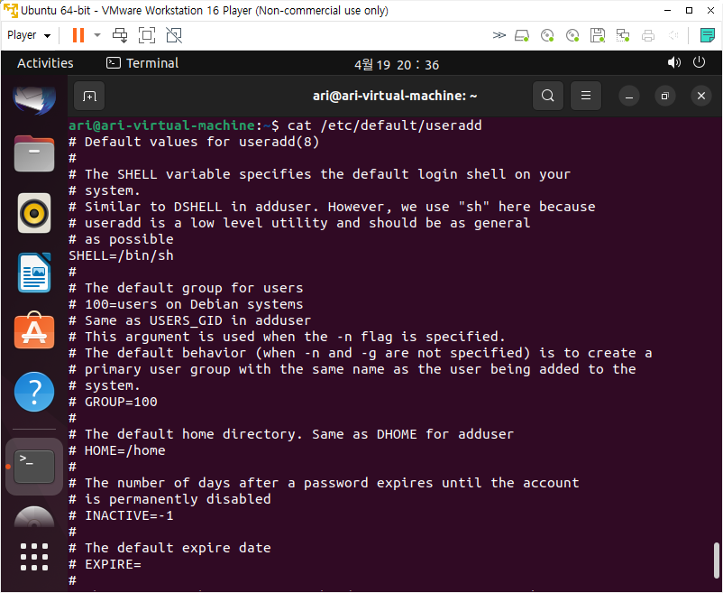
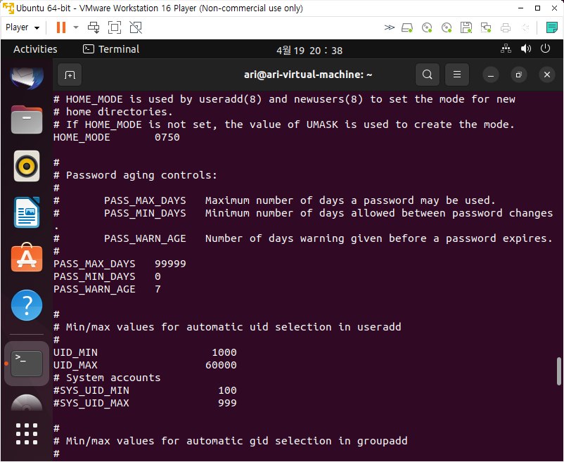
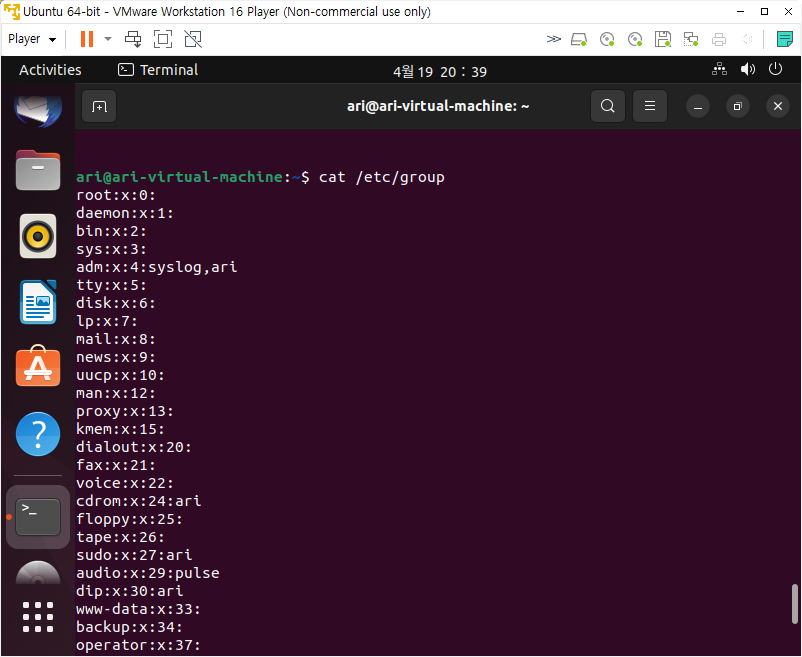
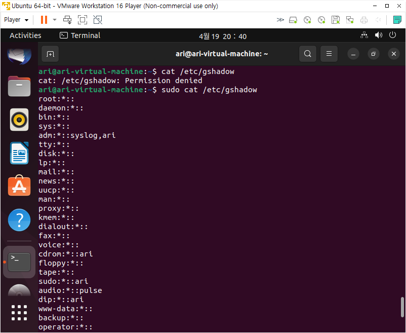

# 1. 사용자 계정 환경 설정 파일

정의 : 사용자 계정과 그룹 정보는 /etc디렉터리 이하에 존재한다.

| 구분 | 파일명 | 설명 |
| --- | --- | --- |
| 계정 및 그룹 설정파일 | /etc/passwd | 사용자 계정의 아이디, 그룹정보 등 계정정보 |
|  | /etc/shadow | 암호화된 패스워드 및 정책 설정 정보 |
|  | /etc/group | 사용자 그룹의 기본 정보 |
|  | /etc/gshadow | 사용자 그룹의 암호화된 패스워드 정보 |
| 계정 환경설정 파일 | /etc/default/useradd | useradd명령을 사용할 때 기본 사용자 부가정보 |
|  | /etc/login.defs | 로그인 수행 시 기본 설정 |
|  | /etc/skel | 홈 디렉터리 생성 시 기본으로 제공할 파일 |

# 2. **환경 설정 파일 종류**

## 2.1 **/etc/passwd**

- 로그인시 필요한 UID, GID, 홈디렉터리, 셸 등의 사용자 `계정 정보`를 포함.
- 모든 사용자에게 읽기 권한 가진 파일
- 루트 사용자만 쓰기 허용



→ 마지막 줄은 수업 시간에 만든 나의 계정

```sql
$ cat /etc/passwd
 userid:x:14:50:FTP This is test User:/var/userid:/sbin/nologin
 [사용자명]:[비밀번호]:[UID]:[GID] [사용자설명]:[홈디렉토리]:[쉘경로]

# 사용자 명 : 로그인 할때 사용하는 사용자이름
# 비밀번호 : x는 암호화된 패스워드를 보관하고있다는 의미
# UID : 사용자 번호
# GID : /etc/group 파일에 보관된 주 그룹 ID번호
# 사용자 설명 : 사용자에대한 추가설명 코멘트 필드
# 홈 디렉터리 : 기본디렉터리로 절대경로로 설정
# 셸 : 셸의 위치를 절대 경로로 지정.
```

## 2.2 **/etc/shadow**

- 사용자 패스워드를 해시 알고리즘으로 암호화한 값과 `패스워드와 연관된 여러 속성`을 단고있는 파일
- /etc/passwd 파일은 각 사용자들에 대한 암호 정보를 담고 있음.


→ `/etc/shadow`는 시스템의 중요한 보안 파일 중 하나로, 일반 사용자는 읽거나 쓸 수 없음

```sql
$ cat /etc/shadow
 francis: $fislf2R$R45trhertsdfs:18119:0:99999:7:  :  :
 [사용자명]:[패스워드]:[마지막 변경일]: [패스워드] [최소사용일]:[최대사용일]:[만료경고일]:[유예기간]:[만료일]
```

## 2.3 **/etc/default/useradd**



- 사용자 생성 시 사용되는 기본 설정값이 저장된 환경 설정 파일
- useradd -D 로 내용 확인 가능.

## 2.4 **/etc/login.defs**



- 쉐도우 패스워드 스위트를 위한 읽기 전용 환경 설정 파일
    - 패스워드 최대 사용일 : PASS_MAX_DAYS
    - 패스워드 최소 사용일 : PASS_MIN_DAYS
    - 패스워드 만료 경고일 : PASS_WARN_AGE

## 2.5 **/etc/group**

- `그룹에 속한 사용자를 관리`하는 파일.
- 그룹에 여러 사용자가 속할 수 있음.



```sql
$ cat /etc/group | grep mail
 mail:x:12:mail,postfix
 [그룹명]:[패스워드]:[GID]:[멤버목록]
```

## 2.6 **/etc/gshadow**



- `그룹의 암호화된 비밀번호` 정보를 포함.
- 루트 권한 사용자만 접근 가능

```sql
$ cat /etc/gshadow
 test:$65$ssafhasrjkg/sasldfjsadkf:test:francis
 [그룹명]:[패스워드]:[그룹관리자]:[멤버목록]
```