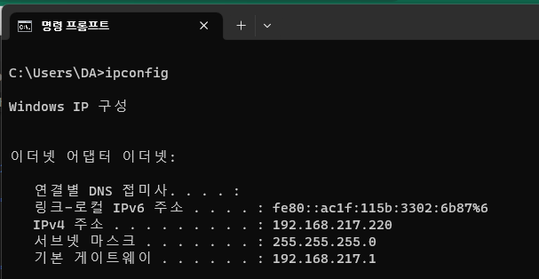

# 1. **IP란?**

다른 네트워크에 있는 목적지로 데이터를 보내기 위해서는 네트웨크 계층의 기술이 필요하다. 그 중에서도 데이터를 다른 네트워크로 보내기 위해서는 **라우터**가 필요하다. 라우터는 데이터의 목적지까기 어떤 경로로 가는 것이 좋은지를 알려준다.

하지만 우편물을 보낼때 받는 곳의 주소를 모르면 우편물을 보낼 수 없는 것처럼, 라우터에서도 목적지 주소를 알아야 한다.바로 이게 **IP(Internet Protocol)**이다.

우리가 컴퓨터에서 다른 곳으로 데이터를 보낼 때에는 캡슐화를 시켜서 보낸다. 즉 쉽게 말하면 보다 더 정확히 보내기 위해 우편물에다가 추가로 정보를 더 붙여서 보내는데,IP에서는 이걸 **IP헤더**라고 부른다. 여기에는 여~러 정보들이 있지만 중요한 것은 **출발지의 IP주소, 도착자의 IP주소**가 포함되어 있다.

# 2. **IPv4와 IPv6**

**IPv4**와 **IPv6**가 있다는 말은 들어본 적 있을 것이다. 지금 우리가 익숙하게 쓰고 있는 건 IPv4인데 43억개의 주소로는 부족해지다 보니 IPv6가 생겨났다.사물인터넷, 자율주행자동차, 스마트폰 등등 다른 기기와 데이터를 주고받을 일이 많이 생겨나기 때문에 아이피 주소를 할당해야 할 일이 많아졌다.새로 등장한 IPv6로 이제는 IP주소가 우주의 별보다 더 많아졌기 때문에 걱정할 일은 없어졌다.

# 3. **네트워크 주소와 브로드캐스트 주소**

IP주소에는 **네트워크 주소**와 **브로드캐스트 주소**가 있다. 이 두 개는 컴퓨터가 자신의 IP로 설정하면 안되는 주소이다.

**네트워크 주소는 10진수로는 0, 2진수를 00000000인주소,브로드 캐스트 주소는 10주소는 255, 2진수로 11111111인 주소를 말한다.**

예를 들어 사설IP의 192.168.1.0은 네트워크 주소이고 192.168.1.255는 브로드캐스트 주소이다.

그렇다면 용도는 뭘까? **네트워크 주소**는 작은 네트워크를 식별하는데 사용된다. **즉 192.168.1.0은 그 네트워크 전체를 대표한다.브로드캐스트 주소**는 이름에서부터 알 수 있듯이 여기로 데이터를 보내면 해당 네트워크에 있는 모든 컴퓨터로 송신된다. 따라서 이 두 개의 IP는 사용할 수 없다.

# 4. **IP주소의 클래스 구조**

우리가 지금 사용하고 있는 IP주소는 대개는, 사설IP를 받아서 사용한다. 공인IP는 이미 고갈 상태이기 때문에 위에서 말한 라우터에만 IP를 할당한다.

그리고 위에서 말한 라우터의 DHCP기능을 사용하여 주소를 자동으로 할당해주고 있다.

사설IP 할당 IPv4의 IP주소는 32비트이다. 또 이는 **네트워크 ID**와 **호스트 ID**로 나뉘어 있다. 네트워크ID란 ‘어떤 네트워크’인지를 나타내고 호스트 ID는 ‘해당 네트워크의 어느 컴퓨터’인지를 나타낸다. 클래스는 5개로 나뉘어져 있다. 목적에 따라서 5개 정도로 나뉘며 일반인들은 보통 A~C클래스를 사용할 수 있다.

그리고 일반적인 A~C클래스를 기준으로 설명하면 각각 8, 16, 24비트로 네트워크와 호스트 ID가 나뉘어진다.

그리고 아래와 같이 공인 IP와 사설IP 주소를 정리해 보았다. 사설IP는 공인IP로 절대 사용할 수 없음을 알아두자.

그럼 실제 활용으로 현재 내 위치의 IP주소는 어떤 클래스일까 알아볼 수 있다.

네이버에 ‘내ip확인’이라고 치면 나온다.

그리고 cmd창에 ipconfig라고 쳐도 나의 ip를 확인할 수 있다.

이 두 ip가 다른 이유는 cmd창에 ipconfig라고 쳤을 때 나오는 ip는 외부IP, 즉 공인 주소가 아니라 로컬 네트워크상에서 배당한 주소, 즉 내 공유기를 거쳐 ‘내부에서만’ 사용되는 IP 주소이다.