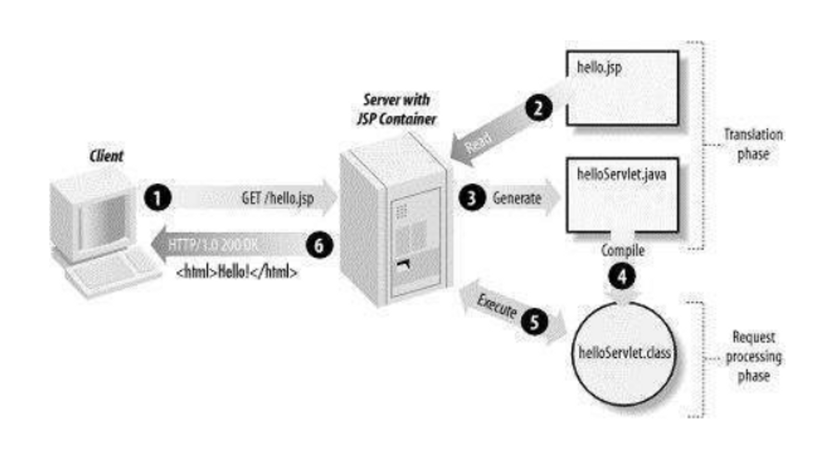

## JSP란?

- JavaServer Page의 약자로 HTML에 Java코드를 넣어 동적 웹페이지를 생성하는 웹 어플리케이션 도구이다.
- JSP가 실행되면 자바 서블릿(Servlet)으로 변환되며 웹 어플리 케이션서버에서 동작되면서 필요한 기능을 수행하게 된다.
    
    > 자바 서블릿 (Java Servlet) :
    > 
    > 
    > 웹 페이지를 동적으로 생성하기 위한 서버 측 프로그램을 말한다.
    > 
    > 이는 Java 언어를 기반으로 만들어지며 웹 어플리케이션 서버 ( Web Application Server ) 위에서 컴파일 되고 동작한다.
    > 

### JSP의 동작 과정



1) 클라이언트가 hello.jsp를 요청

2) JSP 컨테이너가 요청받은 hello.jsp 파일을 읽는다.

3) JSP 컨테이너가 변환(Generate) 작업을 통해 Servlet(.java) 파일 생성한다. (이 작업은 WAS가 한다.)

4) .java 파일을 컴파일해서 .class 파일을 생성한다.

5) 실행(Execute)을 통해 HTML 파일을 생성하여 JSP 컨테이너에게 전달한다.

6) JSP는 HTTP 프로토콜을 통해 HTML 페이지를 클라이언트에게 전달한다.

> WAS : 웹 어플리케이션 서버 (Web Application Server)
> 

### JSP의 특징

- 스크립트 언어이기 때문에 자바 기능을 그대로 사용할 수 있다.
- Tomcat(WAS)이 이미 만들어놓은 객체(predefined values)를 사용한다.
    - 미리 정의된 객체란? WAS가 제공하는 객체를 의미한다.
        - request: the HttpServletRequest Object
        - response: the HttpServletResponse Object
        - session: the HttpSession Object
        - out: the PrintWriter Object
        - application: the ServletContext Object
- 사용자 정의 태그(custom tags)를 사용하여, 보다 효율적으로 웹 사이트를 구성할 수 있다.
    - JSTL(JSP Standard Tag Library, JSP 표준 태그 라이브러리)사용
    - 아래 설명
- HTML 코드 안에 Java 코드가 있기 때문에 HTML 코드를 작성하기 쉽다.
- Servlet과 다르게 JSP는 수정된 경우 재배포할 필요 없이 Tomcat(WAS)이 알아서 처리해준다.

### JSP 문법

```
<%@    %> # 지시자 : JSP 페이지의 속성을 지정함
<%-- --%> # 주석
<%!    %> # 선언 : 변수와 메소드 선언
<%=    %> # 표현식 : 계산식이나 함수를 호출한 결과를 문자열 형태로 출력
<%     %> # 스크립트릿 : 자바코드 기술
```

### JSTL이란?

- 많은 JSP 애플리케이션의 공통적인 핵심 기능을 캡슐화하는 유용한 JSP 태그 모음(JSP 표준 태그 라이브러리)
    - 즉, JSP 페이지를 작성할 때 유용하게 사용할 수 있는 여러 가지 action과 함수가 포함된 라이브러리
    - 가장 많이 사용하는 태그 확장 라이브러리
    - 자신만의 Custom Tag를 추가할 수 있는 기능을 제공한다.
- 사용하는 이유?
- JSP에 Java Code가 들어가는 것을 막기 위해서 사용한다.
- 즉, Java Code(JSP Scriptlet)대신 Tag를 사용하여 프로그래밍할 수 있도록 하기 위해 도입되었다.

### 예시

1. JSP Scriptlet 태그 이용

```html
<html>
<head>
<title>Count to 10 in JSP scriptlet</title>
</head>
<body>
	<%
		for(int i=1;i<=10;i++){
	%>
	<%=i%><br/>
	<%
		}
	%>
</body>
</html>
```

1. JSTL(JSP Standard Tag Library) 이용

```html
<%@ taglib uri="http://java.sun.com/jsp/jstl/core" prefix="c"%>
<html>
<head>
<title>Count to 10 Example (using JSTL)</title>
</head>
<body>
   <c:forEach var="i" begin="1" end="10" step="1">
      <c:out value="${i}"/>
      <br/>
   </c:forEach>
</body>
</html>
```