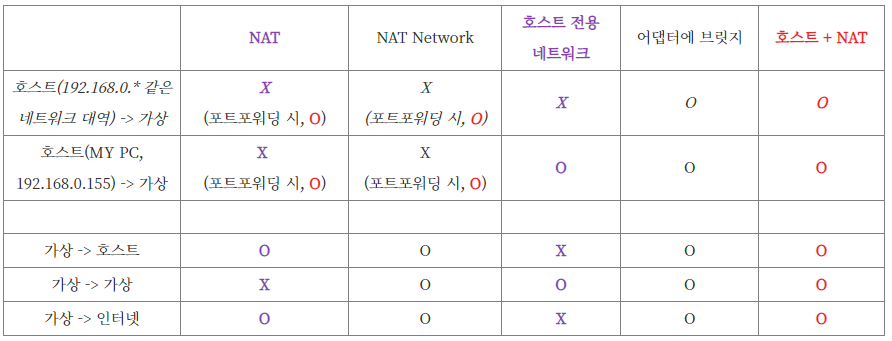
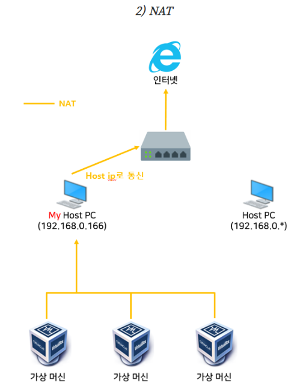
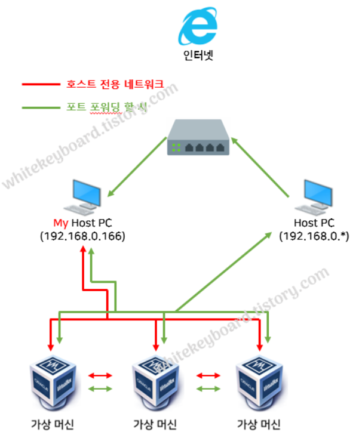

# 1. NAT + 호스트전용네트워크 사용 이유

어댑터에 브리지해서 내 호스트 PC와 동일한 IP 수준을 부여해서 쓰면 가장 쉽고 간편하다. 하지만 현실에서 테스트하다 보면 IP를 20개 정도 써야할 때가 있다.

이러한 소중한 IP자원을 아끼기 위해서는 **"NAT"**와 **"호스트 전용 네트워크"**를 써서 **"어댑터에 브릿지"**와 동일한 수준을 구현하여 사용한다.

# 2. NAT

: 가상 머신에서 인터넷 접속이 가능한 형태인데, My Host PC의 ip를 빌려 인터넷에 접속하는 구조이다.

# 3. 호스트전용네트워크

: 기본 세팅값으로는 외부(Host PC 레벨)에서는 접속이 안되지만 포트포워딩을 설정해준다면 가능한 구조이다.

