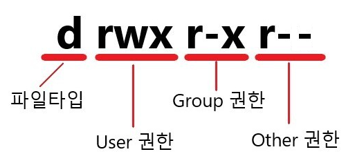
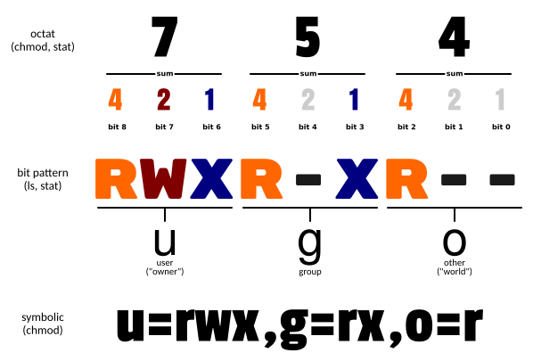
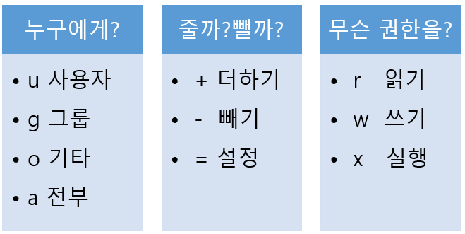

# 1. 허가권이란?

각 파일에 접근해서 **읽거나 쓰거나 실행할 권리**를 **사용자 / 그룹 / 다른사용자** 로 나눠서 관리한다.

- user: 파일을 만든(생성) 소유주
- group: 파일을 만든 소유주가 속한 그룹의 사용자
- other: 기타 사용자

| 문자값 | 파일 | 디렉토리 |
| --- | --- | --- |
| r(4) | 파일에 대한 읽기 권한. 열기, 읽기 허용 | 디렉토리 내의 파일을 나열할 수 있게 허용 |
| w(2) | 파일에 대한 쓰기 권한. 쓰기, 잘라내기 허용이름 변경이나 파일 삭제 허용하지 않음.파일 삭제나 파일 이름 변경은 디렉토리 속성에 의해 결정됨 | 디렉토리 내의 파일들을 생성, 삭제, 이름변경이 가능하도록 허용 |
| x(1) | 파일에 대한 실행 권한파일이 프로그램으로 처리되고 파일이 실행되도록 허용스크립트 언어에서 작성된 프로그램 파일들은 읽기 가능으로 설정 되어 있어야만 실행 가능함 | 디렉토리 내에서 탐색을 위해 이동 할 수 있도록 허용 (디렉토리에 들어 올 수 있도록 허용) |
|  - |  r, w, x에 대한 권한이 없음을 표시 (문자 자리를 -로 대체) |  r, w, x에 대한 권한이 없음을 표시 (문자 자리를 -로 대체) |

> 참고 : 디렉토리는 실행권한 x를 꼭 가지고 있어야 해당 디렉토리로 이동 할 수 있다.
> 



첫번째 **rwx** 의 의미는 **파일소유자**에게 **읽기, 쓰기, 실행 권한**이 모두 있다는 뜻이며

두번째 **r-x** 의 의미는 **파일소유그룹**에게 **읽기, 실행 권한**이 있다는 뜻이며

마지막 **r--** 는 파일 소유자와 소유그룹 **외**에는 **읽기 권한**만 있다는 뜻이다.

# 2. 허가권 변경 ****$ chmod [퍼미션 숫자]****



| 모드 | 설명 |
| --- | --- |
| 8진수 숫자 | 읽기 4
쓰기 2
실행 1
권한을 주지않으려면 0
(읽기 및 쓰기 4+2=6)

3번째 자리는 다른 사용자 허가권
2번째 자리는 그룹 허가권
1번째 자리는 사용자 허가권
(755라면 사용자 허가권은 읽기, 쓰기, 실행 권한을 모두 갖고 그룹과 다른사용자 허가권은 읽기,실행 권한을 가짐.) |

> 예를 들어 '777'의 경우
> 
> 
> 이진수로 111111111이고 rwxrwxrwx라는 의미를 가지므로 **파일 소유자, 소유 그룹, 일반 사용자**에게 **읽기, 쓰기, 실행**의 모든 권한을 주는 설정이다.
> 

```sql
# 사용자는 읽기,쓰기(4+2) 권한 부여하고, 
# 그룹과 다른사용자는 읽기(4) 권한만 부여
$ chmod 644 myfile.txt

# 권한 전부 주기
$ chmod 777 test.txt
```

# 3. ****허가권 변경 $ chmod [기호 문자]****



| 모드 | 설명 |
| --- | --- |
| 기호 | 읽기 r
쓰기 w
실행 x

권한 추가 +
권한 삭제 -
권한 지정 =

사용자 허가권 u
그룹 허가권 g
다른사용자 허가권 o 
모두 a |

```sql
# 파일에 대하여 사용자(u)에 읽기 및 쓰기(rw)권한으로 초기화(=)
$ chmod u=rw myfile.txt

# 파일에 모두(a)에게 읽기,쓰기(rw) 권한으로 초기화(=)
$ chmod a=rw file.txt

# test.txt 의 소유자(u)에게 읽기(r) , 쓰기(w) 권한을 추가 부여(+)
$ chmod u+rw test.txt

# test.txt 의 소유그룹(g)에게 쓰기(w) 권한을 제거(-)
$ chmod g-w test.txt

# 그외 계정에게 모든 권한을 제거(-)
# rwx의 순서는 변경하여도 무방하다. o-rwx = o-wxr
$ chmod o-wxr test.txt
```

# 3. ****허가권 변경 $ chmod 옵션****

| -R, --recursive | 특정 디렉터리 내의 파일과 디렉터리에 대해 재귀적으로 허가권 변경 |
| --- | --- |
| -C, --changes | 변경된 파일이나 디렉터리에 대한 자세한 정보를 출력 |
| -f , --silent, --quite | 대부분의 에러메시지 출력을 제한 |
| --reference | 모드 대신 파일에 지정한 모드를 사용  |

```sql
# 디렉터리 이하의 모든 파일과 디렉터리에 대해 (-R)
# 사용자는 읽기, 쓰기, 실행(4+2+1) 권한을 부여하고 ,
# 그룹과 다른 사용자는 읽기 및 실행(4+1) 권한 부여
$ chmod -R 755 myfiles
```

> 디렉토리의 허가권이 파일보다 우선되는 것은 알고 넘어가자
> 
> 
> 즉, 어떤 계정이 파일에 허가권이 있지만 그 파일을 담고 있는 디렉토리에 허가권이 없다면 **사용불가**한 셈이다.
> 
> 또한 임의 파일에 실행권한 x 를 부여 하였어도 실제로 실행가능 한 형태가 아니라면 오류가 발생 하다.
> 
> x 권한이 있는 파일을 실행하려면  ./ 을 앞에 붙인다. (예로 ./exefile 라고 입력)
>