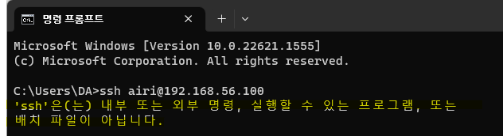
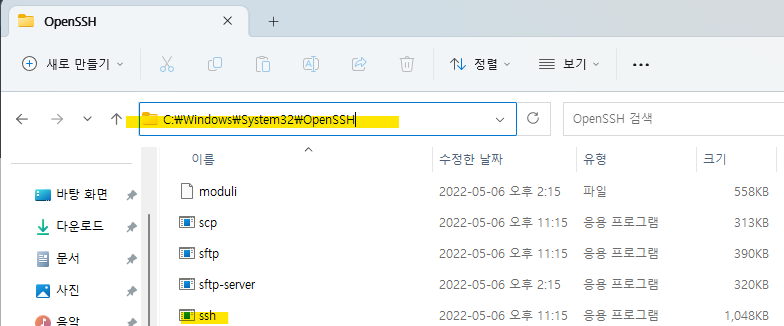
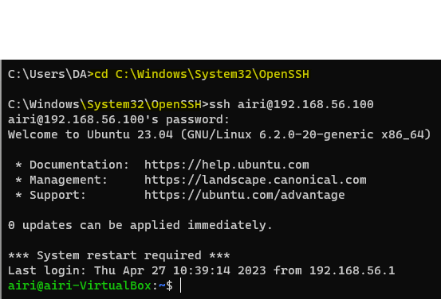
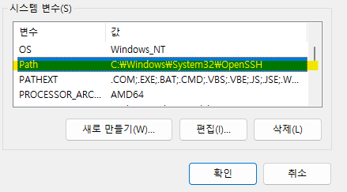
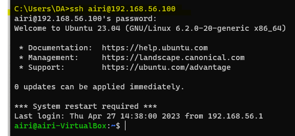
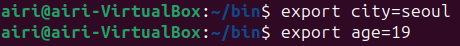
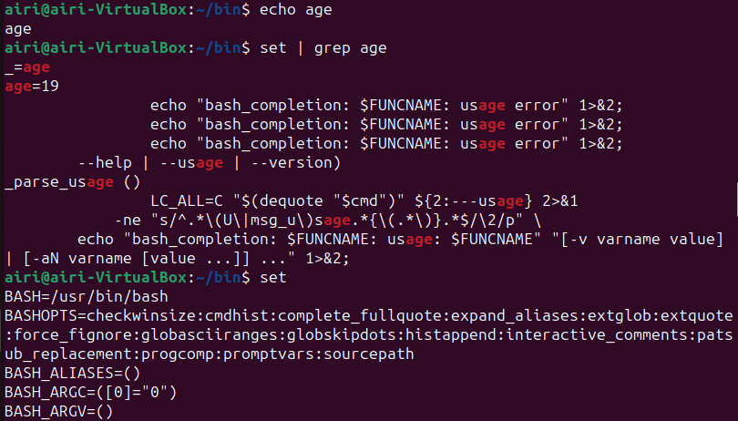
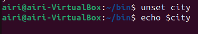

# 1. 환경변수란?

: 프로세스가 컴퓨터에서 동작하는 방식에 영향을 미치는, 동적인 값들의 모임

# 2. 환경 변수를 사용해야하는 이유?

: 경로에 상관없이 프로그램이나 라이브러리에 대한 실행 명령어를 구동시키기 위해서는 환경변수 설정이 필요하다.

만약에 자주 사용하는 특정 프로그램이나 명령어가 있다고 했을 때, 환경변수를 설정하지 않으면 `해당 프로그램이나 명령어가 위치하고 있는 경로까지 매번 직접 이동`해서 실행해줘야 하는 수고를 해야하기 때문에 시간을 절약하고 노동을 최소화하기 위해 환경변수를 설정한다.

# 3. 위에서 말하는 수고를 직접 해보자! (Window.ver)



→ 수업시간에 처음에 ssh를 실행하려니까 저런 오류문이 떴었다



→ 그래서 찾아보니 해당 디렉토리에 있었다



→ 위에서 말한 것과 같이 `해당 프로그램이나 명령어가 위치하고 있는 경로까지 매번 직접 이동` 하면 쓸 수 있는 상태였다



→ 그래서 윈도우 시스템 변수에 해당 경로를 추가해주었고,



→ 그 이후에는 경로 이동 없이 바로 ssh 명령어를 사용할 수 있었다

# 4. Shell 환경변수 관련 명령어 정

### 4.1 변수 선언

```sql
export city=seoul
export age=19
```



### 4.2 변수 확인

```sql
echo $(varname)
set | grep (varname)
set //shell에 저장된 모든 변수가 다 나오기 때문에 찾기 힘드므로 grep 명령어 사용 권
```



### 4.3 변수 제거

```sql
unset (varname)
```



### 4.4 주요 환경변수

| PATH | 명령어 탐색 경로 |
| --- | --- |
| HOME | 홈 디렉토리 경로, cd 명령 실행 시 적용 |
| USER | 로그인 사용자 이름 |
| SHELL | 로그인 Shell 이름 |