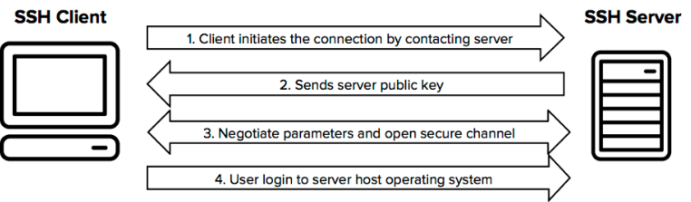

## 1. SSH이란? (What is SSH?)

시큐어 셀(Secure SHell, SSH)은 네트워크 상의 다른 컴퓨터에 로그인하거나 원격 시스템에서 명령을 실행하고 다른 시스템으로 파일을 복사할 수 있도록 해주는 응용 프로그램 또는 그 프로토콜을 가리킨다. 즉, 네트워크 프로토콜 중 하나로 컴퓨터와 컴퓨터가 인터넷과 같은 Public Network를 통해서 서로 통신을 할 때 보안적으로 안전하게 통신을 하기 위해 사용하는 프로토콜이다.

## 2. 대표적인 사용 :

1. 데이터 전송
2. 원격 제어

## 3. 데이터 전송의 예 :

- 깃 허브
- 원격 저장소, 소스 코드를 원격 저장소인 깃헙에 푸쉬할 때 SSH를 활용해 파일을 전송하게 된다.

## 4. 원격 제어의 예 :

- AWS와 같은 클라우드 서비스는 인스턴스 서버에 접속하여 해당 머신에 명령을 내리기 위해서 SSH을 통한 접속을 해야한다.

## 5. 사용이유 :

- 보안때문에 FTP나 Telnet과 같은 다른 컴퓨터 통신을 사용하지 않는다.
- SSH는 보안적으로 훨씬 안전한 채널을 구성한 뒤 정보를 교환하기 때문에 보다 보안적인 면에서 뛰어나다.

## 6. 어떤 방식으로 서로 다른 컴퓨터가 안전하게 통신하게 하는가?



- ***Public Key and Private Key :***
    - SSH는 다른 컴퓨터와 통신할 때 일반적으로 사용하는 비밀번호 입력을 통한 접속을 하지 않는다.
    - 기본적으로 SSH는 한 쌍의 Key를 통해 접속하려는 컴퓨터와 인증 과정을 거친다.
    - 이 한 쌍의 Key는 다음과 같다.
- ***Public Key :***
    - 단어 뜻 그대로 공개되어도 비교적 안전한 Key.
    - 이 키를 통해 메세지를 전송하기 전 암호화를 한다.
    - 암호화는 가능하지만 복호화는 불가능하다.
- ***Private Key :***
    - 절대로 외부에 노출되어서는 안되는 Key.
    - 본인의 컴퓨터 내부에 저장하게 되어있다.
    - 암호화된 메세지를 복호화 할 수 있다.

## 7. 사용 예시

1. ***원격 서버에 로그인하기***
다음 명령어를 사용하여 리눅스 서버에 SSH를 사용하여 로그인할 수 있다. (수업 시간의 실습 내용과 동일!)

```
cssCopy code
ssh username@server-ip-address
```

1. ***파일 복사***
SCP(Secure Copy)는 SSH 프로토콜을 기반으로하는 파일 전송 프로토콜이다. 원격 서버에 파일을 복사하려면 다음과 같이 SCP 명령을 사용할 수 있다.

```
luaCopy code
scp local-file-path remote-username@remote-ip-address:remote-file-path
```

1. ***원격 명령 실행***
원격 서버에 로그인 한 후 원격 명령을 실행할 수 있다. 예를 들어, 원격 서버의 파일 목록을 확인하려면 다음 명령어를 사용할 수 있다.

```
bashCopy code
ssh remote-username@remote-ip-address ls
```

위와 같은 방법으로, SSH는 안전한 원격 접속 및 명령 실행을 통해 서버 관리를 용이하게 해준다.