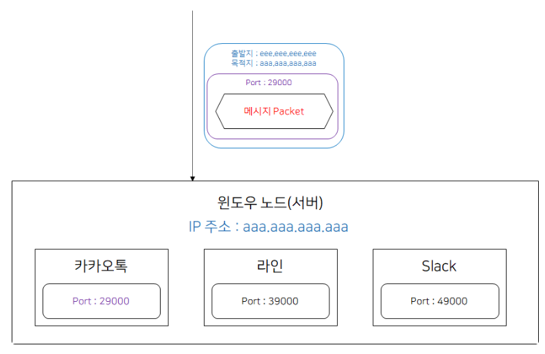
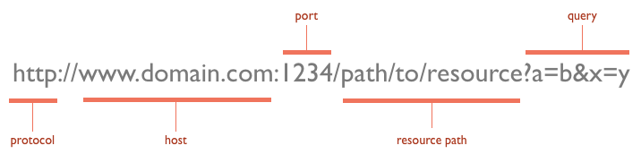

# 1. 포트란?

본래의 의미로 직역하면 '항구'라는 뜻으로, 컴퓨터 관련 분야에서의 의미로는 **운영 체제 통신에서의 종단점**을 뜻한다.

네트워크 상에서 통신을 할 때 IP를 토대로 해당 서버가 있는 컴퓨터에 접근한다.

그런데 대부분의 경우 하나의 컴퓨터에는 여러 개의 서버가 실행될 수 있다.

컴퓨터에 여러 개의 서버가 실행되고 있다면, 어느 서버에 접속해야 하는지 컴퓨터에게 알려주어야 한다.

예를 들어 컴퓨터에 **카카오톡, 라인, Slack 채팅서버 앱 메세지 프로세스가 여러개 실행 중**이라고 해보자.

컴퓨터가 메세지를 받았을 때 어떤 프로그램으로 해당 메세지를 전송해야 하는가?

만약 아무런 정보가 없다면 어떤 프로세스로 메세지를 보내야 하는지 알 수 없다. 이를 해결하기 위해 TCP에서는 패킷에 어떤 프로세스가 받아야 하는지에 대한 정보(Port 정보)를 추가하여 보낸다.

# 2. 포트번호

**포트 번호**는 컴퓨터에서 실행되고 있는 서버를 구분 짓기 위한 16비트의 논리적 할당으로 0~65536번이 존재한다.

IP내에서 프로세스 구분을 하기 위해서 사용한다.

예시로 내 컴퓨터의 주소가 123.456.789.000라고 치면,

자료를 받을 경우 & 채팅을 하는 경우 포트번호를 나누지 않으면 혼란이 생긴다.

**그래서 자료는 :1000 채팅은 :1001로 이렇게 구분을 해주는것**

👉**IP주소는 컴퓨터의 집주소, 포트는 집 안에서 각 프로세스가 위치한 방번호라고 생각하면될듯 하다**

이 중에 0~1023번까지는 이미 어떤 통신이 해당 포트를 사용할 것인지 정해져 있다.

예를 들어 http 통신은 80번 포트를 사용하고, ssh 통신은 22번 포트를 사용한다.

이렇게 정해져 있는 0~1023번까지의 포트를 **well-known port**라고 한다.

컴퓨터에 있는 **웹서버**는 기본적으로 **80번 포트**와 연결(listening)되어 있다.

만약 웹서버를 하나 더 사용하고 싶은 경우 80번 포트는 이미 기존 웹서버가 사용하고 있기 때문에 사용할 수 없다.

그런 경우 **well-known port가 아닌 다른 포트**들과 연결하여 사용한다.

보통 관습적으로 **8080 포트**에 연결하여 사용한다. (톰캣)

그런데 이런 경우 웹 통신이 들어왔을 때 80번과 8080번 포트 중에 어떤 포트와 통신할까?

정답은 **URL**에 **포트번호**를 적어서 통신할 포트를 구분한다.

예를 들어 http://test.com에 접속하면 **80포트**에 연결된다.

http://test.com:80에서 **80 포트는 생략이 가능**하기 때문에 생략된 것이다.

그렇다면 http://test.com:8080에 접속하면 어떻게 될까?

예상 가능하듯 **8080 포트**에 연결이 된다.

URL 구성을 살펴보면 맨 앞에는 http와 같은 통신 규약이 온다.

http, ftp 등등 어떠한 방법으로 통신을 할 것인지를 적는 것이다.

그다음 도메인이나 ip를 적고, 뒤에 **포트 번호**를 적는다.

# 3. 주요 포트 번호 종류

| 프로토콜 | 포트 | TCP/UDP | 포트 종류 | 용도 |
| --- | --- | --- | --- | --- |
| (사용되지 않음) | 0 | UDP | Well-known | 예약된 포트로서 사용 불가 |
| TCPMUX | 1 | TCP | Well-known | TCPMUX (TCP Port Service Multiplexer) |
| ECHO | 7 | TCP, UDP | Well-known | ECHO |
| DISCARD | 9 | TCP, UDP | Well-known | DISCARD |
| DAYTIME | 13 | TCP, UDP | Well-known | DAYTIME |
| FTP | 21 | TCP | Well-known | 파일 전송 프로토콜 (File Transfer Protocol) |
| SSH / SFTP / SCP | 22 | TCP | Well-known | SSH(Secure Shell) 보안 셸, 보안 파일 전송(SSH File Transfer Protocol) 등에 사용TELNET에 보안 가미된 통신이라 보면 된다. |
| TELNET | 23 | TCP | Well-known | 텔넷 텍스트 통신(암호화되지 않음)을 위한 프로토콜 |
| SMTP | 25 | TCP | Well-known | 이메일 전송을 위한 SMTP(Simple Mail Transfer Protocol) 프로토콜 |
| DNS | 53 | TCP, UDP | Well-known | DNS(Domain Name System)서버에서 사용되는 프로토콜 |
| TFTP | 69 | UDP | Well-known | 단순 파일 전송을 위한 프로토콜 (Trivial File Transfer Protocol) |
| HTTP | 80 | TCP, UDP | Well-known | www 통신에 대한 요청-응답 프로토콜 (HyperText Transfer Protocol) |
| Kerberos5 | 88 | TCP | Well-known | MIT 커버로스(Kerveros) 인증 에이전트 |
| POP3 | 110 | TCP | Well-known | 이메일 가져오기/보내기 프로토콜 (Post Office Protocol version 3) |
| NTP | 123 | UDP | Well-known | 인공위성 표준 시간 동기화 (Network Time Protocol) |
| IMAP4 | 143 | TCP | Well-known | 이메일 가져오기 프로토콜 (Internet Message Access Protocol version 4)메일 서버들이 쓰는 포트 |
| XDMCP | 177 | UDP | Well-known | 디스플레이 매니저 제어 프로토콜 (X Display Manager Control Protocol) |
| HTTPS | 443 | TCP | Well-known | 보안 강화 www 통신 프로토콜 (HyperText Transfer Protocol over Secure Socket Layer) |
| SMTPS | 465 (비공식) | TCP | Well-known | SSL이 적용된 SMTP 프로토콜 (비공식 프로토콜) |
| RLOGIN (login) | 513 | TCP | Well-known | RLOGIN 접속을 위해 사용되는 프로토콜 |
| syslog | 514 | UDP | Well-known | 시스템 로그 프로토콜 |
| LPD | 515 | TCP | Well-known | 프린트 프로세스 처리 (Line Printer Daemon protocol) |
| Submission | 587 | TCP | Well-known | Email message submission |
| Rsync | 873 | TCP | Well-known | 원격 서버 간의 파일 동기화 프로토콜 (Remote Sync) |
| POP3S | 995 | TCP | Well-known | pop3(110)의 보안 버젼 |
| MS-SQL | 1433 | TCP | Registered | Microsoft SQL Server에서 사용됨 |
| Oracle DB | 1521 | TCP | Registered | Oracle Database에서 사용됨 |
| MySQL | 3306 | TCP, UDP | Registered | MySQL에서 사용됨 |
| RDP | 3389 | TCP | Registered | 원격 제어 프로토콜 (Remote Desktop Protocol) |
| SVN | 3690 | TCP | Registered | 버전 관리 시스템인 서브버전(Subversion)에서 사용되는 프로토콜 |
| PostgreSQL | 5432 | TCP | Registered | PostgreSQL에서 사용됨 |

→ 이 밖의 자세한 포트 종류들은 리눅스 디렉토리 /etc/services에서 확인할 수 있다. 윈도우 포트도 똑같이 통용된다.