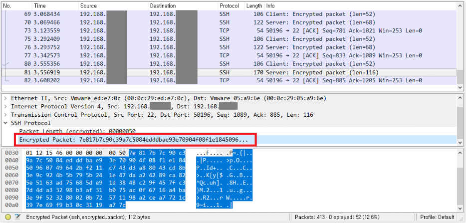

---
layout:home
---

# 원격 터미널 접속 **Telnet**과 **ssh** 차이

## 원격 터미널 접속
- 리눅스 서버를 구축한다면 터미널이나 그래픽 유저 인터페이스(GUI) 환경을 통해 여러가지 작업 가능
- 대부분의 리눅스 서버는 사내 서버로 한장소에 묶어두거나 클라우드 호스팅 등으로 이루어져있어 관리자와 멀리 어떨어져있음
-  원격 접속 프로그램을 사용하여 서버의 주소(IP 등)만 알고 있다면 다른 PC를 통해 접속 가능
-  원격 접속 프로토콜 Rlogin, Telnet, `SSH`

## Telnet
### 정의
- 인터넷 상에서 원격 호스트나 장치에 접속하기 위한 프로토콜 중 하나
- TCP/IP 프로토콜을 이용하여 작동

### 특징
- Telnet은 암호화되지 않은 평문 데이터를 전송하기 때문에, 해커가 이를 가로채서 중요한 정보를 탈취하는 위험이 있음
- 보안상의 이유로 사용에 제한

## SSH
### 정의
- Secure Shell로 보안을 중요시한 프로토콜.
- 최근에는 대부분 ssh를 사용

### 특징
- 데이터가 암호화되어 식별할 수 없는 내용으로 패킷을 보냄

<h>
<h>

## Telnet과 SSH 차이점
  
|패키지 시스템| Telnet과 | SSH|
|---|---|---|
|보안|암호화X. 평문데이터 전송|암호화O. 안전|
|인증|사용자이름과 암호|공개키 암호화|
|포트번호|23|22|
|기능|터미널 에뮬레이션과 명령어를 실행하는 기능만을 제공|파일 전송, 포트 전송, X11 전송 등 다양한 기능을 제공|
|호환성|대부분의 운영체제|window, Linux, macOS|
|성능|암호화 없어서 빠른 전송 속도|암호화하여 전송속도 느릴 수 있음|
### ※ `SSH`가 Telnet보다 더 안전하고 효율적인 원격 접속 방법!!

## WireShark 패킷 분석 프로그램을 통해 차이점 확인
### **Telnet**

<h>

### **SSH**

