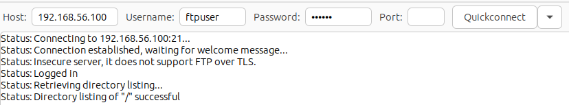
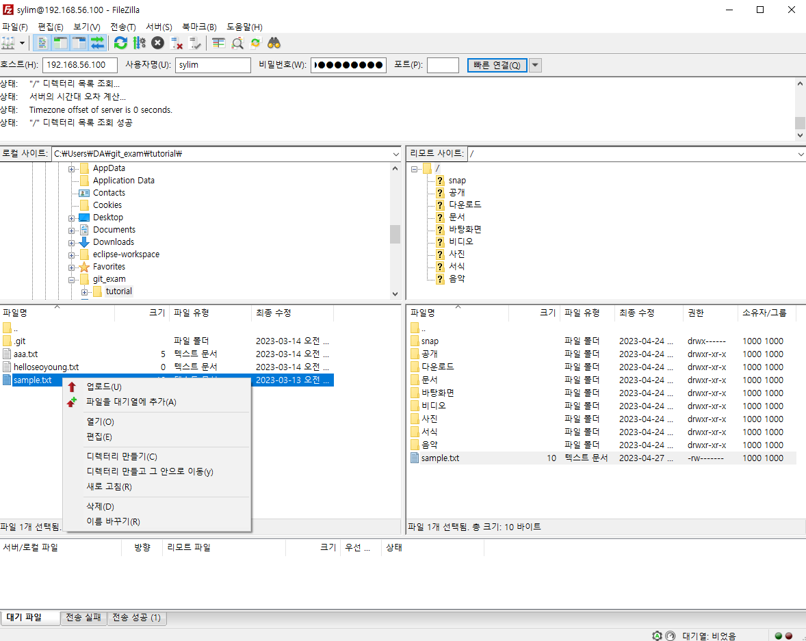
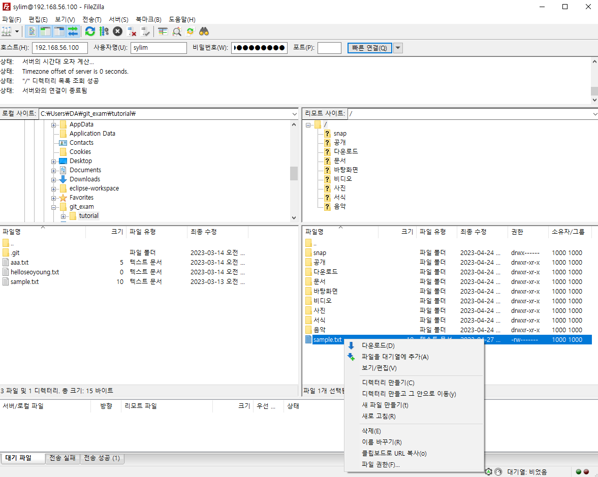

# FTP Client FileZilla

## FTP(File Transfer Protocol)
인터넷상에서 `파일 전송` 시 사용되는 프로토콜
- 인터넷 사용 시 주로 사용하는 WEB에서는 FTP를 사용하지 않지만 네트워크 공유 서버나 웹서버, 파일 서버 등에는 FTP를 통해 파일을 주고받음
- 파일 전송시에는 FTP 클라이언트 프로그램을 사용해야 FTP 서버에 접속이 가능
- FTP 클라이언트 프로그램중 무료이며 Windows 기반의 PC에서 손쉽게 사용 할 수 있는 것이 FileZilla

## FTP 클라이언트
FTP 서버에 연결하여 파일을 전송하거나 다운로드하는 데 사용되는 소프트웨어
- 사용자 인터페이스를 제공하며, 사용자가 FTP 서버에 로그인하고 파일을 전송하거나 다운로드하는 데 필요한 기능을 제공
- 대부분의 FTP 클라이언트는 `로컬 파일 시스템과 원격 FTP 서버 간에 파일 전송`을 가능
- 일부 FTP 클라이언트는 파일을 업로드하거나 다운로드하는 동안 파일 전송 진행률을 표시하고, 일부 클라이언트는 전송된 파일을 자동으로 압축 또는 암호화도 가능
- FTP 클라이언트 프로그램에는 FileZilla, WinSCP, Cyberduck 등이 있으며 무료 또는 유료로 제공되고 Windows, macOS 및 Linux 등 `다양한 운영체제`에서 작동

## FileZilla
FTP(파일 전송 프로토콜)와 FTPS(FTP의 보안 확장판), SFTP(SSH 파일 전송 프로토콜)를 지원하는 무료 오픈소스 크로스 플랫폼 소프트웨어
- 사용자 인터페이스가 직관적, 사용하기 쉬운 파일 전송 기능을 제공
- 웹 호스팅 서비스에서 파일을 관리하거나 원격 서버에서 작업을 수행할 수 있음
- 로컬 파일 시스템과 원격 FTP 서버 간에 파일 전송을 지원하며, 파일 전송 중에 전송 진행률을 모니터링 가능
- 파일 전송 중에 오류가 발생하면 자동으로 재시도하고, 전송 속도를 제한하거나 일시 중지할 수 있음. 또한 파일 전송 중에 중단되면 이어받기 기능을 사용하여 전송을 재개할 수 있음
- 기본적인 파일 관리 기능도 제공. (EX) 파일 및 폴더를 생성, 삭제, 이동 및 복사
- 무료로 제공되며, 소스 코드도 공개되어 있어 사용자가 프로그램을 수정할 수 있음
- Windows, macOS 및 Linux와 같은 여러 플랫폼에서 실행

## FileZilla 사용법
### 1. 서버 연결
호스트 : FTP 서버의 도메인 주소나 IP 정보   
사용자명 : FTP 서버의 계정 정보   
비밀번호 : FTP 서버 계정의 패스워드   
포트 : 포트번호   

   
  
### 2. 업로드
왼쪽 : 자신의 로컬 PC   
오른쪽 : FTP 서버   
 

### 3. 다운로드
  

FTP 클라이언트를 통해 다운로드/업로드 쉽게 가능
