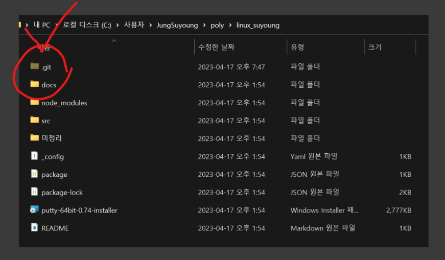
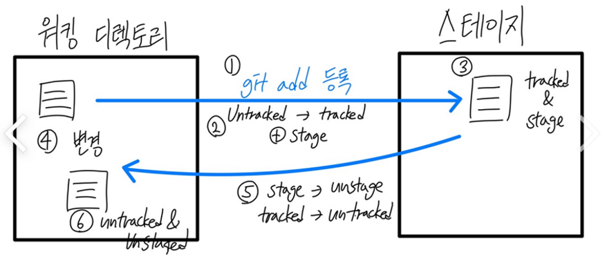

# Suyoung Report

# GIT & GITHUB

# GIT

## 깃이란?

분산형 버전 관리 시스템 중 하나로, **소스 코드의 변경 사항을 추적하고 저장하는 도구**

## 깃의 역할

소스 코드의 모든 **변경 사항 이력을 관리**

깃이 파일 변경 내역을 저장 관리하는데, 이는 깃 저장소를 통해서 한다. 

# 깃 저장소Repository와 깃 초기화

## 깃 저장소

### 깃 저장소란?

깃으로 관리되는 **파일들의 변경 이력**을 저장하는 공간

깃은 변경 이력을 저장할 때마다 **깃 객체를 생성**하고, 이 깃 객체를 **깃 저장소에 저장**한다. 

### 깃 저장소의 종류

**로컬 저장소**Local repository

개발자의 개발 환경에 있는 저장소

**원격 저장소**Remote repository

로컬 저장소와 동일한 깃 저장소를 인터넷 상의 다른 위치에 위치시킨 것

## 깃 초기화 : 오늘부터 linux_suyoung 폴더는 이 깃의 저장소임을 공식 발표하는 바이다.

 초기화 : git init <경로명> 

### 깃 초기화 정의

기존 폴더 → **깃 저장소로 변경**

경로명 생략 시 현재 폴더가 깃 저장소로 초기화

초기화 : 이미 존재하는 폴더에 깃 초기화 명령어를 실행, **기존 폴더를 vcs(version control system)로 관리할 수 있도록** 숨겨진 영역 (”.git”)을 생성하는 작업

linux_suyoung이라는 기존 폴더를 깃 저장소 (로컬저장소)로 설정을 하면, **내부의 파일 상태를 추적 관리하여 이력을 기록할 수 있게** 된다. 

깃은 이 깃 저장소를 이용해, **자체적으로 이력을 기록**  “ .git” 이라는 폴더에 **버전을 관리할 수 있는 시스템을 자체적으로 구축**한다. (” .git”폴더를 삭제하면 일반 linux_suyoung 폴더는 일반 폴더로 되돌아가고, 이미 기록된 버전의 이력도 같이 삭제됨)

# 워킹 디렉토리 working directory

## 정의

코드의 생성과 수정작업을 자유롭게 할 수 있는 상태 영역, 즉 **사용자(개발자) 작업 공간**. 실제 작업 중인 파일은 모두 워킹 디렉토리 안에 존재함. 

## 워킹 디렉토리 내에서 파일 수정, 추가하면 git이 자동으로 관리해주나요? (진짜 모름)

우리가 워킹 디렉토리 영역 안에서 파일을 추가, 수정했다고 깃이 자동으로 관리해주지 않음.

### 이유

워킹 디렉토리 안에서 생성(또는 수정된) 파일의 초기 상태는 **untracked 상태**이기 때문에, **git이 추적관리를 할 수 없음.** 

따라서 깃에게 추적관리 해달라고, **tracked 상태로 변경**해줘야함. 이 과정이 **<스테이지 영역에 등록>이라는 과정**임. (git add 명령어 사용하여 등록, 관리할 파일 목록에 등록”해줘”)

### 근데 왜 tracked, untracked으로 나눌까?

워킹 디렉토리(우리의 작업공간)에서 파일의 변경은 매우매우매우 자주 일어남 & 이력을 관리할 필요가 없는 파일과 작업이 존재함 → **커밋할 파일을 명확하게 구분**하고, **자원을 효율적**으로 사용하기 위해 구분함

# 스테이지

깃의 스테이지 영역

## 정의

**임시로 저장**하는 공간

워킹디렉토리 ↔ 저장소 둘 사이의 중간 영역에 위치하는 임시 영역

## 역할

컨텐츠의 **추적 상태 정보만 기록**

(워킹 디렉토리에서 등록 제출된 **tracked 상태의 파일들을 관리**, 실제 파일 내용을 직접적으로 가지고 있지는 않음)

워킹 디렉토리에서의 파일이 add 명령을 통해 “변경이력을 등록해라”라고 하면, 해당 파일은 untracked → tracked 상태로 변경 & stage상태가 됨. 

해당 파일이 워킹 디렉터리 내에서 변경이 되면 다시 untracked & unstage 상태가 됨. 

## 존재 이유

**커밋을 빠르게 처리하기 위해서 존재**

워킹 디렉토리에 추가된 파일과 수정된 내용을 스테이지에 등록, 이런 스테이지 등록은 최종 저장소에 기록되기 전 준비 단계

# 커밋 COMMIT

## 정의

**파일 변경 이력**을 저장하는 작업. 파일을 수정하거나 새로 추가한 후, 해당 변경 내용을 Git 저장소에 기록하는 것

# 머지 MERGE

# 푸쉬PUSH