# 폴리텍 광명융합원 정수영

# GIT & GITHUB 0418 발표

# GIT

## 깃이란?

분산형 버전 관리 시스템 (중 하나)

**소스 코드의 변경 사항을 추적하고 저장하는 도구**

## 깃의 역할

소스 코드의 모든 **변경 사항 이력을 관리**

깃이 파일 변경 내역을 저장 관리하는데, 이는 깃 저장소를 통해서 한다. 

# 깃 저장소Repository와 깃 초기화

## 깃 저장소

### 깃 저장소란?

깃으로 관리되는 **파일들의 변경 이력**을 저장하는 공간

깃은 변경 이력을 저장할 때마다 **깃 객체를 생성**하고, 이 깃 객체를 **깃 저장소에 저장**한다. 

### 깃 저장소의 종류

**로컬 저장소**Local repository

개발자의 개발 환경에 있는 저장소

**원격 저장소**Remote repository

로컬 저장소와 동일한 깃 저장소를 인터넷 상의 다른 위치에 위치시킨 것

## 깃 초기화 : 오늘부터 linux_suyoung 폴더는 이 깃의 저장소임을 공식 발표하는 바이다.

 초기화 : git init <경로명> 

### 깃 초기화 정의

기존 폴더를 **깃 저장소로 변경**

<경로명> 생략 시 현재 폴더가 깃 저장소로 초기화

초기화 : 이미 존재하는 폴더에 깃 초기화 명령어를 실행, **기존 폴더를 vcs(version control system)로 관리할 수 있도록** **숨겨진 영역 (”.git”)을 생성하는 작업**
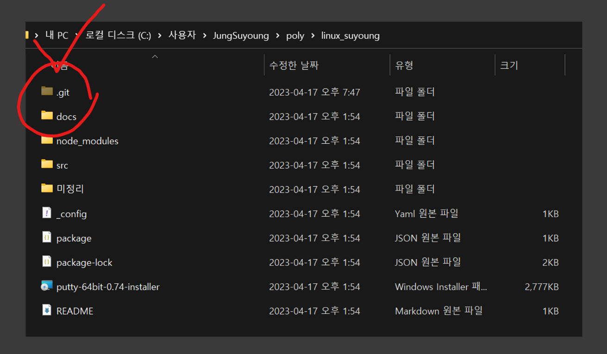

linux_suyoung이라는 기존 폴더를 깃 저장소 (로컬저장소)로 설정을 하면, **내부의 파일 상태를 추적 관리하여 이력을 기록할 수 있게** 된다. 

깃은 이 깃 저장소를 이용해, **자체적으로 이력을 기록**  “ .git” 이라는 폴더에 **버전을 관리할 수 있는 시스템을 자체적으로 구축**한다. (” .git”폴더를 삭제하면 일반 linux_suyoung 폴더는 일반 폴더로 되돌아가고, 이미 기록된 버전의 이력도 같이 삭제됨)

# 워킹 디렉토리 : 작업장

## 정의

코드의 생성과 수정작업을 자유롭게 할 수 있는 상태 영역, 

즉 **사용자(개발자) 작업 공간**. 

실제 작업 중인 파일은 **모두 워킹 디렉토리 안에 존재**함. 

## 워킹 디렉토리 내에서 파일 수정, 추가하면 git이 자동으로 관리해주나요? (진짜 모름)

우리가 워킹 디렉토리 영역 안에서 파일을 추가, 수정했다고 깃이 자동으로 관리해주지 않음.

### 이유

워킹 디렉토리 안에서 생성(또는 수정된) 파일의 초기 상태는 **untracked 상태**이기 때문에, **git이 추적관리를 할 수 없음.** 

따라서 깃에게 추적관리 해달라고, **tracked 상태로 변경**해줘야함. 이 과정이 **<스테이지 영역에 등록>이라는 과정**임. (**git add** 명령어 사용하여 등록, 관리할 파일 목록에 등록”해줘”)

### 근데 왜 tracked, untracked으로 나눌까?

워킹 디렉토리(우리의 작업공간)에서 파일의 변경은 매우매우매우 자주 일어남 & 이력을 관리할 필요가 없는 파일과 작업이 존재함 → **커밋할 파일을 명확하게 구분**하고, **자원을 효율적**으로 사용하기 위해 구분함)

# 스테이지 : 저장소로 가기 위한 발판

깃의 스테이지 영역

## 정의

**임시로 저장**하는 공간

워킹디렉토리 ↔ 저장소 둘 사이의 중간 영역에 위치하는 임시 영역

## 역할

컨텐츠의 **추적 상태 정보만 기록**

(워킹 디렉토리에서 등록 제출된 **tracked 상태의 파일들을 관리**, 실제 파일 내용을 직접적으로 가지고 있지는 않음)

워킹 디렉토리에서의 파일이 add 명령을 통해 “변경이력을 등록해라”라고 하면, 해당 파일은 untracked → tracked 상태로 변경 & stage상태가 됨. 

해당 파일이 워킹 디렉터리 내에서 변경이 되면 다시 untracked & unstage 상태가 됨. 

## 존재 이유

**커밋을 빠르게 처리하기 위해서 존재**

워킹 디렉토리에 추가된 파일과 수정된 내용을 스테이지에 등록, 이런 스테이지 등록은 최종 저장소에 기록되기 전 준비 단계

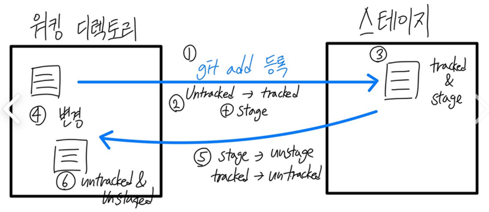

# 커밋 COMMIT

버전 : 의미있는 변화를 의미. 

## 정의

**파일 변경 이력**을 저장하는 작업. 파일을 수정하거나 새로 추가한 후, 해당 변경 내용을 Git 저장소에 기록하는 것

# GIT ADD (등록)

## 정의

워킹 디렉토리에 있는 파일을 **스테이지로 복사**하는 것 

무얼 복사하냐면 —> 깃 내부의 기록들을 복사 

## 사용

```
git add <파일명>

//전체 파일 및 폴더 등록
git add .
```

# 실습 : gistory를 이용해서 뜯어보기

[git add의 원리 - 생활코딩](https://opentutorials.org/course/2708/15238)

## “.git”폴더에는 뭐가 있을까?

사용자 JungSuyoung이란 폴더 안에 gitfth2란 폴더를 만들고, 

git inti으로 초기화한다. ( “.git”이라는 폴더가 생김)

gitfth2안에 생긴 .git폴더 경로에서 안에 뭐가 들었는지 확인하면  

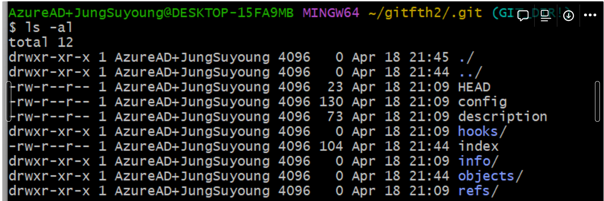

HEAD, congfig, description, hooks, index 등등이 파일들이 나온다. 

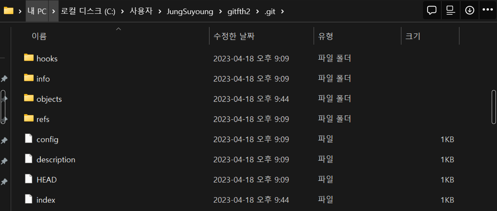
(이런식으로도 확인 가능)

gitfth2 폴더 안에 f1.txt을 만들고 내용은 “a”라고 적어 본다. 
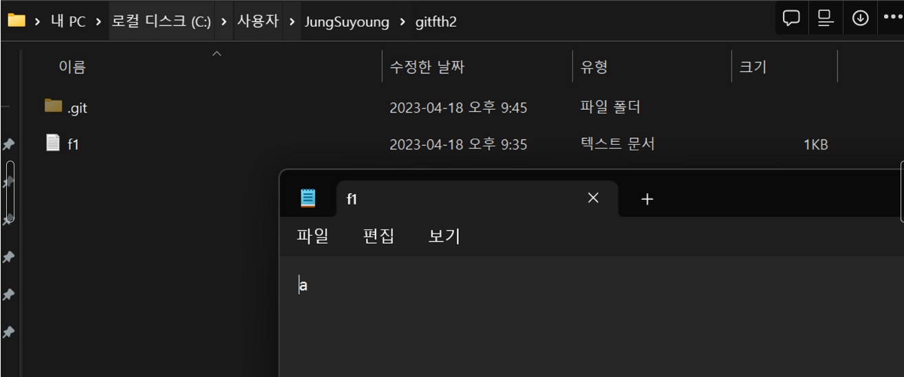

이렇게 git 저장소 내에서 뭔 짓을 해도 
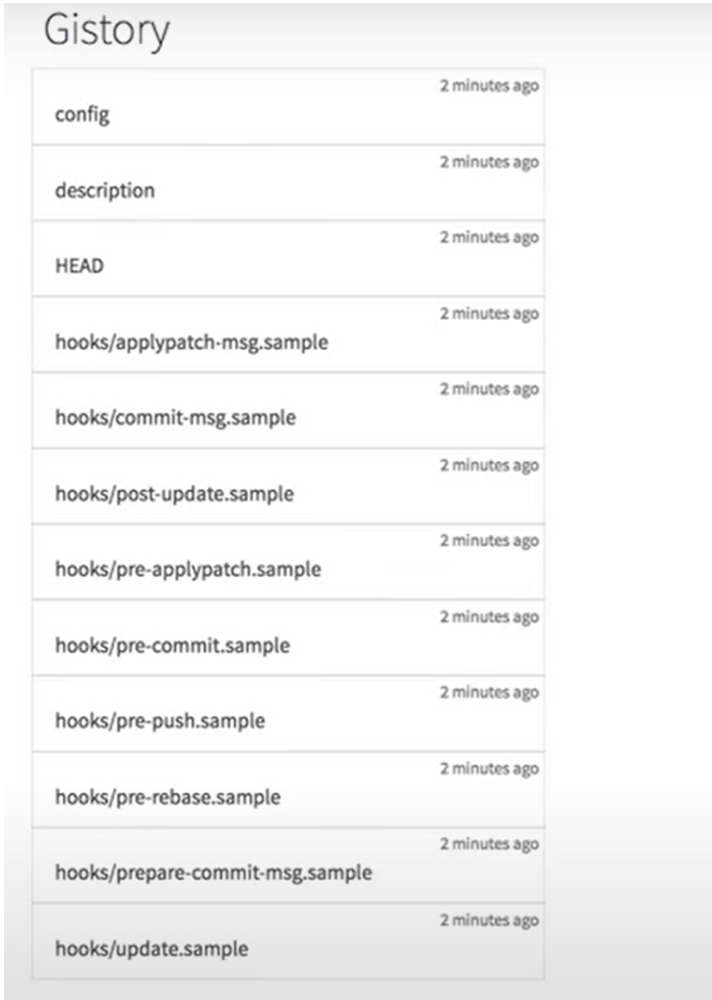

Gistory는 변하지 않는다. 왜?

git add를 통해 워킹 디렉토리 → 스테이지로 옮기지 않았으니까, 변한게 없음

git add f1.txt를 해보자

그러면 gistory가 변한다

index파일이 다음과 같이 변경됨 : 

(index : 파일의 이름이 담긴다)
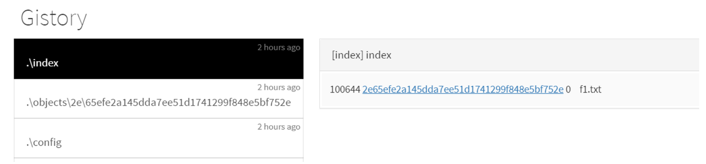

생성한 파일의 제목 f1.txt는  2e 65efe~란 파일에 담겨있음

object : 파일의 내용이 담긴다

(object 폴더에 새로운 파일이 추가된다.)
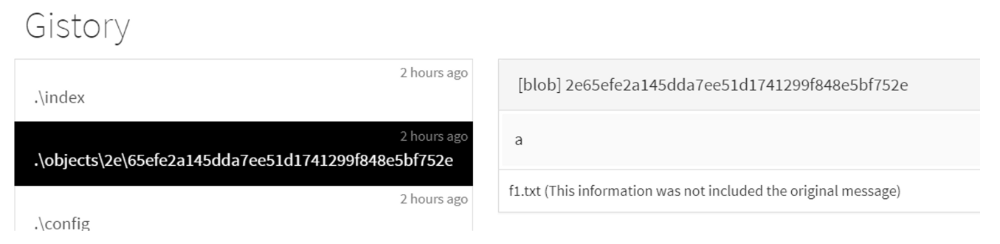

이렇게 objects 안에 잇는 2e65efe~란 파일은 객체, 또는 오브젝트라고 불린다. (사실 2e란 디렉토리 내 65~란 파일)

gitfth2란 폴더에 f2.txt(내용은 z)을 새로 만든다. 
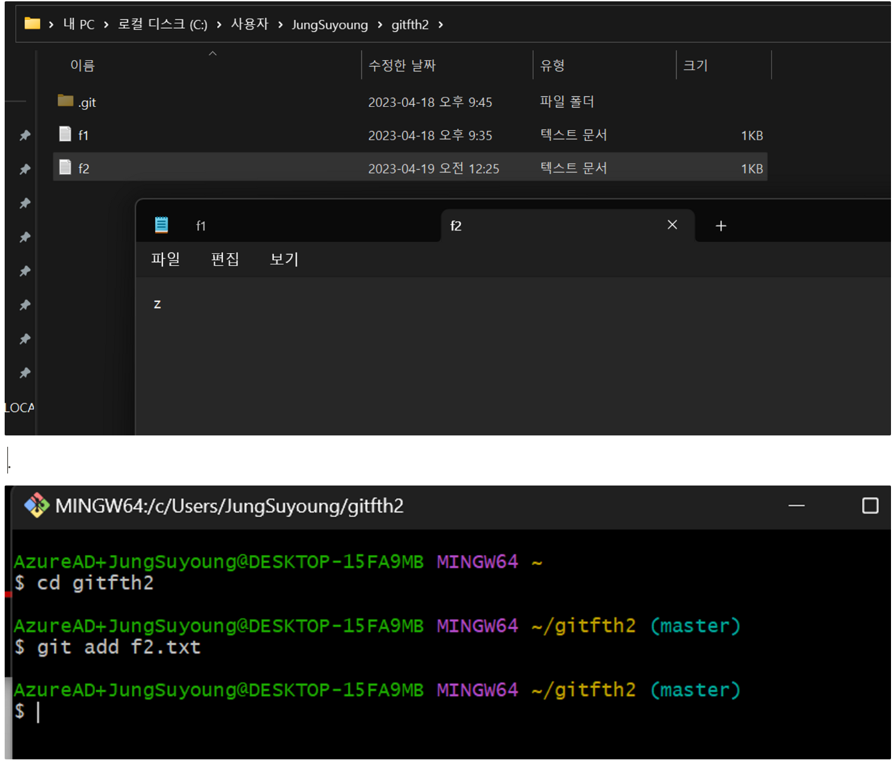

git add를 해보자

그리고 gistory를 확인하면
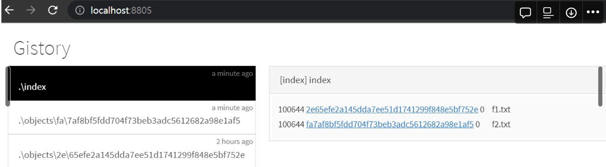

index가 바뀌고, 오브젝트가 추가됐음을 알 수 있음
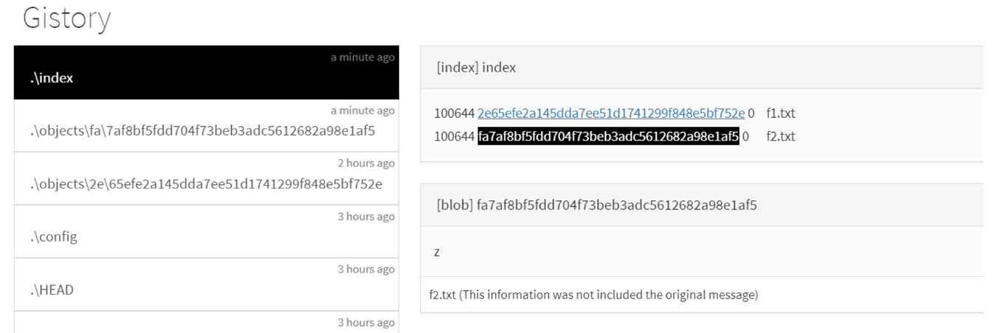

각각의 파일명은 index라는 곳에 적혀있다. 

f1.txt.를 f3.txt로 복사하고, add해보자
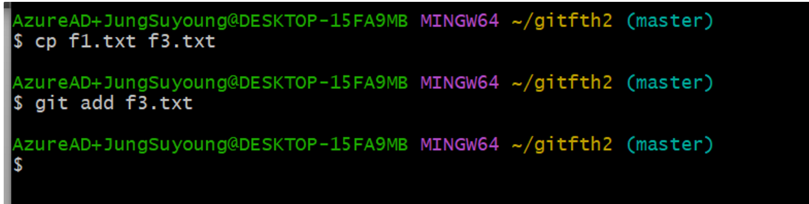

gistory를 확인해보면
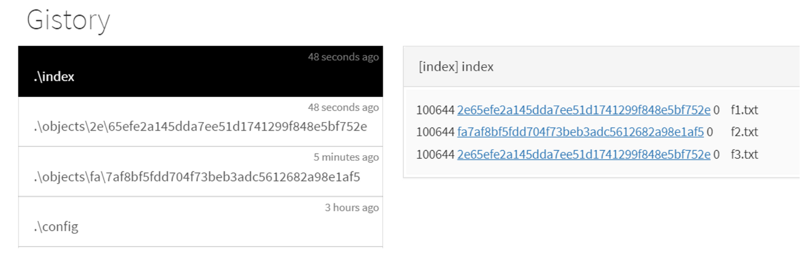

인덱스에는 f1.txt, f2.txt, f3.txt 3개가 있고, 

오브젝트는 변한게 없다. 

클릭해보면
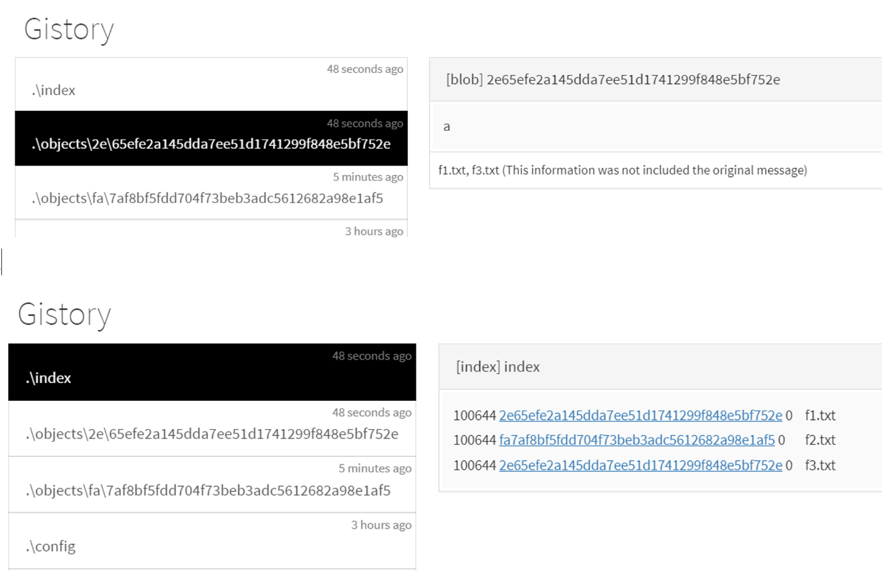

f1.txt와 f3.txt가 같은 오브젝트를 가리키고 있음 → **git은 파일을 저장할때, 파일의 이름이 달라도 내용이 같으면 같은 오브젝트 파일을 가리킴**

(파일이 100만개가 있어도 내용이 같다면, 인덱스에는 파일 이름만 다르게 적혀있고 같은 오브젝트를 가리킴 → (100만 - 1)의 **중복을 제거**할 수 있음!!!!!!!)

## git은 파일의 내용 기반으로 object 파일의 이름을 만든다

내용이 같으면 파일의 이름이 같다. 즉, 내용을 기반으로 파일의 이름이 결정된다. 

sha1 online에 들어가보자. 
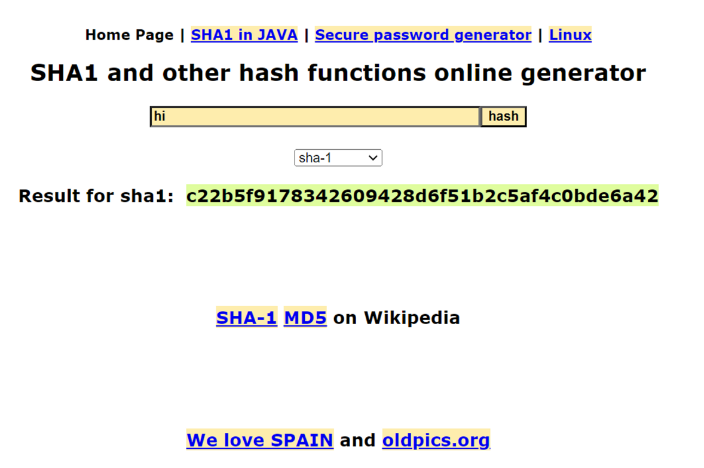

“hi”라고 입력하고 “hash”버튼을 누르면

c22b5~라고 뜸!
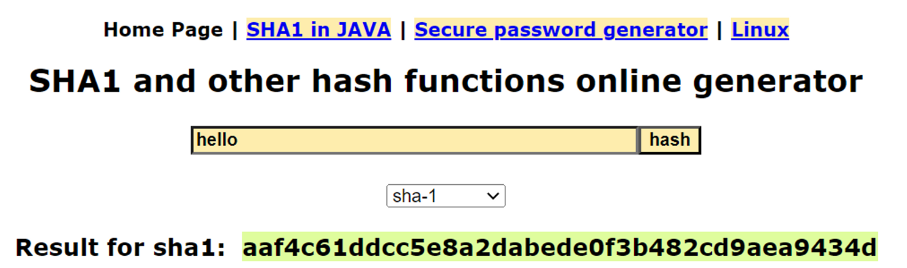

“hello”라고 쳐도 이렇게 뜸

어떤 사람이 입력을 하던간에, “hash”라는 매커니즘(sha-1)을 거치면 똑같은 결과를 얻게 됨. 
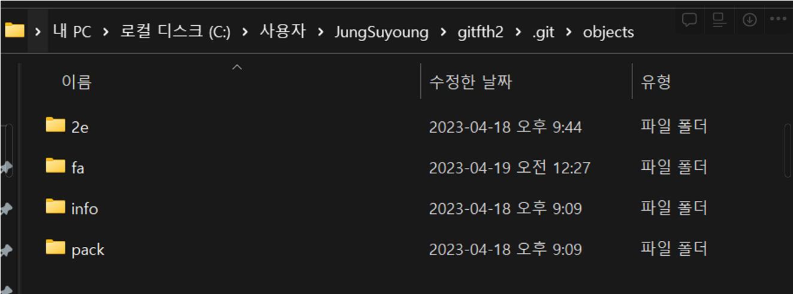

.git > objects 밑에 “2e”라는 디렉토리를 만들고, (f1.txt인 경우), 
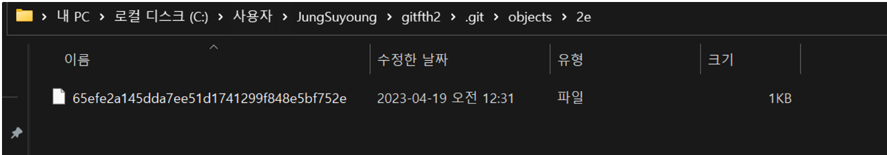

65efe~라는 파일을 만들었음, 여기다 내용을 저장 (사실 추가적으로 더 저장되는게 있지만, 대략적인 메커니즘이 이렇다는 말)

정리 : git add f1.txt를 하면 이런 일이 일어난다. 

1) 먼저 add 한 f1.txt를 본다. 

2) 내용이 “a”라고 적혀있으면, “a”라는 정보와 몇가지 정보를 추가해서 압축함

3) 압축한 결과를 sha1이라는 방법으로 해쉬를 통과시킨 값을 만든다. 

4) 이 값에 해당하는 디렉토리와 파일 (여기서는 2e 디렉토리, 65efe파일)을 objects라는 파일 밑에 만든다.

5) 그리고 65efe~라는 파일 안에 “a”라는 정보를 저장한다. 

6) 인덱스에는 파일의 이름을 (f1.txt)을 적고, 생성한 디렉토리와 파일을 적어줌. 

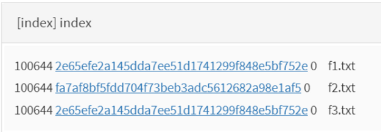

## commit 도 해보자

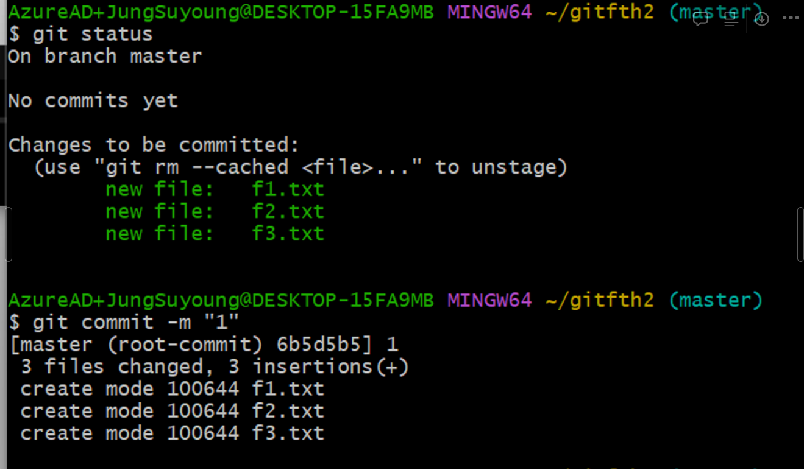
세개 텍스트 파일을 커밋함

gistory를 살펴보자
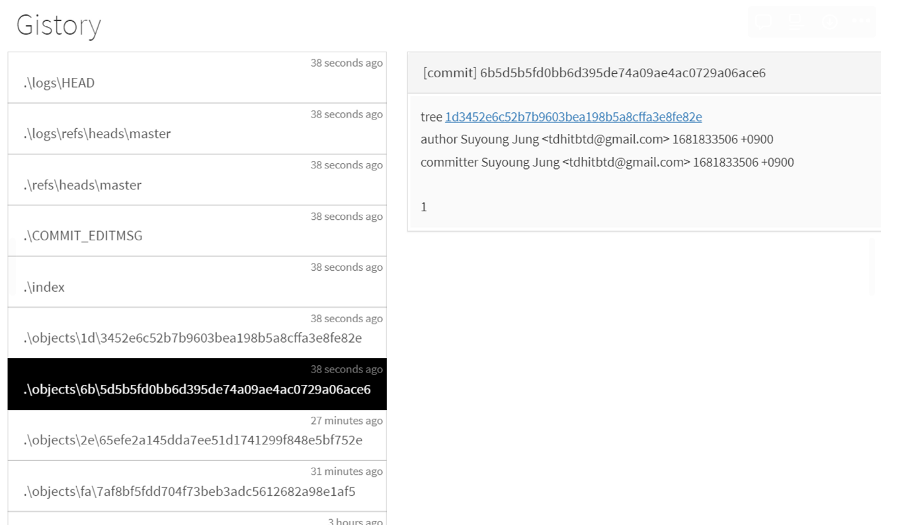
커밋할때 적은 정보 (-m “1”)가 오브젝트 안에 저장이 되어 있음. 

tree 1d3452~라고 적혀있음. 

1d 3452라고 적힌 바로 위 오브젝트를 들어가 보면
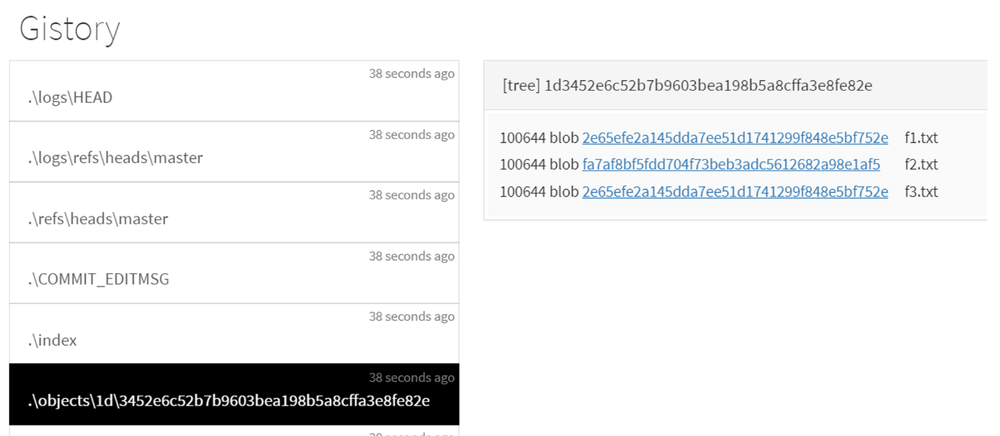

이런 내용이 나옴.

이 [tree]는 f1.txt, f2.txt, f3.txt 내용이 담겨있다. 

버전을 한번 더 만들어서 살펴보자 (변경사항 만들어보기)
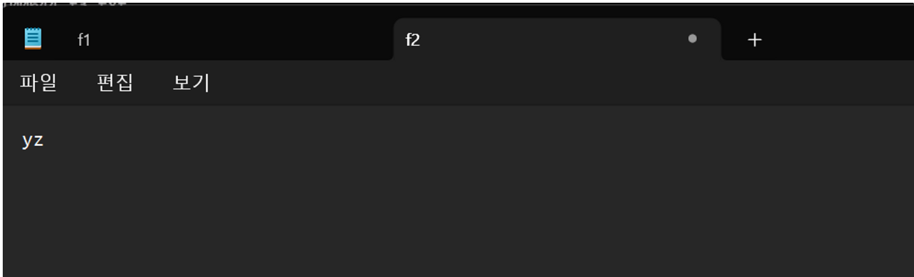

f2.txt의 내용을 “yz”로 바꿔봄

그리고 add해봄

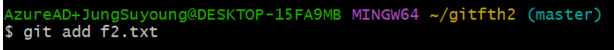

gistory에 변경 내용이 반영이 된다. 

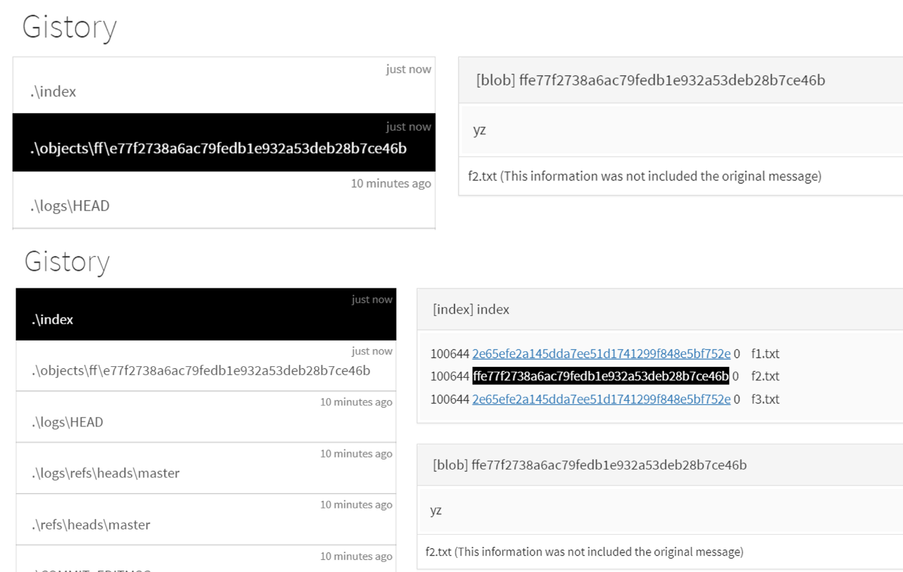


f2.txt의 내용이 저장된 오브젝트가 바뀌었다. 

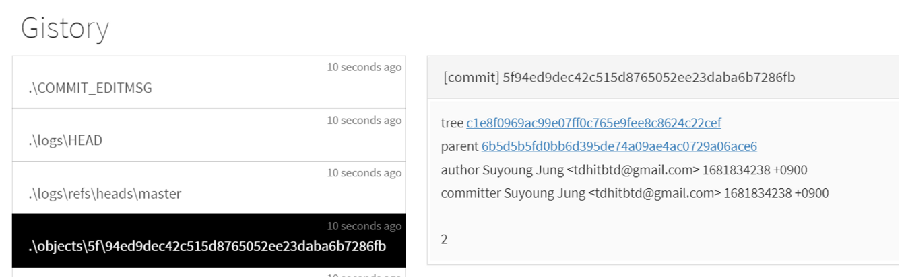

커밋이 담겨있는 오브젝트

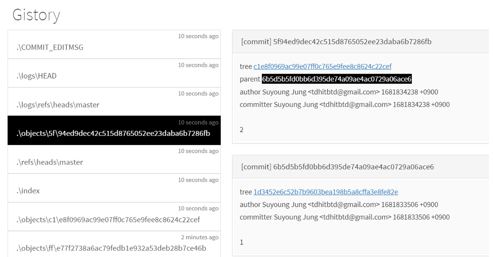


parent를 클릭하면 이 커밋 이전의 커밋을 볼 수 있음

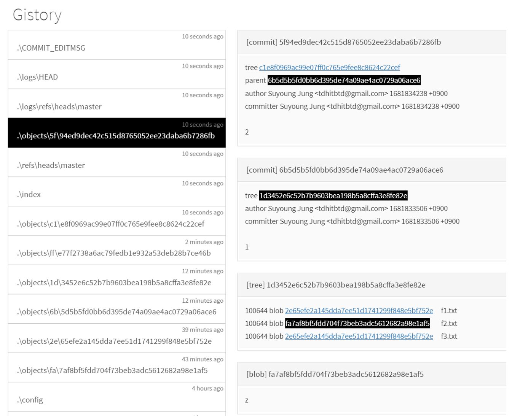


부모 트리를 타고 타고 가면 과거 자신의 커밋한 내용을 확인할 수 있다. 

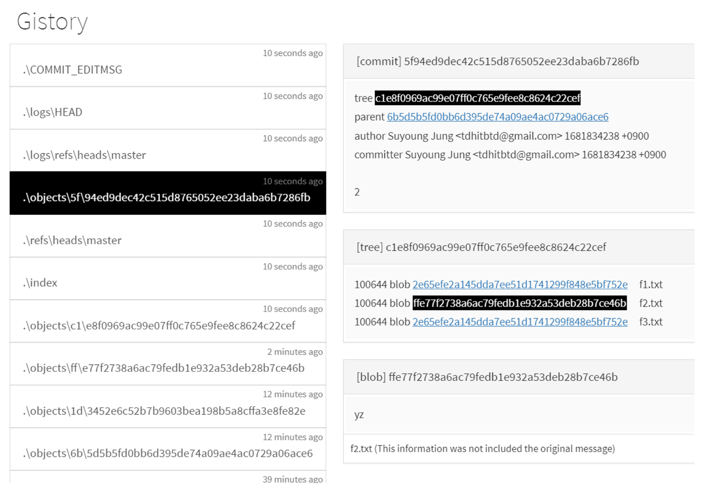


현재 트리에서도 방금한 커밋 확인 가능

정리

커밋에는 주요한 2가지가 있음

1) 이전 커밋이 누구인가, 부모를 나타내는 parent값이 있음 

2) 커밋이 일어난 그 시점에 , 작업 디렉토리의 파일 이름과 내용이 담겨져 있음

각각의 버전마다 서로 다른 트리를 가리키고 있고, 각 트리에는 파일의 이름과 내용이 담긴 링크(오브젝트)가 존재 

버전이 만들어진 시점의 프로젝트 폴더에 대한 상태를 얻을 수 있음. 이러한 걸 사진을 찍었다, 이를 스냅샷이라 부른다. (이러한 스냅샷을 트리라는 정보 구조로 가지고 있음)

# 푸쉬PUSH

# 머지 MERGE

# 브랜치
# 2023-04-18 : [깃]
# 2023-04-17 : [깃 add]