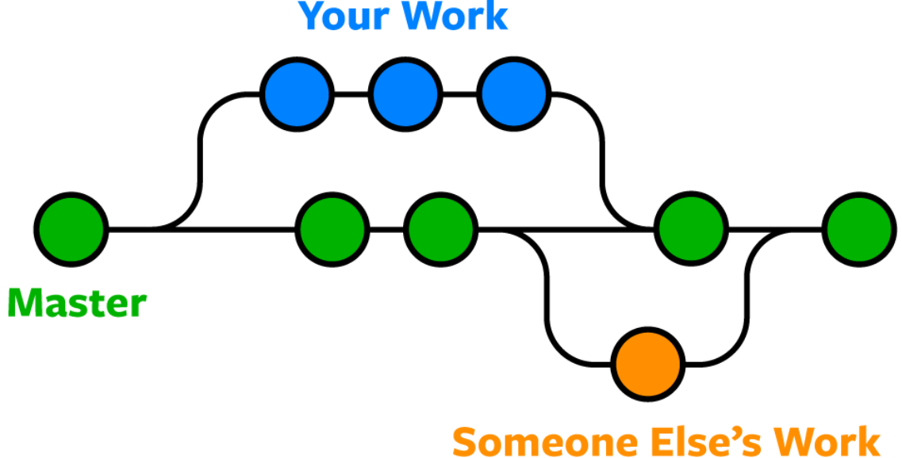

# 09. GIT BRANCH 0420목

# BRANCH 정의

프로젝트의 다른 작업 공간 

새로운 기능을 추가하거나 버그를 수정하는 등의 작업을 할 때, 기본 브랜치에서 새로운 브랜치를 만들어서 작업을 수행함



브랜치를 만든다 : 작업을 진행하다, 필요에 의해 작업이 분기되는 현상 

각각의 브랜치는 your branch, someone else’s work 2개가 추가적으로 존재함. master 브랜치도 포함하면 3개 

# BRANCH의 기능

## 브랜치 만들기 : 새로운 브랜치를 만들면 기존 브랜치 내용을 그대로 가져온다.

사전 수행한 것

```
git mkdir gitfth //gitfth란 새로운 폴더를 만든다
//여기에 새로운 f1.txt를 만들고, a란 내용으로 저장

git add f1.txt
git commit -m "1" //첫번째 커밋

//f1.txt의 내용을 ab로 수정
git add f1.txt
git commit -m "2" //두번쨰 커밋
```

브랜치를 git branch exp라고 새로운 브랜치를 만든다. 

그리고 master, branch 각각에서 git.log를 통해 기록을 확인하면 


둘다 같은 커밋 내용이 들어 있음을 알 수 있다. 

## 브랜치에서 커밋 : 나의 브랜치에서만 커밋을 하면?

f1.txt 파일의 내용을 abc로 바꾼다음 

exp브랜치에서만 커밋을 해보자

exp, master 브랜치의 git log, cat f1.txt는 다음과 같이 나온다. 


## 브랜치끼리 비교하기

사전 상황

exp 브랜치에서, f2.txt 파일을 만들고 a라는 내용을 입력한 뒤, add, commit함. 

exp 브랜치에서는 f2.txt(내용은 a), f1.txt(내용은 abc), 4개의 커밋이 있고

master 브랜치에는 f1.txt(내용은 ab), 2개의 커밋이 있다. 

이 두개를 git log를 통해 각각 비교하기는 번거롭다. 

### git log —branches —decorate

이럴때 다음 명령어를 쓰면 간단하게 확인이 가능하다. 

```
git log --braches --decorate
```


HEAD : checkout이 현재 master 

### git log —branches —decorate —graph

gitfth폴더 안에 f3.txt파일을 만들고, 내용은 “a”라고 한다. 

master 브랜치에서 커밋을 한다. (”5”)

그리고 git log —branches —decorate —graph를 하면


graph로 구분이 되어 나온다. 

# BRANCH의 원리

### git init후 HEAD파일의 생성

gitfth3폴더를 새로 만들고,  git init 후 gistory를 살펴보자 


HEAD라는 파일은 git init을 하면 새로 생겨나고, “~master”라고 적혀있다. 


## 커밋 후에 refs\heads 디렉토리에 master란 파일이 생성

gitfth3 폴더 내에 f1.txt(a)를 만들고, 커밋한다. 

그러면 다음과 같이 변한다. 


refs라는 디렉토리 아래에, heads라는 디렉토리 아래에 master란 파일이 생긴다. 

그리고 여기에 있는 오브젝트를 클릭하면 


방금 커밋한 것과, 커밋한 내용이 저장되어 있다. 

## 커밋을 한번 더 해보면?

f1.txt의 파일 내용에 b를 추가하여 ab로 바꾼 다음, master 브랜치에서 커밋하였다. 

그러면 어떻게 바뀔까? 


최신 커밋 내용으로 바뀌어 있다. 

## 다음과 같이 추론 가능


어떻게 최신 커밋을 알려줄수 있을까? 

바로 최신 커밋을 알려주는 “5bc6e~”가 refs/heads디렉토리 내 HEAD 파일에 저장되었기 때문이다. 

깃은 HEAD라는 파일을 가지고 있고, 

HEAD는 refs/heads/master란 파일을 가리키고 있고, 

refs/heads/master는 가장 최근에 커밋된 오브젝트의 id값을 가지고 있기 때문에 

깃은 git log를 했을 때 HEAD 파일을 보고, refs/heads/master 파일의 커밋 오브젝트 id 값을 봄으로써 최신 커밋을 알 수 있다. (이전 커밋은 parent를 통해서 탐색할 수 있음) 

## 결론

깃에서 브랜치는 refs라는 디렉토리 밑에 있는 파일을 의미함!