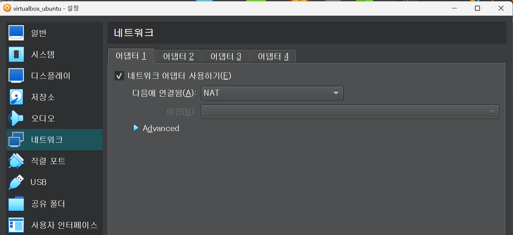

# 0421금 발표과제

# VirtualBox에서의 어댑터란?

## 정의

**가상 머신과 호스트 컴퓨터**, 또는 **다른 가상 머신 - 가상머신 간**의 **연결을 설정하는 인터페이스**

여러 개의 어댑터가 있는 경우, 가상 머신이 여러 개의 네트워크 인터페이스를 가지고 있다는 것을 의미 

## 그러면 NAT, 어댑터에 브리지 이런건 뭔데

### NAT(Network Address Translation) :

이 옵션을 선택하면 가상 머신은 호스트 컴퓨터와 **동일한 IP 주소 범위** 내에 있는 **가상 IP 주소를 할당**받게 된다. 이렇게 할당된 가상 IP 주소를 통해, **가상 머신은 호스트 컴퓨터와 인터넷에 연결될 수 있다.**  즉, **호스트 컴퓨터를 경유하여 인터넷에 접속할 수 있게 된다.**

NAT를 사용하면 가상 머신이 외부와 통신할 수 있도록 보안 설정을 자동으로 구성해주므로, 보안상의 이유로 인터넷에 직접 연결되지 않아야 하는 경우에는 이 옵션을 사용하지 않는 게 권장된다. 

### 어댑터에 브리지

브리지 어댑터(Bridged Adapter) . 이 옵션을 선택하면 가상 머신은 호스트 컴퓨터와 동일한 네트워크 상에 존재하는 **다른 컴퓨터와 동일한 방식으로 통신**할 수 있게 됨.  브리지 어댑터를 사용하면 가상 머신은 **호스트 컴퓨터와 같은 네트워크 상에서 독립적인 컴퓨터로 인식**되며, 호스트 컴퓨터가 연결된 모든 네트워크 기능(예: DHCP, DNS 등)을 가상 머신에서 사용할 수 있음. 

### 내부 네트워크(Internal Network)

이 옵션을 선택하면 가상 머신은 호스트 컴퓨터를 포함한 **같은 컴퓨터 내에서만 통신**할 수 있음. 내부 네트워크를 사용하면 가상 머신 간의 통신이 필요한 경우, 호스트 컴퓨터를 경유하거나 다른 가상 머신과의 브리지 연결을 사용할 수 있음. 

### 호스트 전용 어댑터(Host-only Adapter)

이 옵션을 사용하면 **호스트 컴퓨터와 가상 머신 간의 통신만 가능**하며, 이를 통해 가상 머신에서 호스트 컴퓨터의 파일 시스템에 접근할 수도 있다. 

또한, 다른 가상 머신과의 전용 네트워크(Private Network)를 설정하여, **같은 호스트 컴퓨터 상에서 실행되는 다른 가상 머신들과만 통신할 수 있도록 할 수도** 있다. 

# 우분투에서 openSSH 서버 설치할때 의문점

## openSSH 서버 설치할때 의문점1

누구의 방화벽을 열고 누구의 포트를 허용한거지? 

방화벽에서 TCP 프로토콜의 22번 포트를 열어,

 다른 컴퓨터에서 **SSH 클라이언트를 사용하여 해당 컴퓨터에 접속할 수 있도록 설정**하는 것

ufw allow 22/tcp 명령어를 실행하면, 

1. 우분투의 방화벽을 열고
2.  TCP 프로토콜의 22번 포트에 대한 접속을 허용
3. 이렇게 하면 외부에서 SSH 클라이언트를 사용하여 우분투에 접속할 수 있다. 

## 우분투 네트워크에서 설정 의문점

내 로컬 pc의 ip주소는 192.168.45.3인데

우분투의 ip주소는 10.0.2.15임을 알 수 있다. 

NAT 방식을 사용한다면, 호스트 PC의 IP주소 일부(EX.192.168.XXX)를 사용해야 하는 것 아닌가?

### 해결

**NAT(Network Address Translation)는 여러 컴퓨터가 하나의 IP 주소를 사용할 수 있도록 하는 기술**입니다. 이를 통해 인터넷에서 여러 컴퓨터들이 같은 IP 주소를 사용할 수 있으며, **NAT를 사용하는 가상머신은 호스트 컴퓨터의 IP 주소를 공유**하게 됩니다.

따라서, 가상머신이 NAT를 사용하고 있을 경우, 가상머신의 IP 주소는 호스트 컴퓨터에서 사용하는 IP 주소와는 다를 수 있습니다. **10.0.2.15는 VirtualBox에서 제공하는 가상 네트워크 인터페이스의 IP 주소**입니다. 이는 가상머신이 호스트 컴퓨터의 IP 주소를 사용하면서도 인터넷에 연결할 수 있도록 하는 NAT 네트워크에서 사용되는 IP 주소입니다.

따라서, 가상머신이 호스트 컴퓨터와 다른 IP 주소를 사용하더라도, NAT 기술을 사용하면 인터넷에 연결이 가능합니다. 만약 인터넷 연결이 정상적으로 이루어지지 않는다면, 다시 한번 가상머신의 네트워크 설정을 확인해보세요.

우분투, 내 로컬 PC에서 확인하면 다음과 같이 나온다. 

NAT 방식을 이용해 같은 공인 IP 주소를 이용해 인터넷에 접속한다. 

## OpenSSH 시도시 주의점

우분투 리눅스 2개를 사용해야한다. 전에 1개-window 1개 이런식으로 사용해서 망했음… 

virtualbox_ubuntu를 서버 대용으로 사용한다. 

왼쪽 ubuntu에 ssh를 설치하고 ubuntu2에서 연결하려니까 

network is unrecheable이라 뜨면서 작동이 안된다. 왜 이럴까?

해결완료

ubuntu2에도 ssh를 설치해야 연결이 된다. 

이후 ssh@ubuntu1의 ip를 하니까 연결 완료