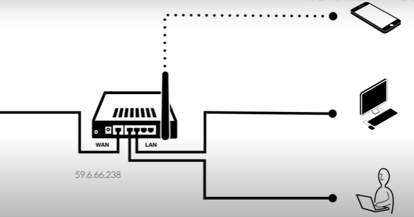

# 폴리텍 광명융합원 정수영

# 발표07 라우터와 NAT 0425화

# 라우터

## 라우터란?

컴퓨터 네트워크에서 데이터를 전송하는 역할을 하는 장치 

일반적으로 인터넷과 연결된 모뎀과, 로컬 네트워크의 모든 장치들을 연결하는 역할을 함. 

## 실제 생활에서는 어떻게 작동하는지 살펴보자

LAN : 특정 지역을 범위로 하는 네트워크

WAN : 인터넷 서비스 제공자가 제공하는 서비스를 사용하여, 구축한 네트워크. “인터넷”이라고 하는 광역 네트워크에 소속. 

라우터(공유기)는 LAN이라는 네트워크와 WAN이라는 네트워크 사이에서 일종의 중계자 역할을 한다. 

## 케이블이든, 무선이든 연결되는 순간 IP를 부여받는다

192.168.0.1이라는 주소 : 내부네트워크 안에서의 (LAN안에서의) IP는 중요하기 때문에 별도의 이름은 Gateway address또는 Router address란 이름을 가진다. 

### Public IP address

WAN이라는 광역 네트워크 안에서 이 공유기로 접속할 수 있게 해주는 IP를 가지고 있다. (59.6.66.238). 이 IP를 통해서 전세계에 있는 누구나 접속이 가능하다. 

### Private IP address

폰, 컴퓨터 노트북에 부여된 ip는 지역 내에서만 (LAN에서만) 사용이 가능하다. 

이를 사설 ip주소라고 한다. 

왜 그러면 사설ip는 192.168.xxx.xxx일까?

192.168.0.0~192.168.255.255를 사설ip로 쓰겠다~라고 약속을 했기 때문 

이밖에 다른 사설ip 주소 대역이 있지만, 작은 규모에서는 주로 192.168.~을 쓴다. 

# NAT (Network Address Translation)

사설 네트워크 내부의 (LAN) 여러대의 컴퓨터가 인터넷에 접속할 수 있도록 **공인 IP주소와 사설IP 주소 간의 변환**을 수행하는 기술

## NAT의 역할

192.168.0.4의 노트북에서, 인터넷에 접속하려면 공인IP 주소가 필요함. 

NAT은 사설 네트워크 내부의 각 컴퓨터에 할당된 사설IP주소를 공인 IP주소로 변환하여 인터넷과 통신할 수 있도록함. 

라우터나 방화벽 같은 네트워크 장비에서 수행한다. 사설 네트워크와 인터넷(WAN)간에 위치한다. 

1. 192.168.0.4의 노트북에서 데이터를 보낸다. 먼저 데이터를 패킷이라는 단위로 나눈다. 
2. 이 패킷에 출발지와 목적지의 주소 정보를 붙여서 전송한다. 
3. NAT가 네트워크 패킷을 받아들이면 출발지 주소를 **사설IP주소에서 공인 IP주소로 변경**한다 (192.168.0.4 주소를 59.6.66.238로 변경), 그리고 요청한 놈(192.168.0.4)을 기록 
4. 이를 인터넷으로 전송한다.
5. 인터넷에서 도착한 패킷을 받아들이면 목적지 주소를 **공인IP 주소에서 사설IP 주소로 변경**한 후
6. 이를 아까 그 사설 네트워크(192.168.0.4)에 전송한다. 

즉, 하나의 공인 IP주소를 공유하여 인터넷에 접속 가능케 한다.