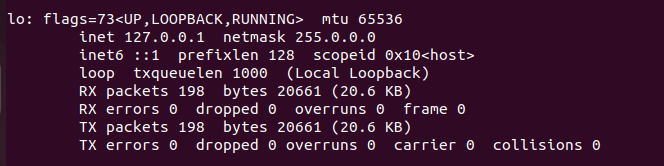

# 폴리텍 광명융합원 정수영

# 0426수 발표과제 아파치웹서버

# 아파치에 대해 알아보자

## 아파치를 배워야하는 이유

1. 가장 많이 사용 : 세계에서 가장 많이 사용되는 웹 서버 소프트웨어 중 하나
2. 근본 : 아파치는 웹 서버의 가장 기본적인 기능을 제공하기 떄문에, 웹 서버의 기본적인 동작 방식을 이해할 수 있음
3. 다양한 기능 제공: 아파치는 모듈화 구조로 되어 있어 다양한 기능을 제공함. 예를 들어, 모듈을 추가하여 SSL 암호화를 지원하거나, PHP, Perl 등의 스크립트 언어를 실행할 수 있음.
4. 대용량 트래픽 처리 가능 : 아파치는 대용량 트래픽을 처리하는 데 강하며, 대규모 웹 서비스를 운영하는 경우에 아파치를 사용하는 것이 일반적
5. 유연유연 : 아파치는 다양한 운영체제에서 사용 가능하며, 설정 파일을 수정하여 맞춤화할 수 있음.
6. 오픈소스 : 아파치는 오픈소스로 제공되므로, 라이선스 비용이 없고, 소스코드를 직접 수정하여 개발에 참여 가능

## 아파치를 시작해보자

아파치를 시행하면, 여러 개의 아파치 서버가 자동으로 실행이 된다. 

많은 접속이 들어왔을 때, 분산해서 처리하기 위해서. 

접속이 많아지면 아파치 프로세스가 자동으로 증가한다. 

### 127.0.0.1은 어떤 ip일까?



특수한 ip. 자기 자신을 가리키는 ip이다. 

바뀌지 않고 언제나 존재. 

이것과 똑같은 의미를 가지는 도메인 네임이 “localhost”이다. 

자신의 로컬pc에 설치된 웹서버에 접속할 때, 해당 웹서버의 ip주소, 포트 외에도 127.0.0.1 or localhost를 통해서 접속이 가능하다. 

## 웹서버의 동작

1. web browser가 webserver의 ip 주소인 10.0.2.15로 index.html파일을 요청 (10.0.2.15/index.html)
2. webserver는 특정 디렉터리에서 index.html파일을 읽어서, web browser에게 전달
3. html을 해석하여 출력

웹서버는 사용자가 요청한 index.html이란 파일을 어디에서 읽어오는 걸까??

```
cd/ etc
cd apache2/
```

로 들어가서 보면, apache2에 대한 설정파일이 저장된걸 확인할 수 있다. 


보면 이런식으로 나오는데, 여기서 apache2.conf라는 파일을 살펴보자

```
nano apache2.conf
```


여기에 “IncludeOptional sites-enabled/* .conf”라고 되어있는데, “sites-enabled라고 하는 디렉터리 안에 있는 확장자가 conf인 모든 파일을 읽고, 사용한다”라는 뜻.

나와서 sites-enabled라는 디렉터리로 들어가보자


000-default.conf이러고 화살표로 되어 있다. 000-default.conf의 실제 내용은 화살표가 가리키는 링크에 있다는 뜻이다. 

```
nano 000-default.conf
```

로 위 파일로 들어가보자. 


들어가보면 DocumentRoot아래 var/www/html이라는게 보임

한번 저 디렉터리로 가보자.


오~ index.html 파일이 있다. 

### 정리해보면

1. web browser가 web server에 접속하여 요청하면 (10.0.2.15/index.html)
2. webserver는 /etc/apache2라는 디렉터리 밑에서, 설정파일들을 참고
3. 사용자의 접속이 들어왔을때, “요청이 들어온 파일이 있는지 찾을 것인가”를 서버의 어느 부분에서 뒤질 것인가를 2번의 설정파일들을 참고해서 뒤진다. 
4. 그리고 거기에 있는 파일을 읽어서 웹 브라우저에 보낸다.