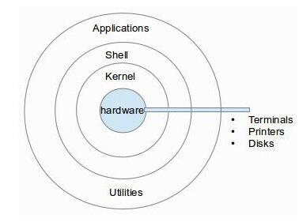

# 폴리텍 광명융합원 정수영

# 발표09 쉘과 커널 관계 0427목

# SHELL VS KERNEL

## kernel : 자원을 관리

hardware를 직접 제어하는 운영체제의 핵심 (운영체제 그자체로 보면 편하긴하다)

시스템 자원을 관리하고, 하드웨어와 소프트웨어간의 인터페이스를 제공

커널은 시스템의 안정성, 보안성, 성능 등에 영향을 미친다. 

### 커널의 종류

마이크로 커널

커널의 기능을 최소한으로 유지하고, 나머지 기능은 유저모드의 서버에서 처리

커널과 유저모드 간의 통신이 빈번하게 일어나면 오버헤드가 발생할 수 있으며, 이로 인한 성능 저하가 발생할 수 있음. 

모노리딕 커널

모든 기능을 커널 내부에서 처리

대부분의 운영체제는 모노리딕 커널을 사용

## shell : 사용자와 커널간의 인터페이스

사용자가 명령을 입력하면 그 명령을 컴퓨터가 이해할 수 있도록 하는 프로그램(명령어를 입력받아, 커널에게 전달하고, 결과물을 출력)

커널과 사용자간의 인터페이스 역할을 함. 

ex. macOS의 파인더, bash SHELL

### 예시

1. “ls -al”이란 명령을 입력하면
2. 쉘에게 명령이 입력됨
3. 쉘은 그 명령을 해석해서 커널이 이해할 수 있는 방식으로 커널에게 전달한다. 
4. 커널은 하드웨어를 제어해서, 어떤 처리를 수행할 수 있도록 한다. 
5. 하드웨어는 동작을 수행함
6. 처리결과를 커널에게 알려줌
7. 커널은 쉘에게
8. 쉘은 우리에게 결과를 보여준다. 

(현재 디렉토리에 있는 파일목록을 “ls -al”로 확인이 가능하다)

### 쉘의 종류

C쉘

유닉스와 리눅스에서 가장 많이 사용

C언어와 유사한 문법을 사용

코넬 쉘(커널 쉘)

윈도우 운영체제에서 사용

MS-DOS와 유사한 문법을 사용하며, GUI를 지원함. 

## 왜 쉘과 커널을 분리해놓았을까?

추정컨데 쉘은 사용자가 입력한 명령을 해석하는 프로그램. 

커널과 분리한다면 장점이 생긴다. 

1. 여러가지 쉘을 사용할 수 있어, 선호하는 쉘을 선택해서 사용할 수 있다. 
2. 보안을 강화할 수 있다. 쉘이 사용자와의 상호작용을 담당하기 때문에, 쉘에서 발생하는 보안 취약점이 커널에 직접적인 영향을 미치지 않는다. 

## 참고 : 터미널은?

terminal : 종점이라는 뜻. 

컴퓨터 시스템의 “끝자락”에 있어 사용자와 서로 상호소통함. 

터미널은 텍스트 기반 명령을 입력하고, 실행할 수 있는 인터페이스 

사용자가 명령어를 입력하면 이를 쉘로 전달한다. 

1. 사용자가 명령어 입력
2. 쉘로 전달, 실행 (커널로 가는 과정 생략)
3. 결과를 터미널로 출력

터미널은 CLI를 제공하는 프로그램 중 하나이다. 

사용자와 쉘 사이의 중간 매개체 역할을 한다. 

정확하게 표현하자면

OS-SHELL-GUI-CLI Terminal Emulator (우리가 사용하는 terminal은 gui를 통해 접속하기 때문에) 

## 그러면 윈도우에서 쓰는 “명령프롬프트”는 뭐지? 다른건가?

명령 프롬프트는 윈도우에서 shell과 유사한 역할을 수행하지만, 정확히는 쉘이 아닌 CLI(Command-Line Interface)이다. 

윈도우에서 제공하는 명령어를 처리하는데 사용되는 프로그램이다. 

(터미널의 역할을 하는 터미널 에뮬레이터)

## 그래서 터미널이랑 명령프롬프트랑 같은거여 다른거여

다르다. 

명령프롬프트는 MS-Dos 기반 운영체제에서 명령어를 입력하기 위한 CLI이고, 

터미널은 UNIX 계열 운영체제에서 명령어를 입력하기 위한 CLI이다.