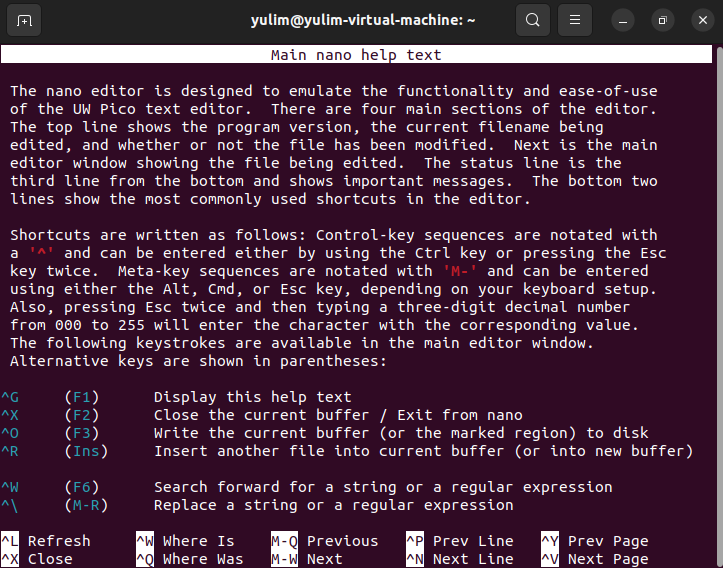
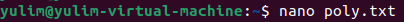
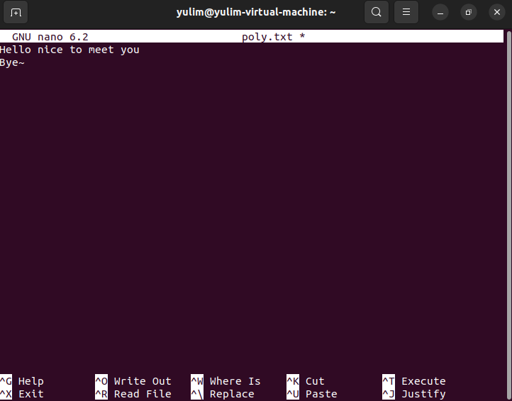
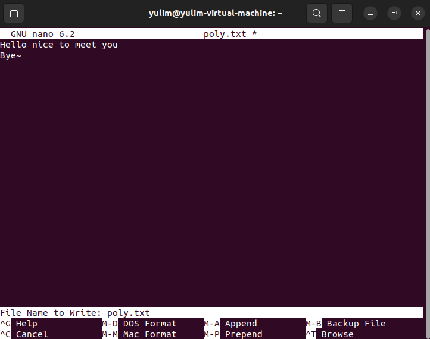
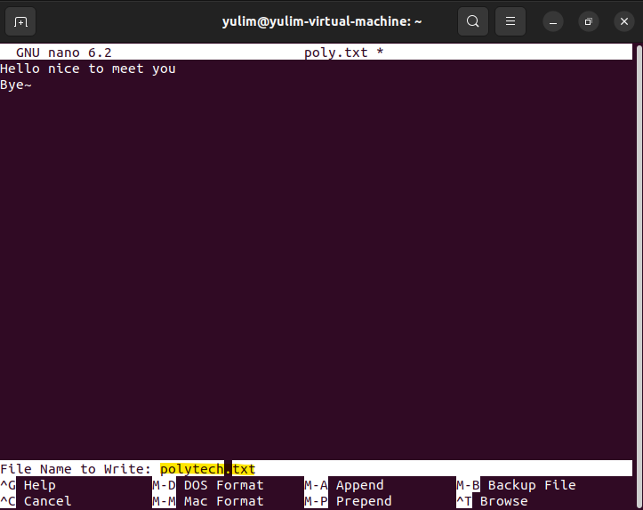
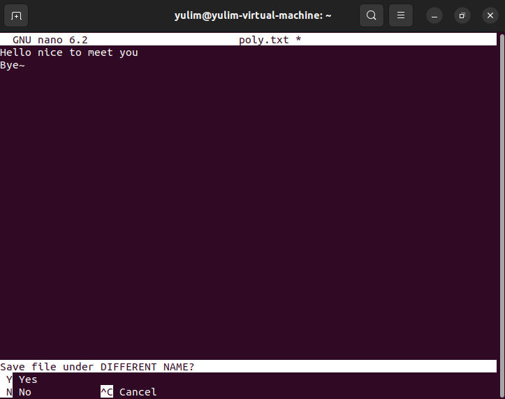
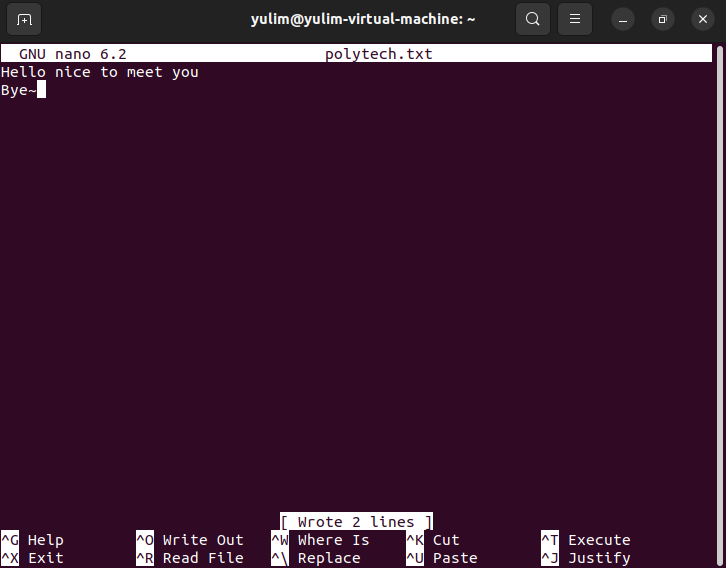
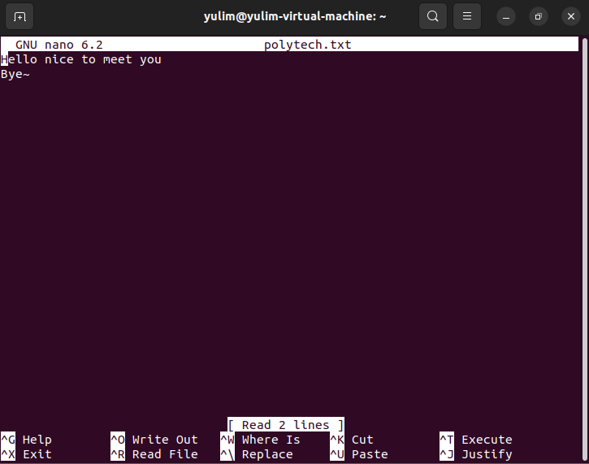
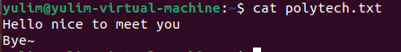

# nano editor

vi editor가 사용자 친화적이지 않아서 불편한 점을 해소하기 위해서 많이 사용하는 에디터.

nano 에디터는 사용법도 쉬울 뿐만 아니라, 하단에 단축키들이 설명되어 있어서 별도의 학습이 없더라도 쉽게 사용할 수 있다. 

vi와 달리 nano는 모덜리스 편집기이므로 파일을 연 후 즉시 텍스트를 입력하고 편집할 수 있다.

*  모덜리스: 대화 상자(dialog)가 실행되더라도 기존 화면을 제어할 수 있는 방식

<br>

<hr>

# nano를 설치

나노 텍스트 편집기는 macOS 및 대부분의 Linux 배포판에 미리 설치되어 있다. 시스템에 설치되어 있는지 확인하려면 다음을 입력

출력 내용

```python
nano --version

# GNU nano, version 2.9.3# (C) 1999-2011, 2013-2018 Free Software Foundation, Inc.# (C) 2014-2018 the contributors to nano# Email: nano@nano-editor.org	Web: https://nano-editor.org/
```

시스템에 나노가 설치되어 있지 않은 경우 배포의 패키지 관리자를 사용하여 나노 나노를 설치할 수 있다.

<br>

<hr>

# Ubuntu 및 Debian에 Nano를 설치

```python
sudo apt install nano
```

<br>

<hr>

# CentOS 및 Fedora에 Nano를 설치

```python
sudo yum install nano
```

<br>

<hr>

# 파일을 열고 생성

기존 파일을 열거나 새 파일을 생성하려면 nano와 파일 이름을 차례로 입력

```python
nano filename
```

<br>

<hr>

# nano 에디터 실행법

모든 명령 앞에는 ^ 또는 M 문자가 붙는다. 

캐럿 기호(^)는 Ctrl 키를 나타냄

예를 들어 ^J 명령은 Ctrl 키와 J 키를 동시에 누른다는 의미

문자 M은 Alt 키를 나타냄

<br>

- **Ctrl + g (F1): 도움말 표시, 모든 명령어 조회 가능**
    
    
    

<br>

- Poly.txt 열기
    
    
    

<br>

- nano editor에서 내용 입력
    
    
    

<br>

- Ctrl + o (F3): 현재 편집 중인 파일 저장
    
    
    
<br>


- 파일 이름을 정하고 엔터
    
    
    

<br>

- Y
    
    
    

<br>

- Ctrl + X (F2): 종료
    
    
    
<br>


- 다시 nano editor 열기
    
    

    

<br>

- cat으로 polytech.txt 파일 내용 보기
    
    
    
    
<br>

<hr>

# nano editor 단축키

| 단축키 | 동작 |
| --- | --- |
| ctrl+g (F1) | 도움말 표시 |
| ctrl+x (F2) | nano 종료 (혹은 현재의 file buffer를 닫음) |
| ctrl+o (F3) | 현재 편집 중인 파일 저장 |
| ctrl+j (F4) | 문단을 justify(행의 끝을 나란히 맞추다)한다. 즉, 한 문단을 한 줄로 붙인다. |
| ctrl+r (F5) | 현재 file에 다른 file의 내용을 추가한다. |
| ctrl+w (F6) | text 검색 |
| ctrl+c (F11) | 현재의 cursor 위치 표시하기 |
| ctrl+t (F12) | spell check 시작 |
| ctrl+\ | search and replace |
| ctrl+k (F9) | 현재의 line 혹은 선택된 text 삭제(그리고 저장(copy)) |
| ctrl+u (F10) | 붙여넣기 (paste) |
| ctrl+6 | 현재 cursor 위치부터 text 선택 시작. 이후 alt+6로 복사 후 선택 종료. 아니면 다시 ctrl+6를 입력하면 (복사 없이)단순 종료. |
| alt+6 | 선택 구간 복사. 선택 구간이 없다면 현재 caret 이 있는 한 줄을 복사. 이후 ctrl+u 로 붙여넣기 할 수 있음, |
| PageUP | 또는 ctrl+y (F7) 이전 화면 |
| PageDown | 또는 ctrl+v (F8) 다음 화면 |
| alt+( | 현재 문단의 시작으로 |
| alt+) | 현재 문단의 끝으로 |
| alt+= | 한 줄 밑으로 스크롤 |
| alt+- | 한 줄 위로 스크롤 |
| ctrl+space | 한 단어 앞으로 |
| alt+space | 한 단어 뒤로 (GUI모드가 아닐 경우) |
| alt+\ | file의 첫 line으로 |
| alt+/ | file의 마지막 line으로 |
| alt+] | 현재 괄호에 match되는 괄호 찾기 |
| ctrl+- | 줄 번호와 열을 입력한 후 그곳으로 이동 |