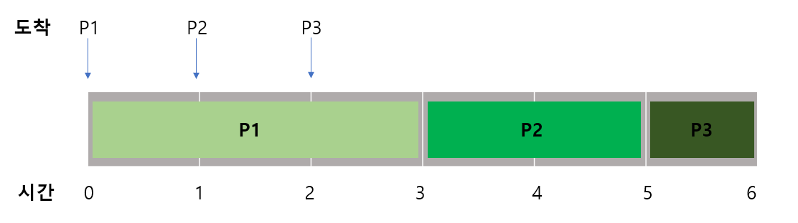
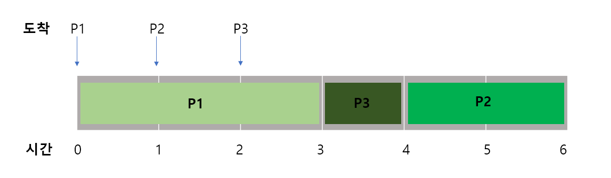
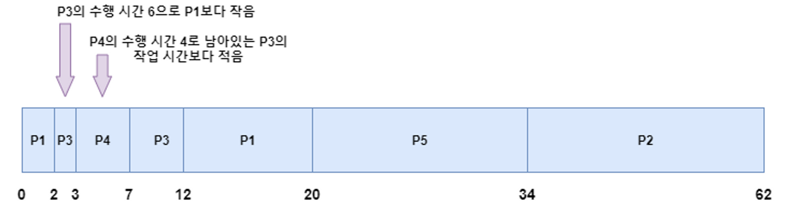

# 스케줄링 알고리즘 Ver 1

CPU 스케줄링은 다중 프로그래밍 환경에서 CPU가 할당되는 방식을 결정하는 것을 말합니다. 여러 개의 프로세스가 동시에 실행될 때, CPU는 어느 프로세스를 먼저 실행할지, 어떤 프로세스를 중단하고 다음에 실행할지 등을 결정해야 합니다. CPU 스케줄링은 이러한 결정을 수행하는 알고리즘을 말합니다.

 

가장 대표적으로, 

1. FCFS (First-Come-First-Served) 스케줄링
먼저 도착한 프로세스부터 CPU를 할당하는 방식입니다.
2. SJF (Shortest Job First) 스케줄링
실행 시간이 가장 짧은 프로세스부터 CPU를 할당하는 방식입니다.
3. Priority 스케줄링
우선순위가 높은 프로세스부터 CPU를 할당하는 방식입니다.
4. Round-Robin 스케줄링
공정한 CPU 할당을 위해 시간 할당량을 정해놓고, 시간이 지나면 다음 프로세스에게 CPU를 할당하는 방식입니다.

이렇게 크게 네 가지 종류가 있습니다.

 

| 용어 | 설명 |
| --- | --- |
| 대기 시간 | 자원의 할당을 대기하는 시간을 의미합니다. |
| 실행 시간 | 실제로 프로세스가 자원을 할당받은 다음 작업을 수행하는 시간을 의미합니다. |
| 반환 시간 | 작업을 완료하는데 소요되는 전체 시간으로 대기 시간과 실행 시간을 모두 포함합니다. |

 

## 1. **선입선처리 스케줄링 (First Come First Served, First In First Out)**

 

선입선처리(FCFS, FIFO) 알고리즘은 말 그대로 먼저 요청한 프로세스가 먼저 자원을 제공 받으며 이미 사용 중이라면 사용이 끝날 때까지 기다려야 하는 스케줄링 방식입니다.

 

| 프로세스 | 도착 시간 | 실행 시간 | 대기 시간 | 반환 시간 |
| --- | --- | --- | --- | --- |
| P1 | 0 | 3 | 0 | 3 |
| P2 | 1 | 2 | 2 | 4 |
| P3 | 2 | 1 | 3 | 4 |

 

 

먼저 도착한 프로세스부터 실행되므로, P1이 먼저 실행됩니다. P1은 0시에 도착하고 3시간 동안 실행되므로, 반환 시간은 3시간입니다. 대기 시간은 0이 됩니다.

그 다음으로 P2가 실행됩니다. P2는 1시에 도착하고, P1이 실행 중인 동안 대기해야 했으므로 대기 시간은 2시간입니다. 실행 시간은 2시간이므로, 반환 시간은 4시간입니다.

마지막으로 P3가 실행됩니다. P3는 2시에 도착하고, P1과 P2가 모두 실행 중이므로 2시간 대기해야 합니다. 실행 시간은 1시간이므로, 반환 시간은 4시간입니다.

따라서, 위의 예시에서 각각의 프로세스의 대기 시간, 실행 시간, 반환 시간은 다음과 같습니다.

 

- P1: 대기 시간 0, 실행 시간 3, 반환 시간 3
- P2: 대기 시간 2, 실행 시간 2, 반환 시간 4
- P3: 대기 시간 3, 실행 시간 1, 반환 시간 4

 

- 평균 반환 시간 = (3 + 4 + 4) / 3 = 3.67
- 평균 대기 시간 = (0 + 2 + 3) / 3 = 1.67

 

## 장점 
    1) 스케줄링이 단순합니다.
    2) 모든 프로세스가 실행될 수 있습니다.
    3) 프로세서가 지속적으로 유용한 프로세스를 수행하여 처리율이 높습니다. 
## 단점 
    1) 비선점방식의 스케줄링이므로 대화형 작업에는 부적합합니다.
    2) 만약 어떤 프로세스의 수행시간이 길면 대기시간이 늘어납니다. 그래서 짧고 간단한 작업은 계속 기다려야합니다. |

 

## **2. 최소 작업 우선 스케줄링(Shortest Job First)**

 

프로세스의 실행 시간을 이용하여 가장 짧은 시간을 갖는 프로세스가 먼저 자원을 할당 받는 방식입니다. 이 방식은 선점할 수도 있는 스케줄링 방식입니다. 이전에 FIFO방식은 중간에 다른 프로세스가 들어오면 그 프로세스는 대기해야 했지만, 이 스케줄링 방식은 선점 또는 비선점이 가능합니다. 위와 같은 프로세스라고 할 때 비선점형 SJF 스케줄링의 결과는 아래와 같습니다.
 

비선점형 스케줄링에서는 각각의 프로세스가 할당 받은 CPU 시간 동안 선점 되지 않습니다. 따라서, 최소 작업 우선 스케줄링에서는 다음과 같이 실행됩니다.

 

 

1. P1을 실행합니다.
2. P2가 도착했지만, P1의 실행 시간이 더 짧으므로 P1을 계속 실행합니다.
3. P3이 도착했지만, P1의 실행 시간이 더 짧으므로 P1을 계속 실행합니다.
4. P1의 실행이 완료되면, P2와 P3 중 실행 시간이 더 짧은 P3을 실행합니다.
5. P3를 실행하고 종료합니다.
6. 마지막으로 P2를 실행하고 종료합니다.

 

- P1: 대기 시간 0, 실행 시간 3, 반환 시간 3
- P2: 대기 시간 3, 실행 시간 2, 반환 시간 5
- P3: 대기 시간 1, 실행 시간 1, 반환 시간 2

 

- 평균 반환 시간 = (3 + 5 + 2) / 3 = 3.67
- 평균 대기 시간 = (0 + 3 + 1) / 3 = 1.33

 

아래의 표는 선점형 SJF의 결과입니다.

| 프로세스 | 도착 시간 | 실행 시간 |
| --- | --- | --- |
| P1 | 0 | 10 |
| P2 | 1 | 28 |
| P3 | 2 | 6 |
| P4 | 3 | 4 |
| P5 | 4 | 14 |

 

P1이 먼저 도착해서 수행하고 있는 와중에 P2가 도착하는데 2는 수행 되어야 할 시간이 P1보다 크니 P1은 계속 작업을 수행합니다. 그러다가 P3가 도착하는데 P1이 수행해야 할 시간보다 P3의 수행 시간이 더 짧으니 P3가 작업을 수행합니다. 그런데 P4가 다음에 도착합니다. P4가 더 적은 시간을 갖으니 P4를 수행합니다. 이때 P4가 끝나면 남아있는 프로세스 중에서 가장 적은 수행 시간을 갖는 P3의 작업을 이어서 하게 됩니다.

 

## 장점 
    항상 짧은 작업을 먼저 처리하게 되니까 평균 대기 시간이 가장 짧습니다. 
## 단점 
    1) 수행 시간이 긴 작업은 짧은 작업에 밀려 기아가 발생합니다.
    2) 실행 시간을 예측할 수 없어 실용적이지 못합니다.
    3) 짧은 작업이 먼저 실행되므로 공정하지 못한 정책입니다.