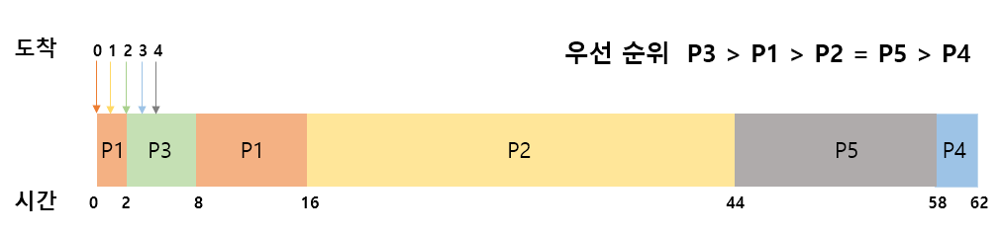
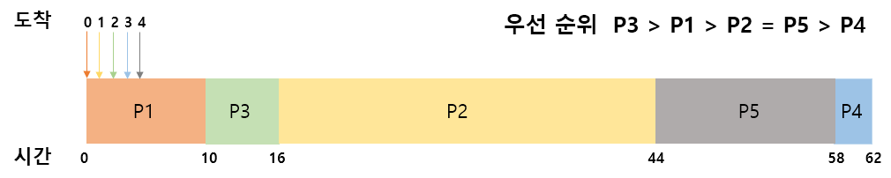
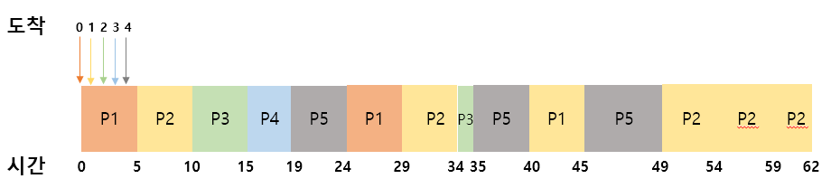

# 스케줄링 알고리즘 Ver 2

### **3. 우선순위 스케줄링**

 

우선순위 스케줄링은 프로세스마다 우선순위라는 속성이 붙게 됩니다. 우선순위 스케줄링도 역시 선점, 비선점형으로 스케줄링이 가능합니다. 숫자가 높을 수록 우선순위가 높고 만약 우선순위가 같다면 FIFO방식으로 동작합니다.

 

| 프로세스 | 도착 시간 | 실행 시간 | 우선순위 |
| --- | --- | --- | --- |
| P1 | 0 | 10 | 3 |
| P2 | 1 | 28 | 2 |
| P3 | 2 | 6 | 4 |
| P4 | 3 | 4 | 1 |
| P5 | 4 | 14 | 2 |

 

그래서 아래는 선점형에서의 결과를 나타낸 표입니다. P1 먼저 수행하다가 P3가 오면 우선 순위가 P3가 더 높으니까 P1은 대기하고 P3가 작업을 수행합니다.

 

| 프로세스 | 반환시간 | 대기시간 |
| --- | --- | --- |
| P1 | 16 | 6 |
| P2 | 43 | 15 |
| P3 | 6 | 0 |
| P4 | 59 | 55 |
| P5 | 54 | 40 |
| 평균 | 평균 반환 시간(16+43+6+59+54)/5 = 35.6 | 평균 대기 시간(6+15+0+55+40)/5 = 23.2 |

 

다음은 비선점형일 때의 결과 표입니다.

 

 

| 프로세스 | 반환시간 | 대기시간 |
| --- | --- | --- |
| P1 | 10 | 0 |
| P2 | 43 | 15 |
| P3 | 14 | 8 |
| P4 | 59 | 55 |
| P5 | 54 | 40 |
| 평균 | 평균 반환 시간(10+43+14+59+54)/5 = 36 | 평균 대기 시간(0+15+8+55+40)/5 = 23.6 |

 

만약 우선순위가 낮은 프로세스가 높은 프로세스에 의해 실행이 되고 있지 않은 상황이라면 어떻게 될까요? 이때는 그 프로세스의 우선순위를 점차 높여 처리 받게끔 하는 **에이징**이라는 기법을 사용합니다.

 

## 장점 
    1) 각 프로세스의 중요성에 따라서 작업을 수행하기 때문에 합리적입니다.
    2) 실시간 시스템에서 사용 가능합니다.
    
 
 
## 단점 
    높은 우선순위를 갖는 프로세스가 계속적으로 스케줄링이 되면 우선순위가 낮은 프로세스는 자원을 할당 받지 못하기 때문에 기아가 발생할 수 있습니다.

 

### **4. 라운드 로빈 스케줄링(Round-Robin)**

 

라운드 로빈 스케줄링은 시분할 시스템을 위해 설계된 스케줄링 기법입니다. 이 스케줄링은 작은 단위의 시간인 시간 할당량(Time-Slice)을 정의하여 그 시간 만큼 자원을 할당하는 방식입니다. 그래서 그 시간 안에 작업을 끝내지 못하면 다음 프로세스가 다시 그 시간만큼 자원을 할당 받아 씁니다. 여기서 시간 할당량을 5로 정하고 간트 차트와 결과를 보면 아래와 같습니다.

각 프로세스들은 공정하게 5만큼의 시간 동안 작업을 진행하는 것을 볼 수 있네요.

 

 

| 프로세스 | 반환 시간 | 대기 시간 |
| --- | --- | --- |
| P1 | 29 | 19 |
| P2 | 61 | 33 |
| P3 | 33 | 27 |
| P4 | 16 | 7 |
| P5 | 45 | 31 |
| 평균 | 평균 반환 시간(29+61+33+16+45)/5 = 36.8 | 평균 대기 시간(19+33+27+7+31)/5 = 23.4 |

 

## 장점 
    1) 모든 프로세스가 공정하게 스케줄링을 받을 수 있습니다.
    2) 실행 큐에 프로세스의 수를 알고 있을 때 유용합니다.
    3) 프로세스의 짧은 응답 시간을 갖고 최악의 응답 시간을 알 수 있습니다.
    4) 평균 대기 시간이 선입선처리 스케줄링과 최소 작업 우선 스케줄링보다 적습니다.

 
 
## 단점 
    1) 성능은 규정 시간량의 길이에 따라 달라지므로 작업이 비슷한 길이가 좋은데, 너무 길면 FIFO로 변하고 짧으면 문맥 교환(Context Switching) 비용이 증가합니다.
    2) 하드웨어적 타이머가 필요합니다.
    3) 미완성 작업은 규정 시간량(시간 할당량)을 마친 후 프로세서를 기다리니까 평균 처리 시간이 높습니다.