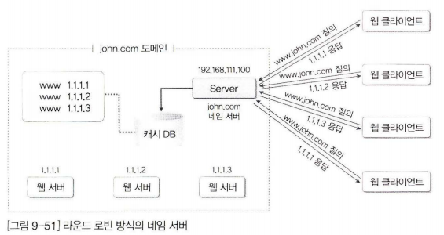
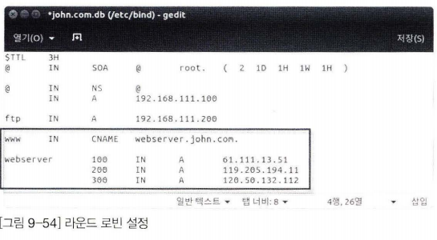
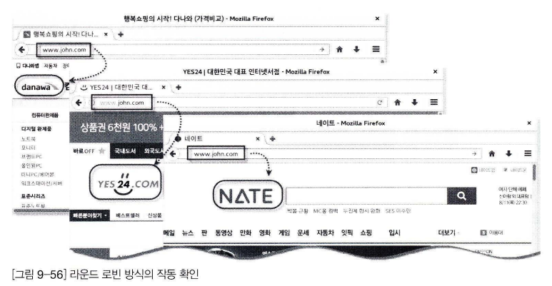

# **라운드 로빈 방식의 네임 서버**

네이버나 다음은 포털 사이트 웹 서버에는 동시에 수십만 이상의 접속이 있을 것이다. 따라서 웹 서버를 1대가 아니라 여러 대의 웹 서버를 운영해서. 웹 클라이언트가 서비스를 요청 할 경우에 교대로 서비스를 실행할 것이다. 그러면 웹 서버의 부하를 공평하게 여러 대가 나눌 수 있다. 이러한 방식을 **라운드 로빈 방식**이라고 부른다.

 

예를 들어 외부 사용자는 결국 john.com 네임 서버에 www.john.com의 IP 주소를 요청하게 될 것이다. 이 때, www.john.com에 해당하는 웹 서버를 3대 운영한다고 가정하고, 각각의 IP가 1.1.1.1 1.1.1.2 1.1.1.3이라면, john.com 네임 서버는 물어오는 순서대로 1.1.1.1 1.1.1.2 1.1.1.3을 차례로 알려주면 될 것이다. 그렇게 되면 3대의 웹 서버에 부하가 공평하게 나눠지는 것이다.

 

호스트 운영체제의 명령 프롬프트에서 [그림 9-52]와 같이 nslookup 명령을 입력해서 보면, 네이버 같은 웹 사이트도 여러 대의 웹 서버를 운영하는 것을 알 수 있다.

 

이미 인터넷에 구현된 다른 웹 사이트를 우리가 구현한 웹 서버라고 간주하겠다. 라운드 로빈 방식의 네임 서버를 직접 구현하는 방법은 다음과 같다.

 

1. 기존에 구축된 웹 서버의 IP 주소를 nslookup 명령어로 확인
    
    
    
    www.yes24.com(61.111.13.51) www.danawa.com(119.205.194.11) www.nate.com(120.50.132.112)의 IP 주소를 확인했다.
    
    이 3개의 IP주소를 www.john.com의 3대 웹 서버로 가정해보자
    
 

2. gedit으로 /etc/bind/john.com.db 파일을 다음과 같이 수정
    
    

 
    
3. 변경 사항을 적용하기 위해 systemctl restart bind9 명령어로 네임서버를 다시 가동

 

4. nslookup 명령을 입력한 후 server 192.168.111.100 명령을 입력하고 www.john.com 웹 서버 정보를 확인
    
    
    
 

라운드 로빈 방식의 동작을 확인하기 위해 www.john.com 접속 시에 3개의 사이트로 접속되는지 확인해보았지만, 실제는 웹 서버의 IP 주소가 다를 뿐 www.john.com에 접속하면 모두 같은 웹 페이지가 나와야 한다.