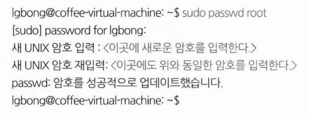

# **우분투 리눅스 03. 리눅스 탐험**

5.1 우분투를 시작하자 
**5.2 "Ubuntu" 내 입맛에 맞추기 **
5.3 화면 해상도 조정 
**5.4 root 계정 사용하기 **
5.5 VMware Tools 설치 
5.6 한글 사용하기 
**5.7. 비밀번호 찾기 **
**5.8 grub 설정 변경하기 **
**5.9 사용자 추가하기 **
5.10 통합 메신저 피진 (pidgin) 설치하기 
**5.11 OpenGL Dock 설치하기 **
5.12 컴피즈 사용하기  

# 5.2 "Ubuntu" 내 입맛에 맞추기

## 대시 홈

런처란 프로그램을 실행 하기 위한 발판이 되는 프로그램 관리자를 가리킨다. 이러한 런처에 있는 다음 아이콘을 클릭하면 태블릿을 연상케 하는 화면이 나타난다.

 

## 내폴더

시스템을 사용함에 있어서 내 컴퓨터에 들어 있는 디렉터리 구조와 파일을 직접적으로 탐색할 때 사용할 수 있다. 윈도우즈의 "내 문서”를 선택했을 때와 같은 친숙한 화면 구성이다.

 

## FireFox 웹브라우저

인터넷 네비게이터인 파이버폭스이다. 윈도우즈의 IE(웹 브라우저)와 동일한 기능으로 성능과 효율은 더욱 뛰어나다는 평을 받고 있는 인터넷 탐색기이다.

 

## 우분투 소프트웨어센터

우분투 시스템을 최신의 상태로 유지할 수 있는 각종 응용프로그램과 도구들을 다운로드 받을 수 있다. 또한 설치된 프로그램의 제거 및 업데이트를 손쉽게 처리할 수 있도록 지원하는 도구이다. 이를 통하여 사용자의 취향과 편의성에 맞는 소프트웨어를 설치하여 자신의 취향에 맞게 시스템을 꾸미기 할 수 있다.

 

## 시스템 설정

윈도우즈의 제어판과 같은 기능으로 각종 시스템 설정을 조정하거나 최적화를 할 수 있다.

 

## 업데이트 관리자

업데이트를 수행할 내용이 있을 때만 나타나며 수시로 업데이트를 수행하는 것이 좋다. 각종 오류, 버그 등을 수정하고 성능을 개선하는 자료가 이곳을 통하여 제공된다.

 

## 휴지통

윈도우즈의 휴지통과 동일한 기능을 제공한다. 리눅스의 rm 명령은 한번 실행되면 복구할 수 없다는 단점이 있었는데 GUI 윈도우를 제공하면서 삭제 명령이 바로 실행되는 것이 아니라 휴지통 거치게 함으로서 실수를 줄일 수 있도록 하는 기능이다.

 

# 5.4 root 계정 사용하기

리눅스를 자신의 시스템에 설치하였다면 스스로 최고 관리자가 될 수 있다. 그러나 "Ubuntu"는 기본적으로 설치에서 설정한 사용자 계정으로만 로그인을 하도록 되어 있다. 최고 관리자 기능은 필요할 때마다 암호를 입력하여 사용하도록 제공하는 형태이다.

root 계정 권한을 획득하는 방법의 명령은 “sudo -s”가 있다. 이는 자신의 계정 암호로 root 계정 권한을 획득하는 것이다.

더 이상 슈퍼바이저 계정이 필요 없을 경우 종료하는 방법은 "exit” 를 입력하는 것이다.
 

 

root 계정 비밀번호를 새로 부여하고 계정을 활성화하여 로그인 가능하게 하기를 원하는 독자를 위한 방법을 제시한다. 먼저 콘솔 터미널을 열고 root 계정에 암호를 부여하도록 한다.

윈도우즈와 다르게 암호 입력에서 커서의 이동이 없다.

 

# 5.7. 비밀번호 찾기

## 5.7.1 root 계정으로 사용자 암호 수정하기

모든 리눅스/유닉스 시스템에서 root 계정의 권한은 막강하다. "rm rf* “를 사용하여 시스템을 멍청이로 만들 수 있으며 다른 사용자 계정의 비밀번호를 수정할 수도 있다.

**root**@coffee-desktop: ~# passwd yulim(사용자 이름) 
Enter new UNIX password: 〈새로운 암호를 입력〉 
Retype new UNIX password: 〈새로운 암호를 다시 한 번 더 입력〉 
passwd: 암호를 성공적으로 업데이트 했습니다

 

## 5.7.2 라이브시디로 수정하기

"Ubuntu" 라이브 시디로 부팅하여 "sudo fdisk -l” 명령을 입력한다.

sudo mkdir/media/sda1 
sudo mount /dev/sda1 /media/sda 1. 
sudo chroot /media/sda 1 <------- <root 사용자 권한 획득〉  
passwd lgbong <---------------------- 〈사용자 이름율 |gbong 대신에 root도 가능〉

 

chroot는 root 디렉터리를 바꿀 수 있을 뿐만 아니라 권한까지 획득하는 명령이다. 라이브
CD에 있는 실행 프로그램이다. 만약 명령어 오류가 난다면 설치를 해주어야 한다.

 

## 5.8 grub 설정 변경하기

"Ubuntu”로 로그인을 하여 root 계정 권한을 획득한 후 "/boot/grub" 디렉터리로 이동한다. "vi grub.cfg" 명령으로 "grub.cfg" 파일을 열어 제시되는 문장을 찾아 편집한다.

 

set default="0" ←—- grub가 시작할 항목의 번호가 0번이라는 뜻으로 원하는 항목 번호로 수정하여 사용 할 수 있다. 윈도우즈와 같이 설치된 경우 윈도우즈 항목 위치 번호를 적어주면 된다. 주의 할 점은 grub 항목 번호를 확인 할 때 0번부터 헤아려야 한다.

 
settimeout=10 ←—-  grub가 보여주는 항목들의 대기 시간을 초 단위로 설정할 수 있다.
 

패널 메뉴의 “위치” → “컴퓨터”를 선택한 다음 “파일 시스템” → “boot” → “grub” 폴더를 찾아 “grub.cfg”를 더블 클릭하여 “gedit” 프로그램을 이용하여 편집하여도 된다.

 
vi에서 편집 후의 장은 ": wq!” 이다. 일반적인 저장 명령 어인 "ZZ”는 파일의 속성이  읽기 전용으로 수정할 수 없다는 안내 메시지만 받을 뿐이다. “gedit"은 root 권한으로 편집할 경우 아무런 제약이 없다. 저장을 완료하였으면 "reboot" 명령으로 재시작 하면 바뀐 설정이 반영됨을 확인 할 수 있다.

 

## 5.9 사용자 추가하기

설치 과정에서 만들어진 사용자 이외에 다른 사용자 계정을 추가해보자.

메뉴바의 [시스템 설정] → [사용자 계정]을 선택한다.  “+” 버튼을 클릭한다. 사용할 계정 이름을 입력하고 [만들기 (E)] 버튼을 클릭한다. 계정의 종류는 표준과 관리자 두 가지를 제공하고 있다.

암호는 계정을 선택했을 때 나타나는 “계정 사용 중지됨”을 클릭하여 설정한다. 이 때 암호는 6자리 이상의 충분히 긴 암호를 사용해야 한다.

 

## 5.11 OpenGL Dock 설치하기

"Apple” 의 "Mac OSX"를 해킹하여 사용하는 "해킨토시"라고 있다. 리눅스에서 "GUI"를 사용하는 "해킨토시"의 "Dock" 의 화려한 기능을 사용할 수 있는 방법이 OpenGL Dock 설치이다.