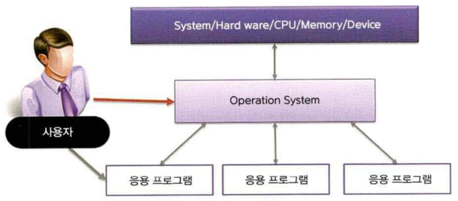

# 리눅스
---
리눅스는 오픈 소스 유닉스 계열 운영 체제 계열이다.

## 운영체제
컴퓨터의 하드웨어와 소프트웨어를 제어하여 사용자가 컴퓨터를 쓸수 있게 만들어 주는 프로그램이다.

### 운영체제 기능

* 하드웨어와응용프로그램 간의 인터페이스 역할을한다.
* CPU, 주기억장차 입출력장치 등의 컴퓨터 자원관리를 한댜
* 인간과 컴퓨터 간의 상호작용을 제공함과 동시에 컴퓨터의 동작을 구동
* 작업의 순서를정하며 입출력 연산을제어한다.
* 프로그램의 실행을 제어한다.
* 데이터와파일의 저장을관리한다.

> 운영체계는 하드웨어와 소프트웨어의 중간에 위치
>
> 

## [유닉스](unix)

* 중 · 대형 서버 시스템에서 가장 많이 사용되는 OS, 고성능. 고기용성의 운영체계이
* 예로는 IBM(AIX), HP(HP-UX), SUN(Soralis) 등이 있다

## 리눅스란?
* [리눅스의 탄생](linux)

* 오픈소스

  > 로그램 소스 코드를 무료로 공개하여 사용자는 원하는 대로 특정 기능을 추가

## 리눅스의 활용
리눅스는 기업이나 공공기관, 학교 동 정보 시스템 서비스를 제공하는 서버의 운영체계로 많이 시용되는 소프트웨어이다.
> 리눅스 운영체계를 개인용 PC의 윈도우 운영체계를 대신하는 운영체계로 시용할 수도 있다.

### 서버용 리눅스
리눅스를 가장 많이 활용하고 있는 분야는 서버이다. 
> 과제: 보충설명

### 데스크탑용 리눅스
x-windows를 기반으로 gui 환경을 제공한다.
> 과제: 보충설명

## 리눅스 운영체제의 구조
통상적인 리눅스는 토르발스가 만든 커널에 컴파일러, 셸, 기타 프로그램이 조합된 배포판을 의미합니다.  

* [커널](structure)
* [쉘](structure)
* [유틸리티](structure)

## 리눅스의 종류

* [배포본이란?](distribution)
* 우분투

