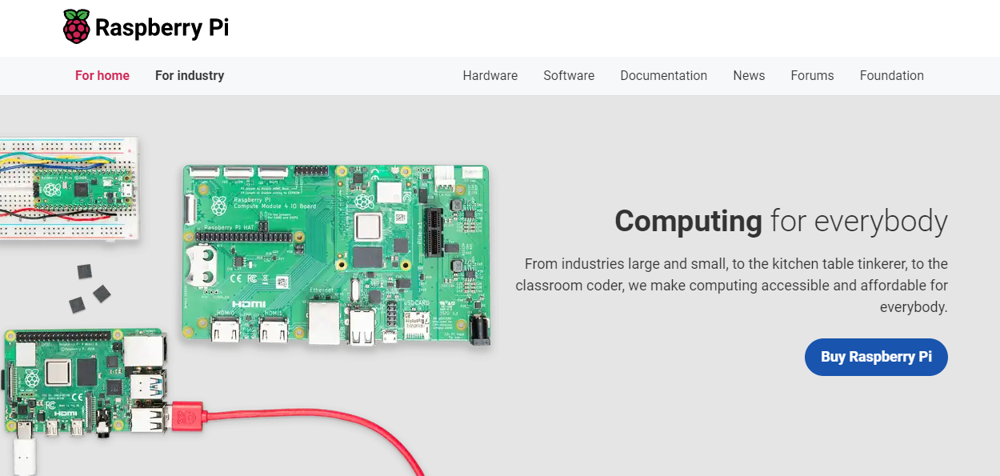

# 리눅스 임베디드 활용
Embedded Linux는 스마트폰, 태블릿, 라우터 및 IoT 장치와 같은 임베디드 시스템에서 실행되도록 특별히 설계된 운영 체제 유형으로, 임베디드 애플리케이션을 개발하고 배포하기 위한 가볍고 유연하며 사용자 지정 가능한 플랫폼을 제공합니다.   

## 라즈베리파이
Raspberry Pi는 저렴하고 에너지 효율적이며 로봇 공학, 가정 자동화 및 IoT(사물 인터넷) 프로젝트를 비롯한 다양한 내장형 응용 제품에 사용하기 쉽도록 설계된 일련의 소형 단일 기판 컴퓨터입니다.

 

### Raspberry Pi OS

Raspberry Pi OS는 라즈베리 파이에서 사용할 수 있는 운영 체제 중 하나입니다. 이 운영 체제는 데비안 리눅스 기반으로 만들어졌으며, 라즈베리 파이와 호환성이 뛰어납니다. Raspberry Pi OS는 라즈베리 파이에서 사용하는 기본적인 소프트웨어와 도구를 제공하며, Python, Scratch, Sonic Pi, Mathematica 등과 같은 프로그래밍 언어와 도구를 제공합니다. 이 운영 체제는 라즈베리 파이의 하드웨어 리소스를 효율적으로 사용할 수 있으며, 다양한 프로젝트에서 사용될 수 있습니다.