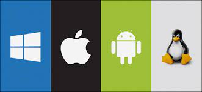

# 운영체제의 종류
운영체제는 다양한 종류가 있으며, 주요 종류는 다음과 같습니다.  

> 출처: https://velog.io/@lot8229/OS-OS-%EA%B0%9C%EB%85%90-%EB%B0%8F-%EA%B8%B0%EB%B3%B8-%EC%A7%80%EC%8B%9D

## 윈도우즈(Windows)
마이크로소프트(Microsoft)에서 개발한 대표적인 운영체제로, 개인용 컴퓨터(PC)에서 가장 많이 사용되고 있습니다. 사용하기 쉬우며, 다양한 응용 프로그램 및 게임이 지원되지만, 라이선스 비용이 발생합니다.  

## 맥OS(Mac OS)
애플(Apple)에서 개발한 운영체제로, 애플 제품인 맥(Mac) 시리즈에서 사용됩니다. 사용자 친화적이며, 세련된 디자인과 높은 안정성이 특징입니다. 하지만 맥 시리즈 제품의 가격이 상대적으로 높고, 다양한 응용 프로그램 지원이 윈도우즈에 비해 적습니다.  

## [리눅스(Linux)](../linux)
유닉스(UNIX) 계열의 운영체제로, 무료 및 오픈 소스 라이선스를 따르기 때문에 누구나 자유롭게 사용, 수정, 배포할 수 있습니다. 서버 및 임베디드 시스템에서 많이 사용되며, 안정성이 높고, 다양한 응용 프로그램 및 개발 도구가 지원됩니다.  

## [유닉스(UNIX)](../unix)
초기에는 대학 연구용으로 개발되었으며, 현재는 서버 및 과학 연구 등에서 많이 사용됩니다. 다양한 유닉스 기반 운영체제가 있습니다.  

## 안드로이드(Android)
구글(Google)에서 개발한 모바일 운영체제로, 스마트폰 및 태블릿 컴퓨터 등에서 사용됩니다. 리눅스 커널을 기반으로 개발되었으며, 구글 플레이 스토어를 통해 다양한 응용 프로그램을 다운로드할 수 있습니다.

이 외에도 다양한 운영체제가 있으며, 최근에는 클라우드 컴퓨팅 환경에서 사용되는 클라우드 운영체제 등도 개발되고 있습니다.