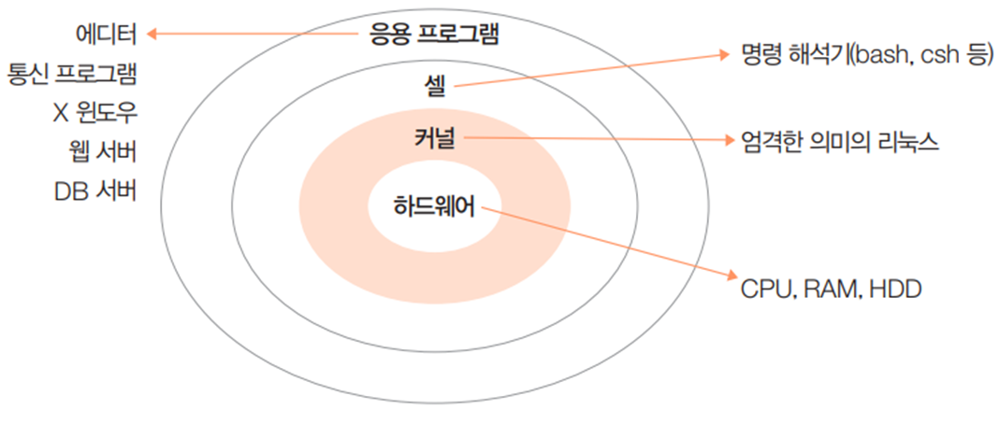

# 리눅스 운영체제의 구조

리눅스 운영체계는 `커널`, `쉘`, `유틸리티`의 3부분으로 구분된다

* 커널과 사용자간의 인터페이스로서 중간 매개의 역할을 담당함.
* 명령어를 해석하고 명령과 관련된 유틸리티나 커널을 호출하고 실행결과를 출력함.
* MS-DOS의 command.com과 같이 기본 제공 OS 명령어를 수행하는 곳

## 커널
사용자가 작동시키는 어플리케이션과 하드웨어 사이에서의 조정자 역할을 한다
* 컴퓨터 운영체계 부분의 핵심이며 하드웨어에 따라 다른 버전이 존재하며. 하드웨어 진화에 따라 같이 진화한다.   (http://www.kernel.org).

## 쉘(shell)

커널과 사용자간의 인터페이스로서 중간매개의 역할을담당한다.
* 명령어를 해석하고 명령과 관련된 유틸리티나 커널을 호출하고 실행 결과
룰출력한다.
* Dos의 command.com과 같이 기본제공 OS 명령어를수행하는곳이다.
* 윈도우에서 탐색기의 왼쪽 마우스 메뉴의 압축 기능과 같은 기본 명령이다.

## 유틸리티
사용자가 시스템을 편하게 시용-하기 위한 용용 프로그램이다.  

* 사용자 입장에서는 Shell과 유틸리티의 구분이 필요 없다.
* dir. ping. type. 좀 더 편리하게 사용하기 위해 만들어서 제공하는 명령 시스템이다
* 윈도우에서 알집 등좀더 편리하게 만든압축프로그램을사용하는명령이다.

