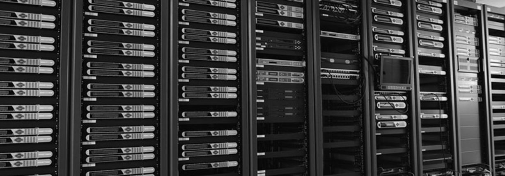

# Bare-Metal
베어메탈 서버는 가상화 기술을 사용하지 않는 하드웨어 가상화 기술을 의미합니다. 즉, 가상화 레이어가 없이 하드웨어 자체를 가상화하여 서버를 실행하는 기술입니다.

이는 하이퍼바이저를 사용하여 가상화하는 기술에 비해 높은 성능을 제공하며, 하이퍼바이저와 같은 가상화 레이어가 없기 때문에 보안성이 높다는 장점이 있습니다. 또한 베어메탈 서버는 하이퍼바이저가 필요 없기 때문에 시스템 관리자가 서버 자원을 직접 관리하고 조작할 수 있어 더욱 유연한 운영이 가능합니다.

베어메탈 서버는 주로 대규모 데이터 센터, 고성능 컴퓨팅 등의 분야에서 사용되며, 컨테이너, 오픈스택 등의 기술과 함께 사용됩니다.

## Dedicated Server와의 차이점

Bare-Metal 서버와 Dedicated Server는 모두 고성능 서버로, 다음과 같은 차이점이 있습니다:

- Bare-Metal 서버: 가상화를 사용하지 않는 물리적인 서버로, 클라우드 환경이 아닌 자체 보유한 데이터 센터 등에서 운영됩니다. 운영체제를 직접 설치하고 관리하며, 높은 성능과 안정성을 제공합니다. 일반적으로 고객이 서버를 구매하거나 임대하여 사용합니다.
- Dedicated Server: 고객이 사용하는 전용 서버로, 클라우드나 데이터 센터에서 호스팅 됩니다. Bare-Metal 서버와 마찬가지로 고성능 및 안정성을 제공하지만, 클라우드 서비스에 비해 더 높은 가격을 지불해야 합니다. 서버의 하드웨어와 운영체제, 네트워크 등을 고객이 직접 선택하고 구성할 수 있습니다. 일반적으로 인터넷 서비스 제공업체(ISP)나 호스팅 업체에서 제공됩니다.

따라서 Bare-Metal 서버는 클라우드 환경이 아닌 자체 보유한 데이터 센터 등에서 직접 운영하고자 할 때 선택되며, Dedicated Server는 클라우드나 호스팅 업체를 통해 서비스를 이용하고자 할 때 선택됩니다.

