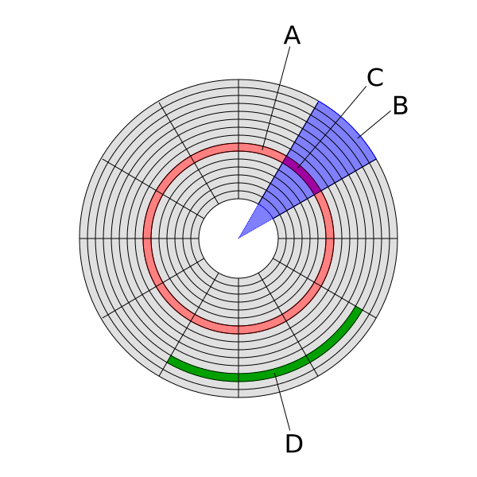
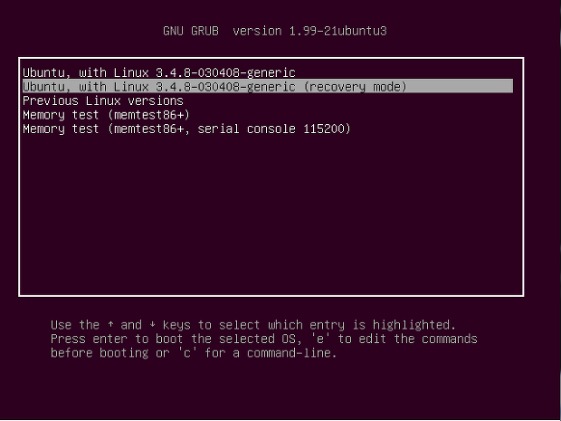

# 인스톨러
리눅스 배포판은 일반적으로 설치를 간편하게 하기 위해 인스톨러를 제공합니다. 인스톨러는 사용자가 리눅스를 설치하기 위해 따라야 할 단계를 안내하는 도구입니다.  

## 설치미디어
인스톨러는 일반적으로 부팅 가능한 USB 또는 CD/DVD 등의 설치 매체에 포함되어 있으며, 부팅할 때 이를 선택하면 설치 과정이 시작됩니다.  

### 부트 섹터

부트 섹터(Boot sector)는 컴퓨터의 부팅 과정에서 사용되는 특별한 섹터입니다. 부트 섹터는 보조 기억 장치(하드 디스크, USB 드라이브, CD-ROM 등)의 첫 번째 섹터에 위치하며, 이 섹터에는 컴퓨터가 부팅될 때 필요한 정보들이 저장됩니다.  

부트 섹터에는 부트 로더(Boot loader)라는 프로그램이 저장되어 있습니다. 이 부트 로더는 컴퓨터가 부팅될 때 실행되어 운영 체제를 로드하거나 다른 부트 가능한 프로그램을 실행합니다. 부트 로더는 일반적으로 운영 체제 설치 프로그램이나 부트 가능한 CD-ROM 등에서 생성됩니다.  

부트 섹터는 일반적으로 512바이트 크기로 구성되어 있습니다. 이 중에서 처음 446바이트는 부트 로더를 저장하는 데 사용되며, 나머지 64바이트는 파티션 정보와 부트 섹터의 마지막 두 바이트는 부트 가능한 섹터(Bootable sector)인지 여부를 나타내는 서명(Signature) 값입니다.  

## 인스톨러의 역할
인스톨러는 사용자에게 몇 가지 선택지를 제공합니다. 예를 들어, 어떤 파티션에 리눅스를 설치할지, 어떤 파일 시스템을 사용할지, 어떤 언어를 선택할지 등을 선택할 수 있습니다. 이후에는 디스크 파티션을 설정하고, 필요한 패키지를 설치하며, 부트 로더를 설치하는 등의 과정을 거쳐 리눅스가 설치됩니다.  

### 부트로더

리눅스를 설치하기 위해서는 우선 컴퓨터의 `부트로더(Bootloader)`를 설정해야 합니다. 부트로더는 컴퓨터가 부팅될 때 운영 체제를 선택하도록 해주는 프로그램으로, 리눅스를 설치할 때는 일반적으로 그래픽 `부트로더(GRUB, Grand Unified Bootloader)`를 사용합니다.

리눅스는 오랜기간 다양한 부트로더를 통하여 리눅스를 보다 쉽게 설치 및 사용을 할 수 있도록 개선되어 왔습니다.

* LILO (LInux LOader): 초기 리눅스 부트로더로서, 1992년에 개발되었습니다. LILO는 MBR (Master Boot Record)에 설치되며, 부팅 가능한 운영 체제 목록을 관리합니다. 하지만 LILO는 부팅 파티션의 시작 위치를 고정해야 하므로, 매우 작은 MBR 공간을 사용할 수 있습니다.

* GRUB (GRand Unified Bootloader): LILO의 한계를 극복하기 위해 개발된 부트로더로서, 1995년에 개발되었습니다. GRUB는 MBR에 설치되지 않고, 부팅 가능한 파티션의 첫 번째 섹터에 설치됩니다. GRUB은 부팅 가능한 운영 체제 목록을 관리하며, 다른 부트로더에 비해 더욱 많은 옵션과 기능을 제공합니다.

* GRUB2: GRUB의 개선 버전으로서, 2009년에 출시되었습니다. GRUB2는 GRUB보다 더욱 모듈화된 구조를 가지며, 다양한 파일 시스템과 장치를 지원합니다. 또한, GRUB2는 윈도우와 리눅스를 동시에 설치할 수 있는 멀티 부팅 시스템을 지원하는 등 더욱 다양한 기능을 제공합니다.

* systemd-boot (formerly gummiboot): GRUB2와 유사한 구조를 가지며, 시스템 시작 시간을 단축하고 부트로더 구성을 단순화하기 위해 개발되었습니다. systemd-boot는 Linux 커널 이미지와 initramfs를 찾아서 부팅하며, EFI 시스템에서만 사용할 수 있습니다.

위와 같이 리눅스 부트로더는 LILO에서 GRUB, GRUB2, systemd-boot 등으로 발전해 왔습니다. 각각의 부트로더는 사용 목적에 따라 선택할 수 있으며, 사용자들은 필요에 따라 부트로더를 교체하거나, 부트로더 설정을 변경할 수 있습니다.

### GRUB

GRUB는 리눅스 운영 체제를 부팅할 때 다양한 설정을 제공하는 유연하고 강력한 부트로더입니다. GRUB는 운영 체제가 설치된 파티션을 찾아 부트 가능한 파일시스템을 검색하고, 이를 찾아 부팅합니다. 또한 GRUB는 운영 체제의 커널과 초기 램디스크(initrd)를 찾아 로드하고, 부트로더 메뉴에서 선택한 운영 체제를 부팅합니다.

리눅스 설치 시, GRUB를 사용하기 위해서는 부트로더를 설치해야 합니다. 이를 위해 설치 시, 디스크 파티션 설정 후, GRUB 부트로더를 설치할 파티션을 선택하고, 부트로더 설치 경로를 지정하게 됩니다. 그러면 GRUB는 해당 경로에 부트 로더를 설치하고, 운영 체제를 부팅할 수 있도록 준비합니다.

GRUB는 사용자가 직접 설정할 수 있는 다양한 옵션을 제공하며, 부트로더 메뉴에 리눅스 외 다른 운영 체제를 추가하거나 부트 로더 메뉴를 변경하는 것도 가능합니다. 이렇게 유연하고 강력한 부트로더 덕분에 리눅스는 다양한 하드웨어에서 안정적이고 높은 성능을 유지할 수 있습니다.
