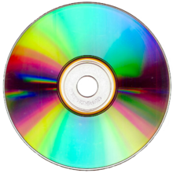

# 설치 미디어
컴퓨터의 저장장치가 발전함에 따라 다양한 설치방법이 존재합니다. 그중에서 가능 인기가 있었던 외장 장치로 CD-ROM이 있습니다.  

## CD-ROM

CD-ROM은 `Compact Disc Read-Only Memory`의 약자로, 콤팩트 디스크(CD)를 이용한 읽기 전용 저장 매체입니다. CD-ROM은 정보를 저장하는데 사용되며, 이 정보는 CD-ROM에 기록된 상태로 읽을 수 있습니다. CD-ROM은 기록된 데이터를 읽기만 할 수 있기 때문에, 쓰기 기능이 없습니다.  

CD-ROM은 레이저를 사용하여 정보를 읽습니다. CD-ROM에는 작은 구멍이 많이 뚫려있는 디스크가 들어있습니다. 레이저는 이 구멍을 통해 디스크에 기록된 정보를 읽습니다. 디스크에는 이진 코드로 된 데이터가 기록되어 있으며, 레이저는 이 데이터를 읽어서 컴퓨터가 이해할 수 있는 형태로 변환합니다.  

.jpg)

## 설치 디스크

CD-ROM은 대용량 데이터를 저장할 수 있으며, 저렴한 비용으로 대량 생산이 가능합니다. 또한, CD-ROM은 노이즈가 없는 고정밀한 음질을 제공하며, 음악 CD와 같이 오디오를 저장하는 용도로도 많이 사용됩니다. CD-ROM은 더 나은 저장 매체가 나오기 전까지는 많은 분야에서 사용되었으며, 현재도 일부 분야에서 사용되고 있습니다.    

## iso 이미지란?
ISO 이미지는 광학 디스크를 복제하거나 디스크 이미지 파일을 만들기 위한 포맷 중 하나입니다. CD, DVD 등의 광학 디스크에 대한 디스크 이미지를 만들 때 사용됩니다.

ISO 이미지는 광학 디스크의 모든 데이터를 포함하며, 파일 시스템과 부트 로더 등의 정보도 함께 저장됩니다. 이러한 정보들은 CD, DVD 등과 같은 광학 디스크를 읽고 부팅하는 데 필요합니다.

리눅스 배포판은 보통 ISO 이미지를 제공하여 사용자가 USB나 CD/DVD 등의 저장 매체에 쉽게 설치할 수 있도록 합니다. 사용자는 ISO 이미지를 다운로드하여 저장 매체에 기록한 후, 해당 매체를 이용해 시스템을 부팅하여 설치할 수 있습니다.

