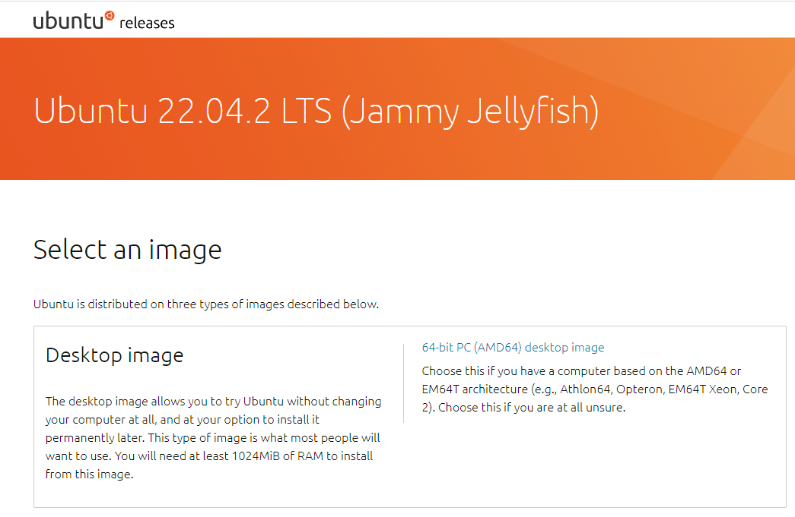

# ubuntu 설치 이미지 만들기
> https://amkorousagi-money.tistory.com/entry/%EC%9A%B0%EB%B6%84%ED%88%AC-%EB%B6%80%ED%8C%85-usb-%EB%A7%8C%EB%93%A4%EA%B8%B0-%EC%9A%B0%EB%B6%84%ED%88%AC-%EC%84%A4%EC%B9%98

이미지를 이용하여 컴퓨터에 직접 우분투(ubuntu)를 설치하는 방법에 대해서 알아 봅니다.  

## 설치 이미지 다운로드
우분투를 설치하기 위해서 iso 이미지를 다운로드 받습니다.  

우분투는 설치 이미지를 쉽게 다운로드 받기 위하여 여러 미러 사이트를 제공하고 있습니다. 국내에는 카카오 미러 사이트가 존재합니다.  

* 카카오 미러 : [우분투 22.04.2 LTS](https://mirror.kakao.com/ubuntu-releases/jammy/)

미러 사이트를 통하여 이미지를 다운로드 받습니다. `64-bit PC(AMD64) desktop image`를 선택합니다.

## Rufus 다운로드

우분투 이미지를 다운로드 받은후에는 설치형 USB를 생산해야 합니다. iso 이미지 파일을 설치용 USB로 쉽게 만들 수 있는 Rufus 파일을 다운로드 받습니다. Rufus는 USB 메모리를 포맷하여 부팅할 수 있는 미디어로 만드는 유틸리티 입니다.

> Rufus 를 이용하여 설치 미디어를 생성하게 되면, USB에 있는 기존 데이터는 모두 삭제 됩니다.

> Rufus 다운로드 및 학습하기 : https://rufus.ie/ko/#google_vignette

## 부팅 미디어 만들기

USB 메모리를 연결하고, 다운로드 받은 Rufus를 실행합니다.  다음과 같은 화면을 볼 수 있습니다.  

* 먼저 설치 미디어로 만들 USB를 선택합니다.
* 부트유형의 `선택`버튼을 선택하여 다운로드 받은 iso 파일을 선택합니다.
* `시작`버튼을 눌러 설치 미디어를 생성합니다.
