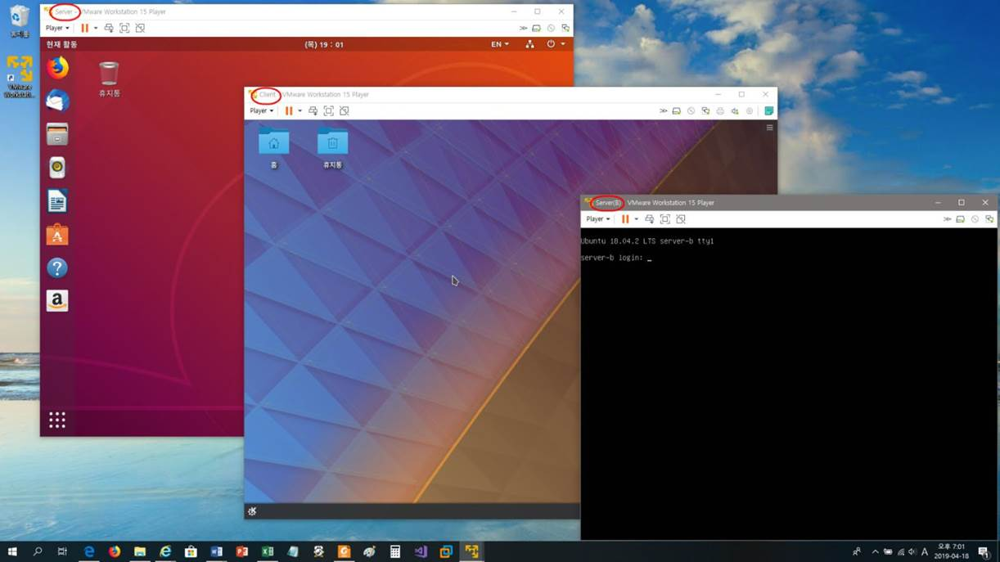
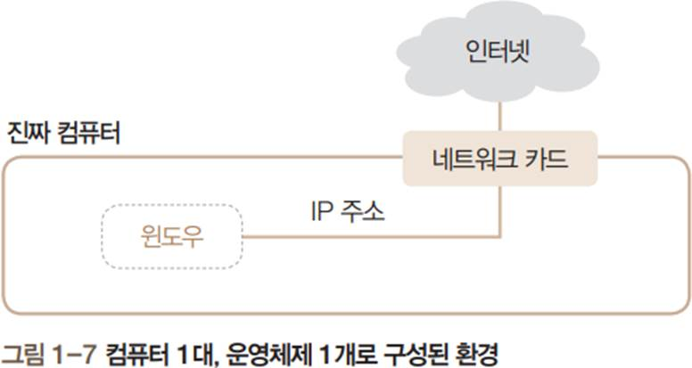

# 가상머신
가상의 소프트웨어를 이용하여 컴퓨터의 하드웨어를 구현하는 방법 입니다.

## 가상머신의 개념
---
기본적으로 한대의 컴퓨터는 하나의 운여체제만을 설치 가능합니다. 하지만, 하드웨어의 성능이 발전함으로서 더 많은 운영체제를 설치하고자 하는 요구들이 발생합니다.  

이를 해결하기 위하여 소프트웨어를 활용하여 가상의 하드웨어를 구현하는 기술들이 등장되었습니다. 이를 가상머신이라고 합니다. 마지 PC 1대만으로 여러 대의 PC를 운영하는 것처럼 만드는 방법입니다.

(가상머신 소프트웨어 또는 가상머신 프로그램이라 부름)

## 가상머신 소프트웨어
---
컴퓨터에 설치된 운영체제(호스트 OS) 안에 가상의 컴퓨터를 만들고 이 가상의 컴퓨터 안 에 또 다른 운영체제(게스트 OS)를 설치·운영할 수 있도록 제작된 소프트웨어를 말합니다.

### 일반적인 운영체제 환경
호스트 컴퓨터에는 윈도우가 설치되어 있고, 기존에 설정된 IP 주소를 이용하여 네트워크 카드를 통해 인터넷에 접속 가능

## Host와 Geust
---
가상머신을 이용하여 여러개의 가상 운영체제를 설치할때 이를 구별하기 위한 용어에 대해서 알아 봅니다.

### 호스트 운영체제
기본적으로 PC에 설치되어 있는 메인 운영체제를 호스트 운영체제(host operating system) 또는 호스트 OS라고 합니다.  

### 게스트 운영체제
가상머신에 설치한 운영체제를 게스트 운영체제(guest operating system) 또는 게스트 OS 라고 합니다.

## 가상머신 사용의 장점
---
컴퓨터 1대에 실무와 비슷한 네트워크 환경 구성

> 실무 환경에서 사용되는 각종 리눅스 네트워크 서버 기능을 컴퓨터 1대에 구축 가능
운영체제의 특정 시점을 저장하는 스냅숏 기능

> 중요한 시점을 저장하는 기능, 필요시 언제든 저장 시점으로 돌아갈 수 있음
여러 개의 하드웨어를 장착하여 테스트 가능
> 가상머신에서는 사용자가 원하는 용량의 가상 하드디스크를 여러 개 장착 가능

현재 상태를 저장했다 추후에 이어서 작업하게 해주는 Suspend 기능
> Suspend(일시 중지) 기능을 이용하면 현재의 가상머신 상태를 그대로 보관하여 우선 종료 하고, 추후에 가상머신을 다시 가동하여 Suspend 상태부터 이어서 작업 가능

가상머신을 사용하기에 적합한 경우
> 실무와 비슷한 네트워크 환경을 구성하여 여러 대의 서버를 구축하려 할 때
> 여러 가지 운영체제를 설치하여 학습하려 할 때
> 새로운 시스템을 도입하기 전에 테스트해보려 할 때

## 가상머신 실습
가상머신(게스트 컴퓨터) 3대를 만들고 리눅스 3대 설치  

* 가상머신 3대에는 가상 IP 주소를 할당하고, 가상 라우터를 통해 가상머신 3대를 하나의 네트워크로 묶어 동일한 네트워크 환경으로 사용

> 윈도우(호스트 OS) 1대와 리눅스 3대로 이루어진 환경이 만들어짐

## 가상머신 소프트웨어의 종류
가상머신은 크개 2종류가 존재합니다. CPU/RAM/DISK와 각종 물리적 인터페이스를 에뮬레이팅 하는 하드웨어 기반 가상머신과 시스템 커널만을 에뮬레이팅 하는 `가상화`가 있습니다.  

대표적인 가상머신으로는 다음과 같습니다.
* [VirtualBox](virtualbox)
* [VMWare](vmware)

