## 머신 생성

VMware 프로그램으로 가상머신 생성

* 앞으로 만들 가상머신은 *.vmdk라는 확장명을 포함한 몇 개의 관련 파일로 존재

* 가상머신을 생성할 때마다 각각의 가상머신이 지정한 폴더에 생성될 예정

## [실습 1-2] VMware로 가상머신 생성하기

1. Server, Server(B), Client 폴더 생성하기

여유 공간(30GB 이상 권장)이 있는 드라이브에 Linux 폴더 생성, 그 아래에 Server, Server(B), Client 폴더 추가 생성

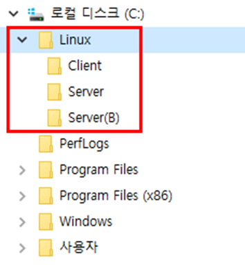

2. Server 폴더에 가상머신 생성하기

Server를 설치할 가상머신을 C:\Linux\Server 폴더에 생성한 후 작업 표시 줄의 VMware Player 아이콘을 클릭, VMware 실행

가상머신을 새로 만드는 방법 3가지

* VMware 초기 화면에서 왼쪽의 Home 아이콘을 선택한 후, 오른쪽 창의

[Create a New Virtual Machine] 클릭

* VMware 메뉴에서 [Player]-[File]-[New Virtual Machine] 선택

* VMware 초기 화면에서 왼쪽의 Home 아이콘을 선택한 후 마우스 오른쪽 버튼 클릭, [Create a View VM] 선택

[New Virtual Machine Wizard] 창에서 ‘I will install the operating system later.’ 클릭

[Select a Guest Operating System] 창에서 ‘Linux’를 선택한 후

Version 부분의 드롭다운 리스트 중 `Ubuntu 64-bit`를 선택하고 `<Next>` 클릭

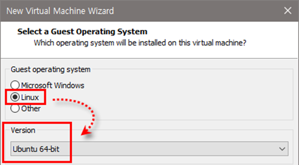

[Name the Virtual Machine] 창에서 Virtual machine name에 ‘Server’를 입력한 후

`<Browse>` 클릭,

[폴더 찾아보기] 창이 나타나면 ‘C:\Linux\Server’를 선택하고 <확인> 클릭, Location에 ‘C:\Linux\Server’가 자동 입력되면 <Next> 클릭

디스크 용량은 그대로 두고 ‘Store virtual disk as a single file’을 선택한 후 `<Next>` 클릭

`<Finish>` 클릭, 가상머신 생성 완료

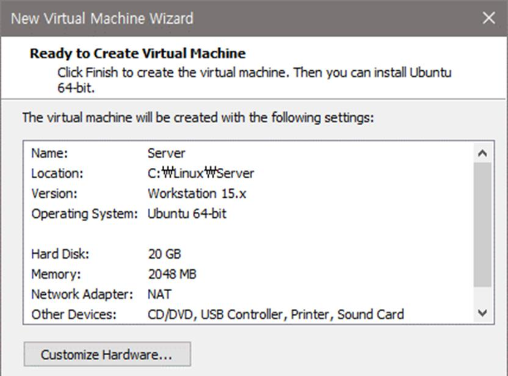

 

## 생성된 가상머신 확인하기

가상머신에 장착된 부품을 확인하기 위해 [Edit virtual machine settings] 클릭

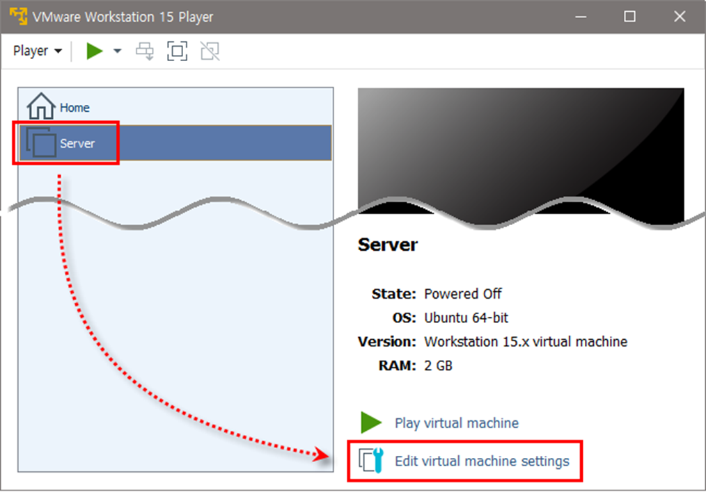

### 메모리 할당량 변경하기

메모리 할당량을 변경할 수도 있으나 일단은 2048MB 유지

CPU를 여러 개 할당한다고 해도 가상머신의 성능에는 큰 의미가 없으니 1로 유지     

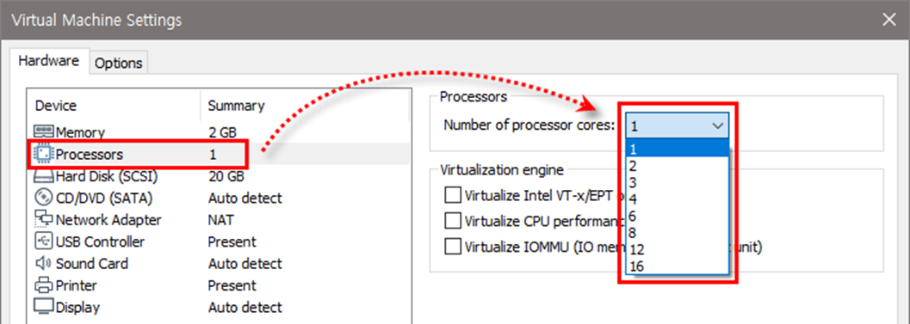

리눅스 실습에는 20GB면 충분, 하드디스크에 아무것도 설치되지 않아 2~3MB만 사용됨

Device status의 ‘Connect at power on’에 체크 표시     

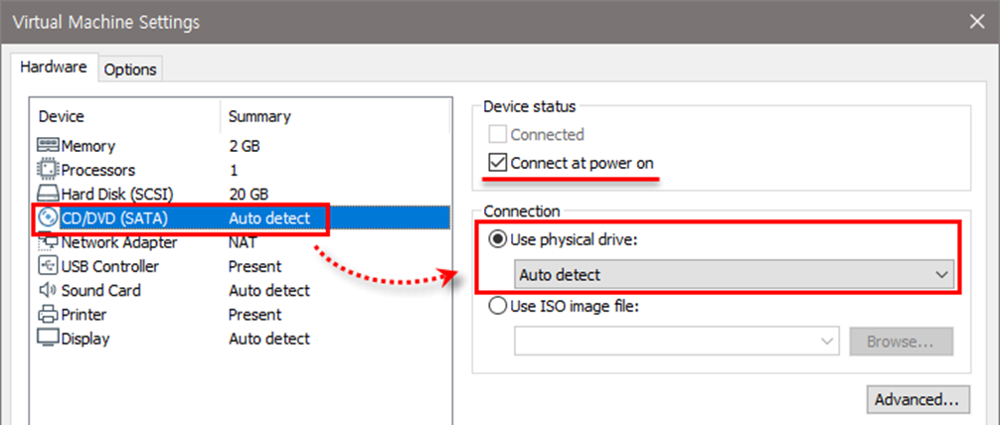

기본 설정인 NAT 방식 사용

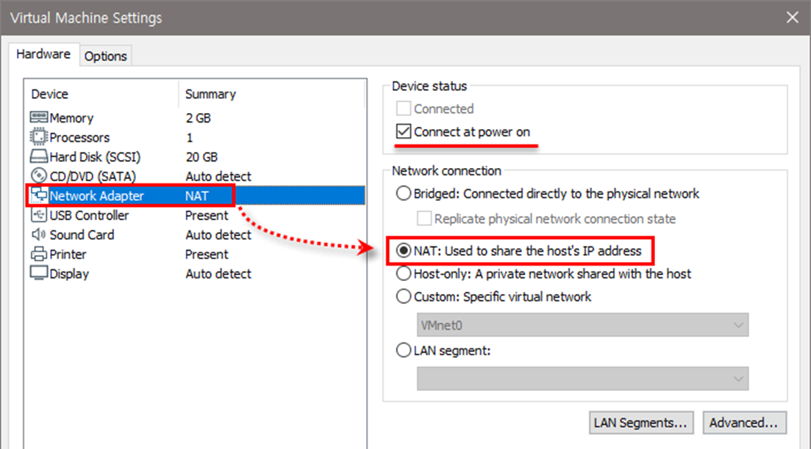

USB 컨트롤러, 사운드 카드, 프린터 각각의 장치 선택한 후 <Remove> 클릭, 제거

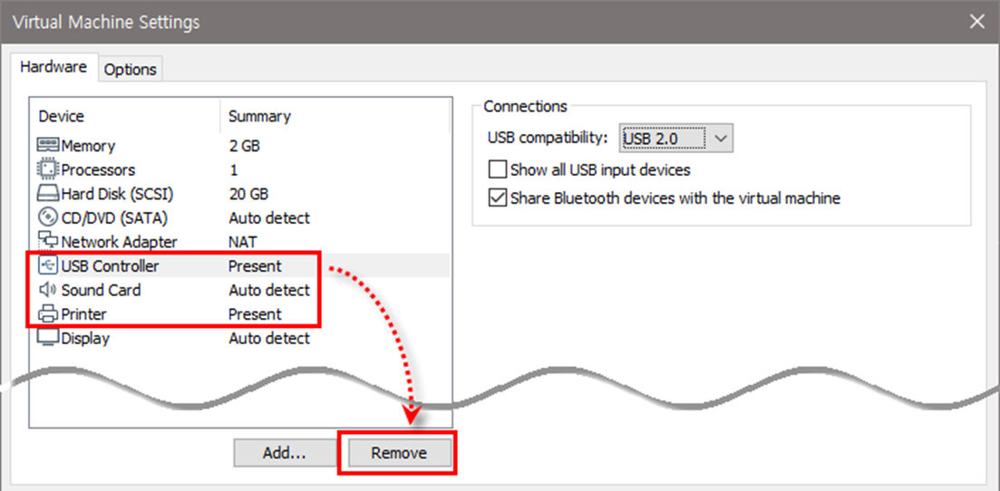

`<OK>` 클릭, 지금까지 설정한 내용을 확정하고 VMware Player 종료

## 설치된 파일 확인하기

`C:\Linux\Server\` 폴더 확인, `*.vmdk`가 가상 하드디스크 파일이며 최대 20GB까지 확장 가능

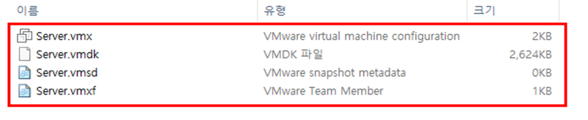

## 가상머신을 목록에서 제거하고 다시 불러오기

VMware Player 실행  
Server를 선택한 후 마우스 오른쪽 버튼을 클릭하여 `Remove from the Library` 선택

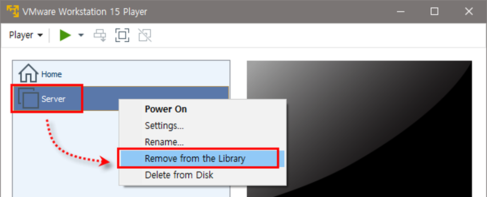

가상머신을 목록에 다시 추가하려면 오른쪽 창의 [Open a Virtual Machine] 클릭,
`C:\Linux\Server\Server.vmx`를 열거나 메뉴에서 [Player]-[File]-[Open] 선택

## 가상머신 부팅하기

가상머신을 켜는 방법 4가지

* 오른쪽 창에서 Play virtual machine 아이콘 클릭

* 메뉴에서 [Player]-[Power]-[Power On] 선택

* 마우스 오른쪽 버튼을 클릭하여 ‘Power On’ 선택

* 메뉴 중 초록색 아이콘(▶) 클릭

부팅할 때 다음과 같은 메시지가 나오면 <No> 클릭

잠시 기다리면 가상머신 가동

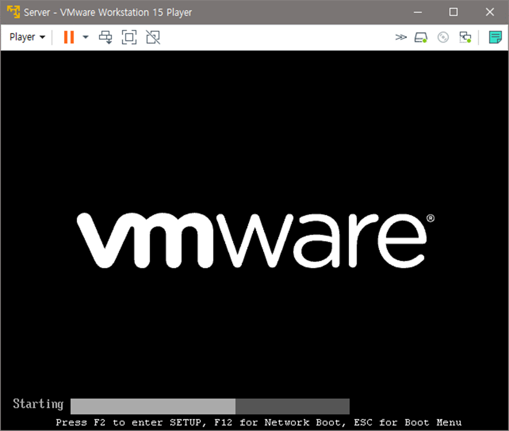

부팅 과정에서 `Operating System not found` 라는 메시지가 나옴과 동시에 마우스 포인터가 움직이지 않을 것, Ctrl + Alt 를 눌렀다 떼면 마우스 포인터가 보임

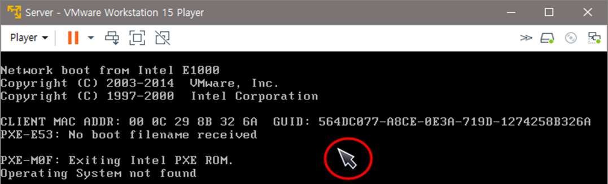

[Player]-[Power]-[Shut Down Guest] 선택, 가상머신의 전원을 끔 경고 메시지가 나오면 <Yes> 클릭

VMware 실행, 왼쪽의 Home 아이콘 클릭 후 오른쪽 창의 [Create a New Virtual Machin] 클릭

## 

## Server(B) 가상머신 생성

8-4 Client 가상머신 생성  

1. 가상머신 부팅하기  
   1-1 VMware Player를 실행하고 가상머신 중에서 원하는 것을 골라 부팅

2. Suspend 기능 실행하기  
   2-1 부팅된 가상머신의 오른쪽 위에 있는 X 클릭 가상머신을 닫으려고 하면 메시지 창이 나타나는데 기본 설정은 `<Suspend>`로 되어 있음 Enter 누르거나 `<Suspend>` 클릭

3. Power off 기능 실행하기  

* 다시 실행하여 해당 가상머신을 살펴보면 상태(State)가 ‘Suspended’로 되어 있음

* [Play Virtual Machine] 클릭, 가상머신을 실행하면 앞에서 멈추었던 부분부터 실행됨

* 다시 오른쪽 위의 X를 클릭하여 닫고 이번에는 [Power Off] 클릭

* 다시 VMware Player를 실행하여 가상머신을 살펴보면 상태가 ‘Powered Off’로 되어 있음

