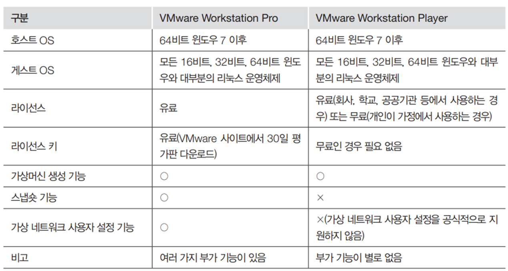
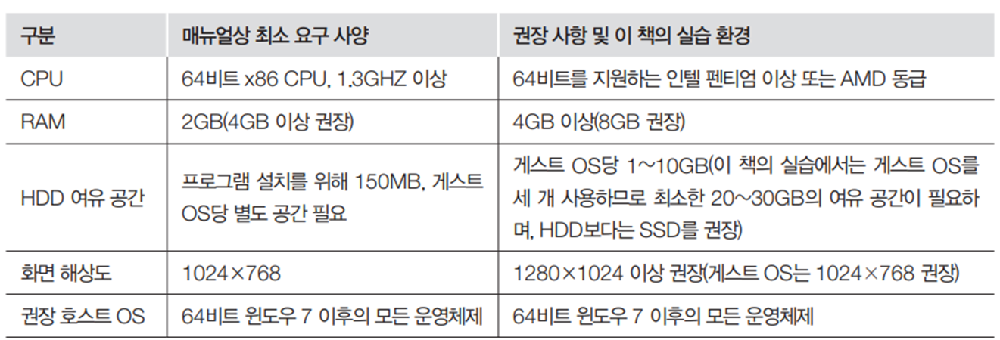

# VMWare
대표적인 가상머신 소프트웨어 입니다.  

## VMWare란
VMware는 가상화 소프트웨어 회사로, x86 호환 컴퓨터에서 가상 머신을 만들고 관리하는 솔루션을 제공합니다. 이를 통해 여러 운영 체제를 동시에 실행하고 하나의 물리적 호스트 컴퓨터에서 다중 운영 체제를 실행할 수 있습니다. VMware의 제품군에는 데스크탑 가상화 솔루션인 VMware Workstation 및 Fusion, 서버 가상화 솔루션인 VMware ESXi 및 vSphere 등이 있습니다. 이러한 솔루션은 서버 가상화, 테스트 및 개발, 클라우드 컴퓨팅 등 다양한 용도로 사용됩니다.

## vmware 다운로드
가상머신을 생성할 수 있는 vmware를 다운로드 합니다.
https://www.vmware.com/products/workstation-player/workstation-player-evaluation.html

## vmware 라이센스 및 준비사항
대표적인 가상머신 소프트웨어 입니다.

* VMware Workstation Pro와 VMware Workstation Player
* 실습에서는 사용 기간에 제한이 없는 VMware Workstation Player를 사용

준비 사항

## VMWare의 특징

## 설치
vmware를 설치합니다. 현재 최신 버젼은 17입니다.
* [vmware17 설치](vm17)

* [vmware15 설치](vm15)

## 실습 
---
vmware를 설치하고, 가상머신을 생성하는 실습을 합니다.
* [설치완료 및 실행하기](run)
* [가상머신 생성하기](create)
* [가상머신 설정](setting)

### 실습 요구사항                 

* 처음엔 standalone 하나만 생성
* 다른 서버들은 추후에 생성

| 구분       | Standalone                       | WebServer | WAS    |
| -------------- | ------------------------------------ | ------------- | ---------- |
| 주요 용도      | 단일 통합 동작                       | Web server    | WAS server |
| OS종류         | Ubuntu- 64bit                        |               |            |
| Ubuntu 종류    | Ubuntu Desktop                       |               |            |
| 가상 머신 이름 | Standalone                           | Webserver     | WAS        |
| 하드용량       | 20G                                  | 20G           | 20G        |
| 메모리         | 2G                                   | 2G            | 2G         |
| 네트워크 유형  | Use network address translation(NAT) |               |            |
