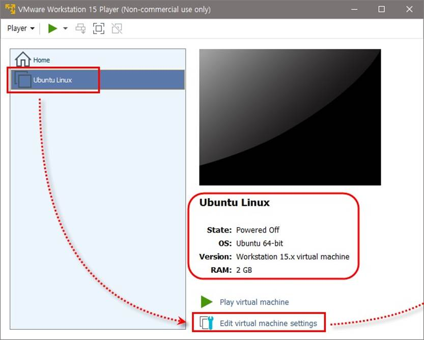

## 설치 완료 후 실행하기

바탕화면의 VMware Workstation Player 아이콘 더블클릭,

또는 윈도우의 [시작]-[VMware]-[VMware Workstation Player] 선택

`Use VMware Workstation 15~` 선택 후 `<Continue>` 클릭, 마지막 화면에서 `<Finish>` 클릭

오른쪽 위의 X 클릭하여 종료 또는 [Player]-[Exit]를 선택하여 종료

 

|      |                                 |
| ---- | ------------------------------- |
|      |  |

## 가상머신의 겉모양

`[실습 1-1]`을 진행하여 호스트 OS(윈도우)에 `VMware Workstation Player`를 설치한 상태

이제 VMware Workstation Player에 게스트 OS를 설치할 차례

가상머신의 이름은 Ubuntu Linux, 컴퓨터는 꺼져 있고(Powered Off) 가상머신에 설치할 게스트 OS는 Ubuntu 64-bit

[Edit virtual machine settings]를 클릭하면 가상머신의 하드웨어 환경 세부사항 확인 가능

 

 

[Hardware] 탭에서 가상머신에 장착된 메모리, CPU 개수, 하드디스크, CD/DVD, 플로피 디 스크, 네트워크 카드, USB 장치, 사운드 카드, 프린터, 모니터 등 가상의 하드웨어 장치 확인

가상머신에서 사용할 메모리(RAM) 2GB 설정 확인

→ ‘가짜’라는 점을 제외하면 완전한 컴퓨터와 마찬가지

