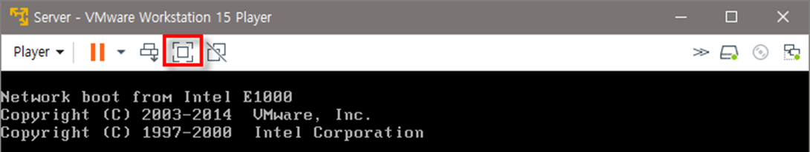

## [실습 1-4] 전체 화면 사용하기

1. 가상머신 부팅하기  

  1-1 전체 화면을 사용하려면 가상머신이 가동 중이어야 함

​    가상머신 중에서 원하는 것을 골라 부팅

2. Full Screen으로 전환하기

  2-1 부팅이 되면 VMware 메뉴에서 [Player]-[Full Screen]을 선택하거나 아이콘을 클릭

  2-2 전체 화면이 게스트 OS 화면으로 바뀜

2-3 원래의 크기로 줄이려면 다시 아이콘을 클릭하거나 Ctrl + Alt + Enter 를 누름

  2-4 메뉴에서 [Player]-[Power]-[Shut Down Guest]를 선택하여 가상머신의 전원을 끔

