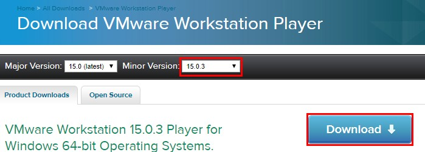
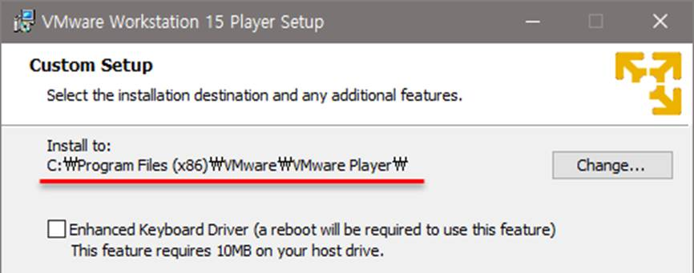
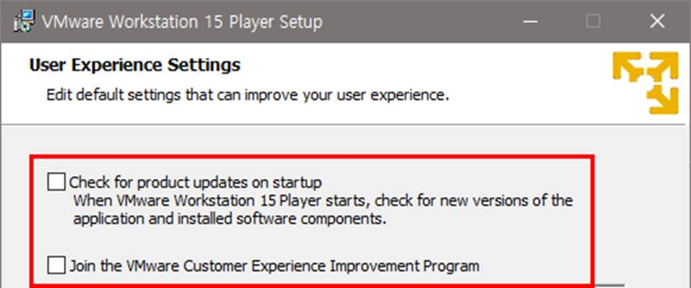

## VMware Workstation Player 설치하기

VMware Workstation Player 다운로드하기 

vmware 홈페이지, download,  15.0.3 버전 다운로드 (15 이후 버전이면 상관 없음)

### 설치 진행하기

설치 파일 더블클릭

### 환영 메시지에서 `<Next>` 클릭

라이선스 동의 창에서 `I accept the terms …`에 체크 표시를 하고 `<Next>` 클릭

설치 폴더 지정, 기본 설정 그대로 두고 `<Next>`클릭, `Enhanced Keyboard Driver…`에는 체크 표시를 하지 않음

 

[User Experience Settings] 창에서는 체크 표시를 모두 없애고 <Next> 클릭

[Shortcuts] 창에서는 디폴트로 두고 <Next> 클릭

[Ready to install VMware Workstation 15 Player] 창에서 <Install> 클릭

잠시 동안 설치 진행

[Completed the VMware Workstation 15 ~] 창에서 <Finish> 클릭, 설치 종료

 